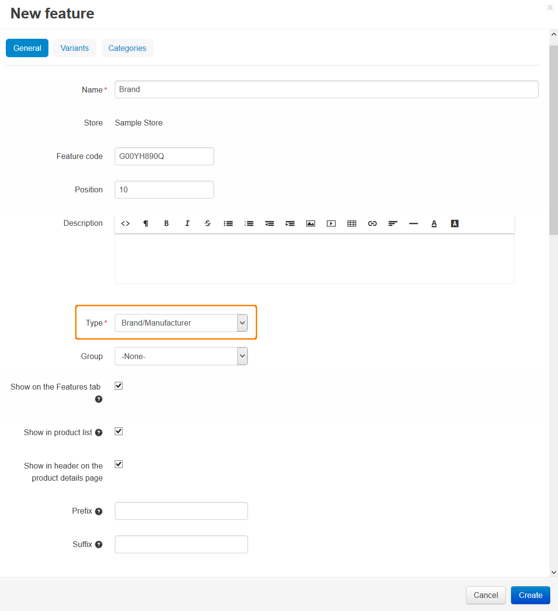

*************************************
How To: Add the Brand Product Feature
*************************************

=====================
Step 1. Add a Feature
=====================

1.1. In the Administration panel, go to **Products → Features**.

1.2. Click the **+** button on the right and choose **Add feature** from the drop-down menu. 

1.3. Specify the following fields in the opened **New feature** window:

     * **Name**—enter *Brand*.

     * **Feature code**—enter the individual code to identify the feature.

     * **Position**—enter the feature position.

     * **Description**—enter the feature description. It will be displayed if a customer clicks on **?** link under the **Features** tab on the product details page on the storefront.

     * **Type**—choose *Select box: Brand/Manufacturer*.

     * **Group**—select the group to which the feature will belong. Leave *None* if you don't want the feature to be a part of any group.

     * **Show on the Features tab**—if you tick this checkbox, the product feature will be displayed on the product details page on a separate tab called *Features*.

     * **Show in product list**—if you tick this checkbox, the feature will appear among the other product details in the list of products on the storefront.

     * **Show in header on the product details page**—if you tick this checkbox, the feature will be shown under the product header.

     * **Prefix**—what you enter here will appear before the feature value.

     * **Suffix**—what you enter here will appear after the feature value.

1.4. Switch to the **Variants** tab and specify the necessary brands.

1.5.   Click the **Create** button.

.. image:: img/manufacturer1.png
    :align: center
    :alt: Feature variants

=====================================
Step 2. Specify a Brand for a Product
=====================================

2.1. Go to **Products → Products** and click on the desired product link.

2.2. Open the **Features** tab.

2.3. Select the necessary brand in the **Brand** feature list.

2.4. Click the **Save** button.

.. note::

    To add a product filter so that it could filter products by brand, read the :doc:`Adding a product filter <../filters/adding_filter>` article.
