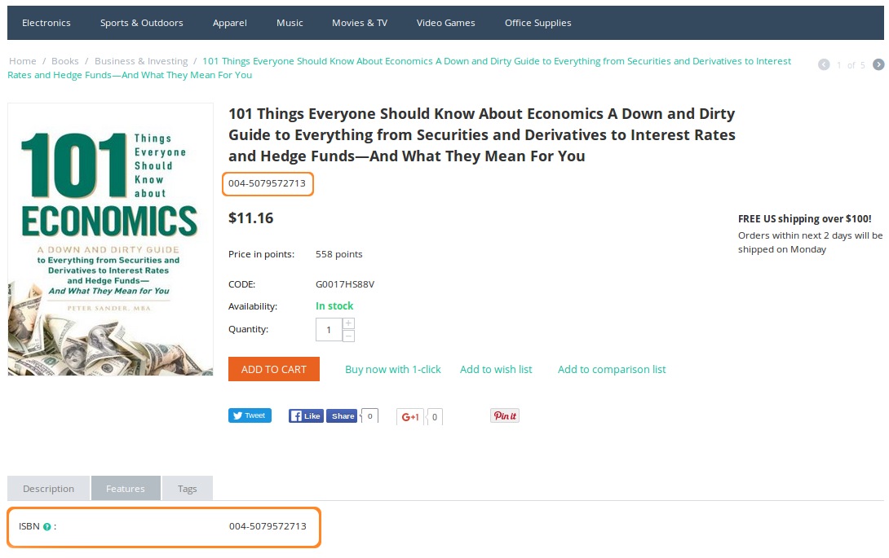

*******************************
How To: Set up Product Features
*******************************

Product features are various traits and properties of the product. You can use features in :doc:`product filters </user_guide/manage_products/filters/index>` to allow customers to find products with specific parameters.

.. contents::
    :backlinks: none
    :local: 
    :depth: 2

=============
Add a Feature
=============

.. note::
    
    Starting from Multi-Vendor 4.12.1 vendors have the ability to add features, if you :doc:`allow them to do it </user_guide/manage_products/features/vendor_features>`.
    
There are two ways to add a new feature:

Way 1: From a Product Page
++++++++++++++++++++++++++

#. Open the **Products → Products** page.

#. Click on the name of the product to open its settings.

#. Open the **Features** tab.

#. Click **Add feature**.

#. Fill in the following fields:

   * **Name**—the name of the feature.
   
   * **Storefront name**—the storefront to which the product feature originally belongs.

   * **Variants**—add the variants for your feature.
     
#. Click the **Create** button.

   .. image:: img/feature_creation.png
       :align: center
       :alt: The feature creation from the product page

   .. note::
   
       Click the **Advanced feature creation** button to proceed to create the feature from the features list.

Way 2: From the Features List
+++++++++++++++++++++++++++++

#. In the Administration panel, go to **Products → Features**.

#. Click the **+** button in the top right corner.

#. Fill in the necessary :doc:`feature properties </user_guide/manage_products/features/feature_attributes>`.

#. (optional) Some features have multiple variants. Once you've configured everything on the **General** tab, make sure to configure the **Variants** tab too, if it appears.

#. (optional) By default, the feature will be available in all product categories. Switch to the **Categories** tab if you wish to make the feature available only in certain categories.

   .. important::

       A feature available in a category is also available in its subcategories. If a feature belongs to a group, its categories are the same as the categories of the group. The **Categories** tab won't appear for the feature in that case.

#. Click the **Create** button.

   .. image:: img/feature_creation_2.png
       :align: center
       :alt: The feature creation from the features list

===================
Add a Feature Group
===================

Feature groups allow you to assign categories to multiple features at once.

.. warning::

    If you delete a feature group, all the features of that group will be deleted too.  

#. In the Administration panel, go to **Products → Features**.

#. Switch to **Feature groups** in the menu on the right.

#. Click the **+** button on the right.

#. Fill in the following fields in the **New group** window that will open:

   .. image:: img/feature_group2.png
        :align: center
        :alt: Configure the properties of the feature group.

   * **Name**—the name of the feature group.

   * **Storefront name**—the storefront to which the group belongs.
   
   * **Vendor**—the vendor to which the storefront belongs.

   * **Feature code**—the code to identify the feature group.

   * **Position**—the position of the feature group relative to other groups.

   * **Description**—the description that appears when a customer clicks the question mark icon on the **Features** tab of the product detail page on the storefront.

   * **Show on the Features tab**—determines whether or not to display the feature group on the product page.

   * **Show in product list**—determines whether or not to show the feature group on the product list page on the storefront among other product details.

   * **Show in header on the product details page**—determines whether or not to show the feature group under the product header.

#. (optional) By default, the feature group will be available in all product categories. To limit the group to certain categories, follow the steps below:

   * Switch to the **Categories** tab.

     .. image:: img/feature_group1.png
         :align: center
         :alt: The categories of the feature group.

   * Click the **Add categories** button. 

   * Tick the checkboxes of the categories where this feature group should be available.

   * Click **Add categories and close**.
    
#. Click the **Create** button. The new feature group will appear under **Products → Features**, if you switch to **Feature groups** using the menu on the right.

   .. image:: img/feature_group_list.png
       :align: center
       :alt: Go to Products → Features and use the menu on the right to view feature groups.
       
.. important::

    Vendors can only delete those features or feature groups which they created. If the vendor's feature is already applied to some products, only the marketplace administrator can delete it.

============================
Specify Features of Products
============================

Single Product
++++++++++++++

#. Go to **Products → Products**. 

#. Click the name of the desired product.

#. Switch to the **Features** tab.

#. Specify the value of the feature.

#. Click the **Save** button.

   .. image:: img/feature_to_product.png
        :align: center
        :alt: The Features tab allows you to edit the features of the product.

Multiple Products
+++++++++++++++++

#. Go to **Products → Products**.

#. Click on the necessary products to select them.

   .. hint::

       Use the search panel on the right to find the necessary products faster.

#. Choose **Edit selected** above the list of products.

   .. image:: /user_guide/manage_products/products/img/catalog_75.png
        :align: center
        :alt: Use CS-Cart bulk editing tools to specify features for multiple products at once.

#. A pop-up window will appear. Click **Unselect all**, then tick the **Features** checkbox.

#. Click **Modify selected**.

#. Specify the values of the features for the selected products.

#. Click the **Save** button in the top right corner.

   .. note::

       You can also add features to products using :doc:`product import <../import_export/product_import>`. The description of the correct format can be found in :doc:`this article <../import_export/fields_format>`.
