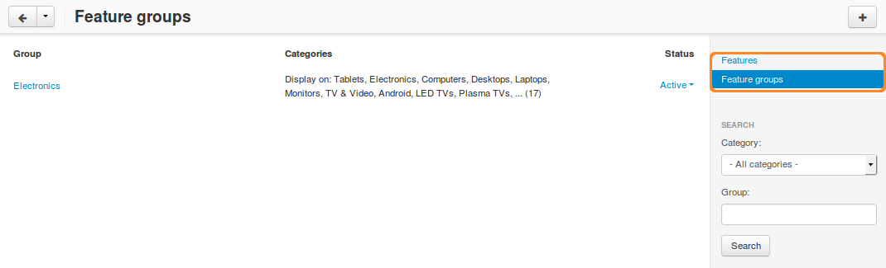

*******************************
How To: Set up Product Features
*******************************

Product features are various traits and properties of the product. You can use features in :doc:`product filters <../filters/index>` to allow customers to find products with specific parameters.

   .. image:: img/feature_on_the_storefront.png
        :align: center
        :alt: Product features appear on the separate tab on the product page.

=============
Add a Feature
=============

1. In the Administration panel, go to **Products → Features**.

2. Click the **+** button in the top right corner and choose **Add feature**.

3. Fill in the following fields in the opened **New feature** window:

   .. image:: img/features.png
        :align: center
        :alt: When you add a feature, a pop-up window appears. There you can configure the properties of the feature.

   * **Name**—the name of the feature.

   * **Store**—the store to which the product feature originally belongs.

   * **Feature code**—the code to identify the feature.

   * **Position**—the position of this feature relative to other features.

   * **Description**—the description that appears when a customer clicks the **?** link on the **Features** tab of the product page on the storefront.

   * **Type**—the type of the feature.

     .. note::

          If you choose *Multiple checkboxes* or one of the *Select box* types, remember to specify feature variants on the **Variants** tab.      

   * **Group**—the group to which feature belongs.

     .. hint::

         Use **None** for a feature that shouldn't be a part of any group.

   * **Show on the Features tab**—determines whether or not to show the product feature on the product page.

   * **Show in product list**—determines whether or not to show the feature on the product list page on the storefront among other product details.

   * **Show in header on the product details page**—determines whether or not to show the feature under the product header.

   * **Prefix**—the text that appears before the value of the feature.

   * **Suffix**—the text that appears after the value of the feature.

4. (optional) By default, the feature will be available in all product categories. To limit the feature to certain categories, follow the steps below:

   * Switch to the **Categories** tab.

     .. important::

         If a feature belongs to a group, its categories are the same as the categories of the group. The **Categories** tab won't appear for the feature in that case.

   * Click the **Add categories** button. 

   * Tick the checkboxes of the categories where this feature should be available.

   .. image:: img/feature_categories.png
        :align: center
        :alt: You can limit a feature to certain categories.

   * Click **Add categories and close**.

     .. note::

         A feature available in a category is also available in its subcategories.

5. Click the **Create** button.

===================
Add a Feature Group
===================

Feature groups allow you to keep your features organized and to assign categories to multiple features at once.

.. warning::

    If you delete a feature group, all the features of of that group will be deleted too.  

1. In the Administration panel, go to **Products → Features**.

2. Click the **+** button on the right and choose **Add group**.

3. Fill in the following fields in the opened **New group** window:

   .. image:: img/feature_group2.png
        :align: center
        :alt: Configure the properties of the feature group.

   * **Name**—the name of the feature group.

   * **Store**—the store to which the group originally belongs.

   * **Feature code**—the code to identify the feature group.

   * **Position**—the position of the feature group relative to other groups.

   * **Description**—the description that appears when a customer clicks the **?** link on the **Features** tab of the product page on the storefront.

   * **Show on the Features tab**—determines whether or not to display the feature group on the product page.

   * **Show in product list**—determines whether or not to show the feature group on the product list page on the storefront among other product details.

   * **Show in header on the product details page**—determines whether or not to show the feature group under the product header.

4. (optional) By default, the feature group will be available in all product categories. To limit the group to certain categories, follow the steps below:

   * Switch to the **Categories** tab.

    .. image:: img/feature_group1.png
        :align: center
        :alt: The categories of the feature group.

   * Click the **Add categories** button. 

   * Tick the checkboxes of the categories where this feature group should be available.

     .. important::

         A group determines the categories for all the features that belong to that group.

   * Click **Add categories and close**.
    
5. Click the **Create** button.

The new feature group will appear under **Products → Features**, if you switch to **Feature groups** using the menu on the right.

================================
Specify Features of the Products
================================

--------------
Single Product
--------------

1. Go to **Products → Products**. 

2. Click the name of the desired product.

3. Switch to the **Features** tab.

4. Specify the value of the feature.

5. Click the **Save** button.

   .. image:: img/feature_to_product.png
        :align: center
        :alt: The Features tab allows you to edit the features of the product.

-----------------
Multiple Products
-----------------

1. Go to **Products → Products**.

2. Tick the checkboxes next to the names of the desired products.

.. hint::

    Use the search panel on the right to find the products faster.

3. Click the gear button in the top right corner and choose **Edit selected**.

   .. image:: img/multiple_features.png
        :align: center
        :alt: Use CS-Cart bulk editing tools to specify features for multiple products at once.

4. A pop-up window will appear. Click **Unselect all**, then tick the **Features** checkbox.

5. Click **Modify selected**.

6. Specify the values of the features for the selected products.

7. Click the **Save** button in the top right corner.

.. note::

    You can also add features to products using :doc:`product import <../import_export/product_import>`. The description of the correct format in the :doc:`Imported fields format <../import_export/fields_format>` article.
