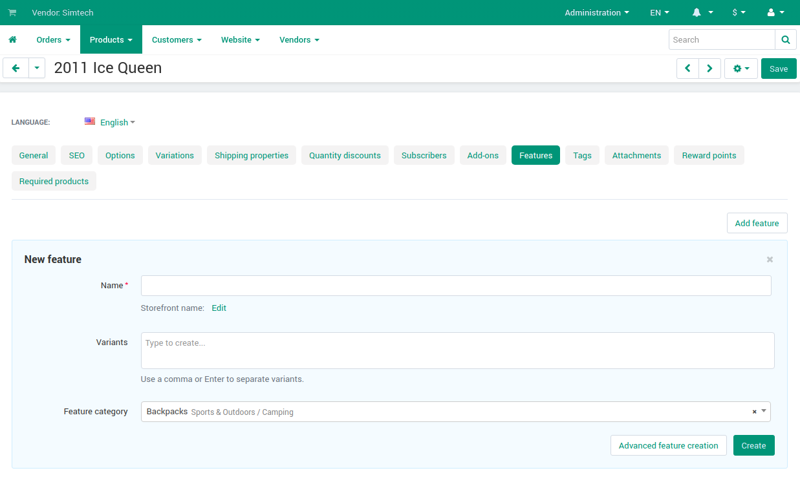

*************************************
How To: Allow Vendors to Add Features
*************************************

.. important::

    This functionality first appeared in Multi-Vendor 4.12.1.
    
Vendors have the ability to :doc:`add features, variants and feature groups for their products </user_guide/manage_products/features/product_features>`. This ability is disabled by default so that vendors do not create too many features and their copies. But you can allow them to manage product features.

To do this:

#. Go to **Settings → Vendors**.

#. Tick the **Allow vendors to manage product features** checkbox.

#. Click **Save**.

#. Now your vendors have the ability to create new features, including when adding new products.

   .. image:: img/manage_features.png
       :align: center
       :alt: Allowing vendors to create features
       
That is how the features work when they are created by vendors:

* Features created by vendors are displayed in the list with all the other features.

* Each feature created by a vendor is linked to him.

* A vendor can use features created by other vendors, but he can't add his variants to those features. To do this, he has to create his own identical feature.

* A vendor can only delete those features, variants and feature groups he created himself.

* If a feature is already applied to some products, only the marketplace administrator can delete it.

