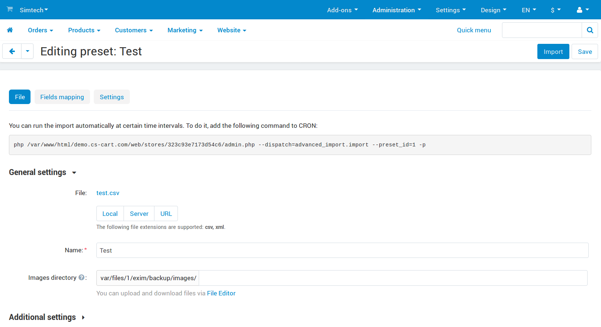
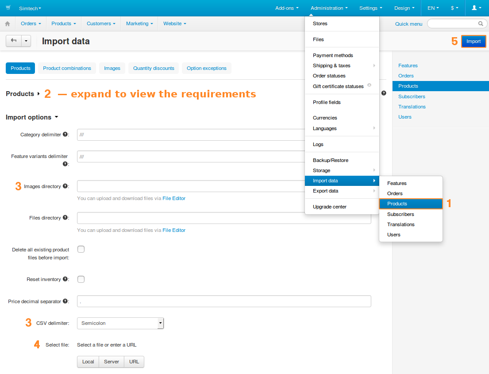
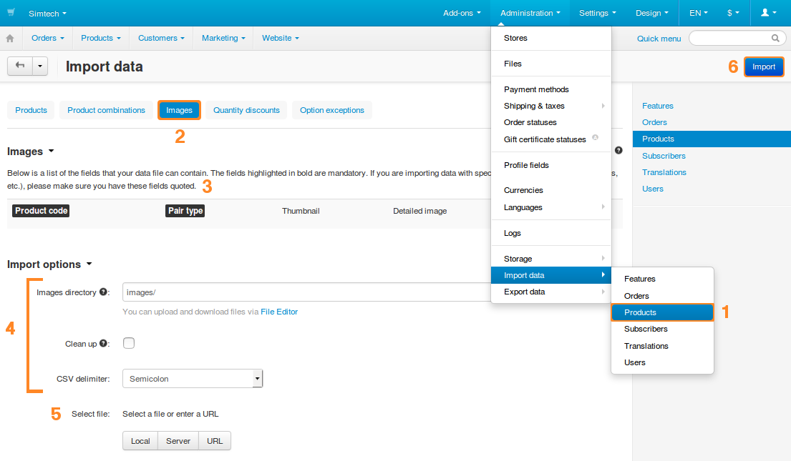

**********************************
How To: Import Images for Products
**********************************

There are two ways to import images in the Administration panel:

* **Administration → Import data → Products**: import products along with main images.

* **Administration → Import data → Products → Images**: import main AND additional images for existing products.

.. important::

    Both ways require a properly formatted CSV file. In most cases, images must be uploaded to the server of your store before you can import them.

.. _upload-images-for-import:

=====================
Ways to Upload Images
=====================

Before you can import the images, you need to upload them. You can do it via:

* any FTP client of your choice;

* the built-in **File editor**.

-----------
File Editor
-----------

Let’s assume that we want to upload some images for products. These images will be used during the import, so we decide to store them in the **Private files** section, in a separate folder called *images*. Here’s what we do:

#. Create an archive called **images.zip**. That way we’ll have the *images* folder when we unpack the archive on our server.

#. Go to **Administration → Files** in the Administration panel of your store.

#. Click **Private files**, then drag and drop your archive with images to the file area.

#. Right-click on the archive and choose **Extract files from archive**.

   Congratulations! We now have a folder called *images*, and we can refer to those images in a CSV file.

   .. image:: img/file_editor.png
       :align: center
       :alt: CS-Cart file editor supports drag-and-drop. Actions can be performed via buttons at the top or via the context menu.

----------
FTP Client
----------

If you use an FTP client, upload the images to *var/files/[number]*. That’s where the **Private files** are stored.

.. note::

    The *[number]* is determined by the ID of the store or vendor. So, if you want to add a private file for the first storefront (or if you have only one storefront), the path will be *var/files/1*.

.. hint::

    **Public files** are located in *images/companies/[number]*. 

===================================
Ways to Specify Images in CSV Files
===================================

There are multiple ways to specify where CS-Cart or Multi-Vendor should look for images.

* **Way 1.** An image URL like ``http://www.example.com/test_image.jpg``.
 
  The URL doesn’t have to lead to your store—you can upload images to an image hosting service and use those URLs. Then the images will be downloaded to your server from there.

* **Way 2.** An absolute path from the root directory of your server to the image file. For example: ``/path/to/cs-cart/var/files/1/test_image.jpg``.

.. important::

    Ways 3 and 4 require you to upload the images to the **Private files** section or its subdirectories :ref:`as described above <upload-images-for-import>`.

* **Way 3.** A relative path to the image file from the **Private files** section. For example: ``images/test_image.jpg``.

* **Way 4.** Only the name of the image file: ``test_image.jpg``.

  In this case you’ll also need to specify a relative path to the image files from the **Private files** section. But unlike Way 3, you’ll need to do it in the CS-Cart Administration panel: there is a special field called **Images directory**.

  If your image files lie directly in the **Private files** section, then leave **Images directory** empty.

.. note::

    The value of the **Images directory** is ignored for Ways 1 - 3.

.. hint::

    You can also specify alternative text for images. Do it after the path or name of the image file, like ``test_image.jpg#{[de]:ALT TEXT;[en]:ALT TEXT;}``.

============================
Examples of Importing Images
============================

-------------------------------------------------
Example 1: Import Products along with Main Images
-------------------------------------------------

.. important::

    Additional product images will have to be imported separately.

#. Prepare the images for import and upload them where necessary. 

   In this example we’ll upload the images to the to the *images* directory in the **Private files** section :ref:`as described above <upload-images-for-import>`.

#. Go to **Administration → Import data → Products** [1] in the Administration panel of your store.

#. Make sure that your CSV file meets the requirements [2]. Here’s an extract from our CSV file::

     Product code;Language;Product name;Detailed image
     "D00014MK1P";"en";"My New Product";"images/test_image.jpg"

   You can copy this extract to an empty *.txt* file, change the file’s extension to *.csv*, and open it in a spreadsheet editor, for example `LibreOffice Calc <https://www.libreoffice.org/discover/calc/>`_.

   * **Product code**—determines the product to which an image belongs. If you enter a non-existing product code in the CSV file, a new product with the specified image will be created.

     .. hint::

         To get the codes of existing products in a CSV file, go to **Administration → Export data → Products** and export your products.

   * **Language**—a two-letter language code, for example, ``en``. This is a required field for importing products.

   * **Detailed image**—the name (and sometimes location) of the image. In this example we specify a relative path to the image file from the **Private files** section.

#. Specify the import options [3]. Not all of them are required, since we’re not importing product categories, prices, etc. Here are the options that pose interest:

   * **Images directory**—since we specified the locations of the images in the CSV file, this setting will be ignored.

   * **CSV delimiter**—select how the columns are separated from each other in your CSV file. The extract above uses *semicolon* (``;``) as a delimiter.

#. Select a CSV file to import [4]:

   * **Local**—upload a file from your computer.

   * **Server**—choose one of the files from the server of your store.

   * **URL**—enter the direct link to the CSV file.

#. Click **Import** [5]. 

   You’ll see a bar indicating the import progress. Once it is full, the images of the specified products will be updated. Products with non-existent product codes will be created.

------------------------------------------------------------------
Example 2: Import Main and Additional Images for Existing Products
------------------------------------------------------------------

#. Prepare the images for import and upload them where necessary. 

   In this example we’ll upload the images to the to the *images* directory in the **Private files** section :ref:`as described above <upload-images-for-import>`.

#. Go to **Administration → Import data → Products** [1] in the Administration panel of your store.

#. Switch to the **Images** tab [2]. Make sure that your CSV file meets the requirements described there [3]. 

   Here’s an extract from our CSV file::

     Product code;Pair type;Thumbnail;Detailed image
     "G0017";"M";"";"test_image.jpg"

   You can copy this extract to an empty *.txt* file, change the file’s extension to *.csv*, and open it in a spreadsheet editor, for example `LibreOffice Calc <https://www.libreoffice.org/discover/calc/>`_.

   * **Product code**—determines the product to which an image belongs. If you enter a code that doesn’t exist, the entry will be skipped.

     .. hint::

         To get the codes of existing products in a CSV file, go to **Administration → Export data → Products** and export your products.

   * **Pair type**—determines the type of the image:

     * *M*—main.

     * *A*—additional.

   * **Thumbnail**—a smaller version of the image. We left the field empty, so that the thumbnail would be generated automatically from the detailed image.

   * **Detailed image**—the name (and sometimes location) of the image. In this example we only specify the name of the file with its extension.

#. Specify the import options [4]:

   * **Images directory**—since in this example we don’t specify the location of the images in the CSV file, we’ll need to specify the relative path to the directory with images from the **Private files** section. In this example we type ``images/`` in this field.

   * **Clean up**—tick this checkbox to delete the existing images of a product before importing new additional images for it.

   * **CSV delimiter**—select how the columns are separated from each other in your CSV file. The extract above uses *semicolon* (``;``) as a delimiter.

#. Select a CSV file to import [5]:

   * **Local**—upload a file from your computer.

   * **Server**—choose one of the files from the server of your store.

   * **URL**—enter the direct link to the CSV file.

#. Click **Import** [6].

   You’ll see a bar indicating the import progress. Once it is full, the images of the products should be updated. Entries with non-existing product code will be skipped.

