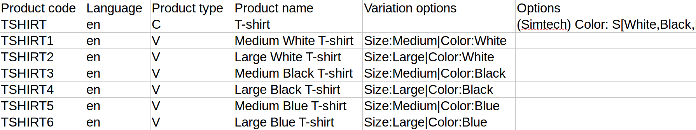

****************************************************
How To: Import Configurable Products with Variations
****************************************************

.. note::

    The ability to create product variations via import wasn't available until CS-Cart and Multi-Vendor 4.7.2. Product variations are a part of the :doc:`Product Variations </user_guide/addons/product_variations/index>` add-on.

During :doc:`product import </user_guide/manage_products/import_export/product_import>` you can create and update :doc:`configurable products and their variations </user_guide/manage_products/products/simple_versus_configurable>`. Variations are imported together with configurable products, as separate entries in the same CSV file.

This article only covers how to arrange configurable products and variations in an imported CSV file. Your file may include more columns such as **Quantity**, **Price**, etc.

#. The :ref:`Product type <import-product-type>` column must be present. The values in it determine the type of a product:

   * ``P``—a simple product.

   * ``C``—a configurable product.

   * ``V``—a variation of the configurable product.

#. The imported CSV file must always have the entry of the configurable product when you create or update the variations of that product. 

   The relative order of entries in the file is important: the entry of a configurable product goes first, and the entries of its variations must come right after it, in the following lines. 

   .. note::

       If you insert a line with a simple product between variations (like *CVPV* instead of *PCVV* or *CVVP*), you'll get an error.

#. As usual, the values in the :ref:`Product code <import-product-code>` column serve to distinguish new products and variations from existing ones during import. So, if a product or a variation with the specified code is found in the store, the import will overwrite it.

#. Variations are based on :doc:`product options </user_guide/manage_products/options/index>`. That's why a configurable product (``C``) must have a value specified in the :ref:`Options <import-options>` field of the CSV file in the following cases:

   * The configurable product doesn't exist yet and will be created during import.

   * The configurable product already exists but doesn't have options and any variations yet. 

   .. note::

       If the configurable product already exists and has at least one variation, then the values provided in the **Options** field won't be imported.

#. Each variation must have a value specified in the :ref:`Variation options <import-variation-options>` column. This column contains the information about the option variants that comprise this variation. There are two rules to remember:

   * Only variations should have variation options specified.

   * Two different variations of a single configurable product can't have the same variation options.
