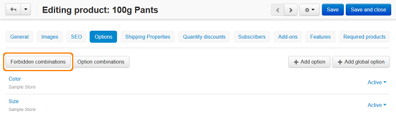

*********************************
Exceptions/Forbidden Combinations
*********************************

To add a forbidden combination:

*   In the Administration panel, go to **Products → Products** and click on the desired product link.
*	Open the **Options** tab and click the **Forbidden combinations** button above the list of the product options. This will open the **Forbidden combinations** page.

*   On the opened page, click the **+** button.
*   In the opened window, create the unavailable combination and click the **Create** button.

The combination will be added to the list of unavailable option combinations. A customer will not be able to select this option combination on the product details page.

.. image:: img/forbidden_comb_02.png
    :align: center
    :alt: New combination

Also, in **Settings → General** you can find the **Exception style** setting that allows regulating exception behavior.

By default, the setting is set to *Hide exception*. This means that the defined unavailable option combinations will be removed from the product options when they are displayed in the storefront. Another value of the **Exception style** setting is *Show warning on exception*. This means that all variants of product options will be displayed, but if a customer selects unavailable option combination, he will see the *Unfortunately this combination is not accessible* notification.