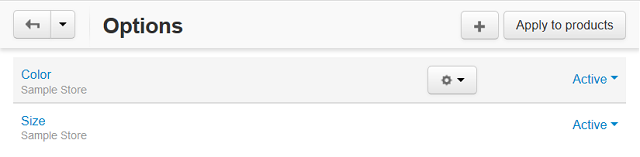

*******
Options
*******

Use this section to manage global product options and option variants in your store. Global options work in the same manner as the product specific options, but they can apply to multiple products.

Here you can add a new option with the **+** button or you can apply existing options to products with the **Apply to products** button.
To edit or delete an option, click the gear button and choose the action from the drop-down list.

Sometimes it is useful to disable options instead of deleting them. To make an option *Active/Disabled* use the drop-down list to the right.

In this section
***************

.. toctree::
    :maxdepth: 1
    :glob:

    product_options
    option_attributes
    global_options
    option_settings
    option_combinations
    comb_images
    exceptions
    max_file_uploads
    inventory_tracking
