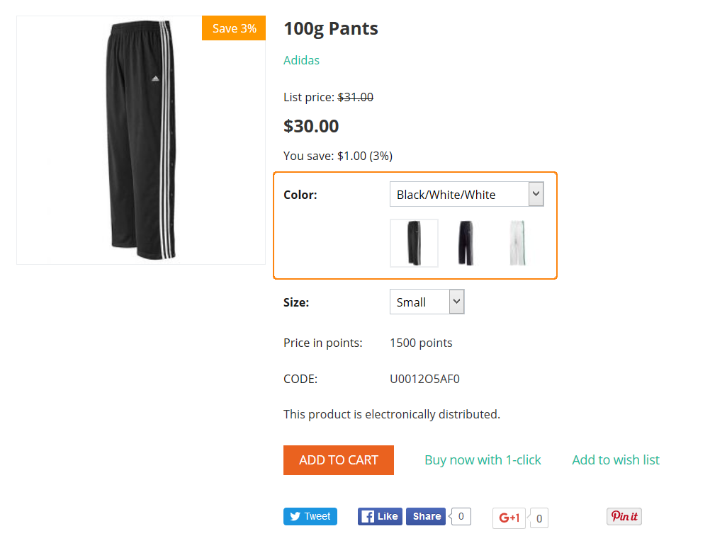

*************************************
Option and Option Variants Attributes
*************************************

Option attributes
*****************

Product options appear on the product details page on the storefront as selectable or input parameters to the product. Options can have the following attributes:

*	**Name** - Name of the product option as it appears on the storefront.
*	**Position** – Position of the product option relatively to the position of the other options in the list.
*	**Inventory** – If selected, the option has its own number of items in stock, which is tracked separately.
*	**Store** - Store to which the product option originally belongs.
*	**Type** – Type of the product option: *Select box*, *Radio group*, *Check box*, *Text*, *Text area* or *File*. Specification of some of the option types read in this :doc:`article <../options/option_settings>`.
*	**Description** - Description of the product option as it appears on the storefront under the question sign (**?**) next to the option name.
*	**Comment** – Comment to be displayed below the option on the storefront.
*	**Required** - If selected, this option is mandatory for selection/completion.
*	**Missing variants handling** - Select how impermissible/missing option combinations should be handled:

	*	*Display message* - the option will be marked as not available, if the option is mandatory (see the previous setting) customers will not be able to add the product to the cart.
	*	*Hide option completely* - the option will be hidden, if the option is mandatory (see the previous setting) customers will be able to add the product to the cart.

Variants attributes
*******************

An option variant is an extension to the product option of types *Select box*, *Radio group* or *Check box*, which may have its own status, icon, and amount of reward points as well as a weight modifier and a price modifier.

Option variants have the following attributes:

*	**Position** – Position of the variant relatively to the position of the other variants in the list.
*	**Name** – Name of the product variant. For example, if the option is titled *Size*, the product variants to the option can be *small*, *medium*, *large*, etc.
*	**Modifier/Type** - Positive or negative value that modifies the original product price. The modifier can be either an absolute value or a percentage.
*	**Weight modifier/Type** - Positive or negative value that modifies the original product weight. The modifier can be either an absolute value or a percentage.
*	**Status** - Status of the product option (*Active* or *Disabled*).
*	**Icon** – Thumbnail to represent the option variant. The image can be either uploaded from a local computer or the server file system, or linked to a remote location where the required image is physically located.
	An alternative text describes the image and is shown when the image is missing or cannot be displayed. It is good practice to have an alternative text associated with the image as an additional SEO-wise opportunity.

	These images are shown in the option variants section on the product detail page in the storefront.

*	**Earned point modifier/Type** (requires commercial license) - Positive or negative value that modifies the original number of reward points that customers receive at their accounts when they buy the product. The modifier can be either an absolute value or a percentage.