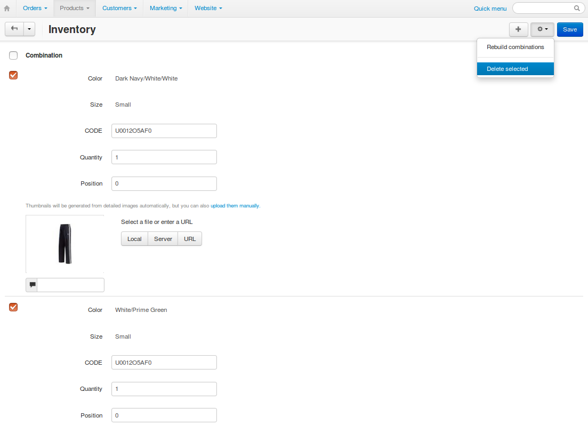

***************************
Product Option Combinations
***************************

.. warning::

    This article is no longer relevant, because option combinations are deprecated. They might exist in your store only if you upgraded from a previous version that had them. To track inventory for similar products and let customers switch between them easily, please use :doc:`product variations </user_guide/manage_products/products/product_variations>`.

To make inventory tracking easier, you can group different combinations of :doc:`product option variants <product_options>` under **option combinations**. For example, clothes come in various colors and sizes. Option combinations allow you to track separately, how many *blue XL-sized T-shirts* and *white M-sized T-shirts* you have. 

.. note::

    Only *Check box*, *Select box*, and *Radio group* options that have the **Inventory** checkbox ticked can be a part of a combination.

.. _tracking-with-options: 

================
Add Combinations
================

#. In the Administration panel, go to **Products → Products**.

#. Click the name of the product you want to edit.

#. (optional) Set the **Inventory** setting to *Track with options* and click the **Save** button. This will allow you to track product quantity for each option combination separately.

#. Switch to the **Options** tab and click **Option combinations**. This will take you to the list of option combinations for this product.

   .. important::

       The **Option combinations** button appears only if the product has options.

   .. image:: img/option_combinations_01.png
       :align: center
       :alt: The Options tab

#. Click the **+** button on the right to add combinations manually.

   .. hint::

       You can automatically create all possible option combinations for the product. To do that, click the gear button instead of **+**, and choose **Rebuild combinations**. This won't overwrite the existing combinations.

   .. image:: img/add_combination.png
       :align: center
       :alt: Use the + button or the gear button to add product option combinations.

#. A pop-up window will open. There you can select the option variants that comprise the combination. Use the buttons on the right to add, clone, and remove combinations from the list.

   .. image:: img/add_option_combinations.png
       :align: center
       :alt: You can add multiple option combinations at once.

#. Click **Create** to add the new option combinations to the list.

   .. important::

       If a new option is added for the product, then the existing combinations won't change automatically.

=================
Edit Combinations
=================

Once you create an option combination, you won't be able to change what option variants are a part of it. If you open the list of existing option combinations of a product, you will only be able edit the following parameters:

* **Code**
* **Quantity** (only if you enabled tracking with options :ref:`in step 3 here <tracking-with-options>`)
* **Image** (:doc:`learn more about it here <comb_images>`)

Remember to click the **Save** button in the upper right part of the page once you've made your changes.

.. note::

    When a customer selects an option combination on the storefront, the image of the option combination will replace the main product image.

.. image:: img/option_combinations_02.png
    :align: center
    :alt: Inventory

===================
Delete Combinations
===================

* **Delete one combination:** hover over the combination, click the gear button, and choose **Delete**.

* **Delete multiple combinations:** tick the checkboxes of the combinations to be deleted, click the gear button in the upper right part of the page, and choose **Delete selected**.

