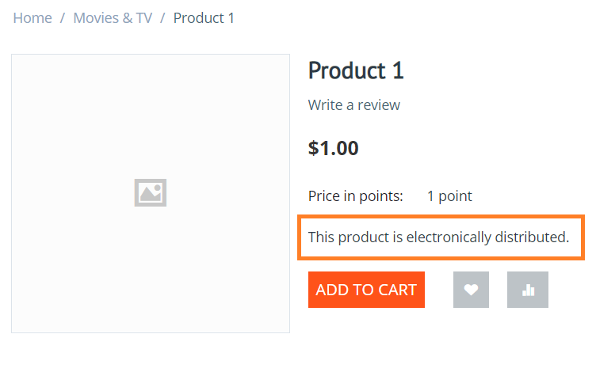
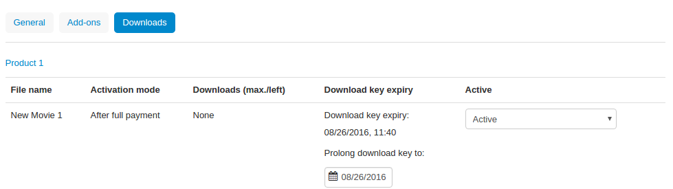

****************************
How to Add and Edit Products
****************************

CS-Cart allows to add and edit products using different methods.

.. contents::
    :backlinks: none
    :local: 
    :depth: 1

.. _products-add-simple:

==================
Adding One Product 
==================

#. Go to **Products → Products** in the Administration panel of your store, then click the **+** button in the top right corner.   

   .. image:: img/catalog_29.png
       :align: center
       :alt: The "Plus" button adds a new product.

#. The product creation page will open. Configure the required properties of the product:

   * Name

   * Categories

   * Price

   * Status

   .. image:: img/catalog_30.png
        :align: center
        :alt: The product creation page in CS-Cart.

   .. note::

       Fill in other fields too, if you'd like. You'll be able to edit all the product properties later at any time. Some properties don't appear during product creation and are available only when you edit a product.

#. Click the **Create** button.

.. _products-add-group:

========================
Adding Multiple Products
========================

#. Go to **Products → Products** in the Administration panel of your store.

#. Click the **gear** button in the top right corner and choose **Bulk product addition**.

   .. image:: img/catalog_31.png
       :align: center
       :alt: Click the gear button and choose "Bulk product addition".

#. Add products and fill in the empty fields.

   .. image:: img/catalog_32.png
       :align: center
       :alt: Fill in the required product properties.

#.  Click **Create**.

=================
Cloning a Product
=================

If you plan to have several products with identical properties, you don't need to create each of them manually. Instead of specifying the product properties each time that you add a new product, you can:

#. Set up one sample product with the common properties.

#. Clone the sample product.

#. Change the names and individual properties of the clone products.

-----------------------
On the List of Products
-----------------------

#. Go to **Products → Products** in the Administration panel of your store.

#. Tick the checkboxes of the products that you'd like to clone.

#. Click the gear button and choose **Clone selected**.

   .. image:: img/catalog_33.png
       :align: center
       :alt: Cloning a product in CS-Cart.

#. Clone products will be created with *Disabled* status.

   .. image:: img/catalog_34.png
       :align: center
       :alt: A duplicate product in CS-Cart.

#. Edit the clone products and enable them by changing their statuses to *Active*.

---------------------------
On the Product Editing Page
---------------------------

#. Go to **Products → Products** in the Administration panel of your store.

#. Click the name of the product you'd like to clone. 

#. The product editing page will open. Click the gear button in the top right corner and choose **Clone**.

   .. image:: img/catalog_35.png
       :align: center
       :alt: Cloning a specific product from the editing page.

.. _products-bulk-editing:

=================================
Editing Multiple Products at Once
=================================

You can edit the properties of a group of products.

#. Go to **Products → Products** in the Administration panel of your store.

#. Tick the checkboxes of the desired products, click the gear button, and choose **Edit selected**.         

   .. image:: img/catalog_75.png
       :align: center
       :alt: The "Edit selected" button allows you to edit specific properties of multiple products at once.

#. A pop-up window will open. Tick the checkboxes of the product properties you'd like to edit, then click **Modify selected**.

   .. note:: 

       Avoid choosing too many properties at once, or else it will be inconvenient to edit them all.

   .. image:: img/catalog_76.png
       :align: center
       :alt: Tick the checkboxes of the product properties you'd like to edit.

#. The selected products and their properties will appear on one page. Edit them, then click the **Save** button in the top right corner.

   .. hint::

       Use **Apply values to all the selected products** in the top left corner to update the value of a properties for all selected products at once.

   .. image:: img/catalog_77.png
       :align: center
       :alt: The chosen properties of all selected products will appear on one page.

.. _products-global-update:

==========================================
Updating Prices and Stock for All Products
==========================================

CS-Cart has a special page where you can update some properties all products at once. For example, you can increase the prices of all products by 10%, or increase the list price to display discount labels on all products. 

To update all products:

#. In the Administration panel, go to **Products → Products**.

#. Click the gear button in the top right part of the page and choose **Global update**.

   .. image:: img/catalog_27.png
       :align: center
       :alt: Global update of products in CS-Cart.

#. A new page will open. There you can update the following product properties:

   * Price

   * List price

   * In stock (the number of products in stock)

   * Price in points

   By default, the update is performed for all products. But if you use the **Add product** button, then the properties will be updated only for the selected products.

#. Once you've chosen how to update product properties, click **Apply**.

   .. image:: img/catalog_28.png
       :align: center
       :alt: The global update page allows you to adjust prices and stock of all products at once.

.. _products-csv-import:

==================
Importing Products
==================

You can import (upload) products from a `CSV <https://en.wikipedia.org/wiki/Comma-separated_values>`_ file. CSV is a popular spreadsheet format. A line in a CSV file is one line of the table.

CSV files can be edited in spreadsheet editors such as LibreOffice Calc, OpenOffice Calc, Microsoft Excel. We recommend using `LibreOffice <http://www.libreoffice.org/download/download/>`_ (a free office suite) to edit CSV files.

To demonstrate the full process, let's export one of the products to a CSV file first. 

#. Go to **Products → Products** in the Administration panel of your store.

#. Select one of the products, click the gear button, and choose **Export selected**.

   .. image:: img/catalog_36.png
       :align: center
       :alt: CS-Cart allows you to export all products or specific groups of products.

#. The **Export data** page will open. There you will be able to chose the exported fields and change export properties. Each exported field is an equivalent of a product property. We recommend you to leave everything as is for the first time. After everything is set up, click **Export**.

   .. image:: img/catalog_37.png
       :align: center
       :alt: Selecting the product properties that will be exported.

#. Open the exported file in the spreadsheet editor. The default delimiter for CSV is semicolon.

   .. image:: img/catalog_39.png
       :align: center
       :alt: An exported CSV file in the spreadsheet editor.  

#. Each column of the table contains the specific type of the product data. 

   The product is identified by the *Product code*; it means that:

   * All products must have unique product codes.

   * If a product code already exists in a database, the product with this code will be updated or replaced.

   * If the product doesn't exist in a database, a new product will be created.

   When you import a product, some fields are required:

   * Product code

   * Language

   * Store — the storefront to which the product belongs.

   * Product name — the name of the product

   * Category — the category to which the product belongs. 

     .. note::

         If a category doesn't exist in the database, it will be created. Use category delimiters to create a tree-like category structure and add a product to a specific subcategory.

   Other fields are optional. This time we recommend exporting only these required fields.

#. Use the sample product as an example and add new products to the table. Each line is a new product.

   .. image:: img/catalog_40.png
       :align: center
       :alt: New products in the CSV file.  

#. Save the file in the CSV format.

#. Now let's import the products to the store. To do it, go to **Administration → Import data → Products**.

   .. image:: img/catalog_41.png
       :align: center
       :alt: How to open the product import page in CS-Cart. 

   .. image:: img/catalog_43.png
       :align: center
       :alt: The product import page.   

#. Go to the bottom of the page, choose a file to import, and click the **Import** button.

   .. image:: img/catalog_42.png
       :align: center
       :alt: Selecting a CSV file to be imported.  

#. You'll receive a notification how the import went.

   * The number of products created.

   * The number of products updated.

   .. image:: img/catalog_44.png
       :align: center
       :alt: Notification about import results in CS-Cart.   

Done!

.. _products-add-digital:

========================
Adding a Digital Product
========================

CS-Cart allows to sell digital products.

.. important::

    First of all, go to **Settings → General** and make sure that the **Enable selling downloadable products** checkbox is ticked. Otherwise you won't be able to mark a product as digital.

#. :ref:`Add a product. <products-add-simple>`

#. Open the **Files to sell** tab on the product editing page.

   .. image:: img/catalog_66.png
       :align: center
       :alt: The "Files to sell" tab lists the files of the digital product.

#. Add the files that you want to sell. Files can be grouped by folders.

   .. image:: img/catalog_67.png
       :align: center
       :alt: Adding a new downloadable file for a product.      

#. The additional properties are available for digital products on the **General** tab in the **Extra** section:

   * *Downloadable*—this checkbox is ticked automatically after the file is added to the product.

   * *Enable shipping for downloadable products*—if this checkbox is ticked, shipping costs will be calculated for this downloadable product just like for normal products.

   * *Time-unlimited download*—if this checkbox is ticked, the product download period never expires.

   .. image:: img/catalog_69.png
       :align: center
       :alt: The additional properties of downloadable products.

The digital product has been created. Create a test order and check the result.

If you uploaded a file for the downloadable product, there will be the **Files** tab on the product page on the storefront.

Once a digital product is purchased:

#. An email with the download link is sent to the customer.

#. The download link will become available on the order details page of the customer's account.

   .. image:: img/catalog_70.png
       :align: center
       :alt: A link to download the product in the order details.

#. All the purchased digital products will be available to the customer on the **Downloads** page of the customer's account. 

   .. image:: img/catalog_71.png
       :align: center
       :alt: Reaching the "Downloads" page in CS-Cart.

   .. image:: img/catalog_72.png
       :align: center
       :alt: The "Downloads" page lists all the files available to the customer.

In the administration panel, orders with downloadable products will appear on a new tab called **Downloads**. There administrators can approve the download, prolong the download availability period, and check the number of downloads left.

