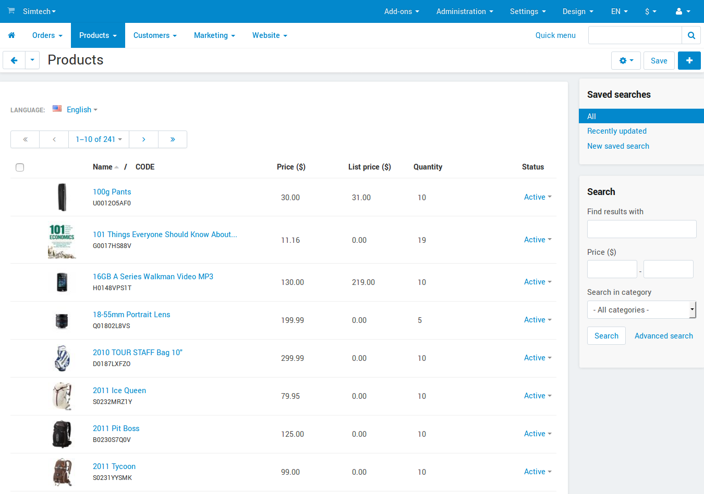

********
Products
********

Use this section to manage the products in your catalog. It displays a sorted list of all products in the store. To filter the list, use the search to the right of the list.

Each entry in the list has the following attributes:

*	**Image** – Product thumbnail.
*	**Name** – Name of the product and the internal product code (SKU number). This number must not necessarily be unique, or it can even be missing.
*	**Price** – Product price.
*	**List price** – Price suggested by the product manufacturer. Good practice is to show that your price is lower than the list price.
*	**Quantity** – Number of products in the stock.
*	**Status** – *Active* – product is available on the storefront, *Disabled* – product is not available on the storefront, or *Hidden* – product does not appear on the storefront, but customers can access it via a direct link.

These attributes can be changed on the fly without opening the product for editing.

Actions on products
*******************

The store administrator can carry out the following actions on the products:

*	Add products individually or in bulk:

	*	To add products individually, click the **+** button in the upper right part of the page.
	*	To add products in bulk, click the gear button in the upper right part of the page, and choose **Bulk product addition**.

*	Clone products:

	*	To clone selected products, tick the checkboxes of the desired products, click the gear button in the upper right part of the page, and choose **Clone selected**.

*	Change attributes per product or simultaneously for several products:

	*	To change attributes per product, hover the mouse pointer over a product and click the appearing gear button. Choose **Edit**.
	*	To change attributes simultaneously for several products, tick the checkboxes of the desired products, click the gear button in the upper right part of the page, and choose **Edit selected**.

*	Export products:

	*	To export selected products, tick the checkboxes of the desired products, click the gear button in the upper right part of the page, and choose **Export selected**. See this `topic <http://docs.cs-cart.com/4.4.x/user_guide/manage_products/import_export/product_export.html>`_ for more information about export procedures.

*	Delete products:

	*	To delete a particular product, hover the mouse pointer over this product and click the appearing gear button. Choose **Delete**.
	*	To delete several products simultaneously, tick the checkboxes of the desired products, click the gear button in the upper right part of the page, and choose **Delete selected**.

*	Look through the list of products with subscriptions:

	*	To look through the list of subscriptions, click the gear button in the upper right part of the page, and choose **Product subscriptions**.

*	Export products to eBay:

	*	To export selected products to eBay, tick the checkboxes of the desired products, click the gear button in the upper right part of the page, and choose **Export to eBay**. The `eBay synchronization <http://docs.cs-cart.com/4.4.x/user_guide/addons/eBay/index.html>`_ add-on must be installed and set up in the **Add-ons → Manage add-ons** section.

In this section
***************

.. toctree::
    :maxdepth: 1
    :glob:

    product_attributes
    out_of_stock_actions
    attaching_files_to_products
    downloadable
    max_order_quantity
    minimum_order_quantity
    quantity_select_box
    same_value_all_products
    upload_file_size
    wholesale
    images_import_problem
    incorrect_thumbnails
    wysiwyg
