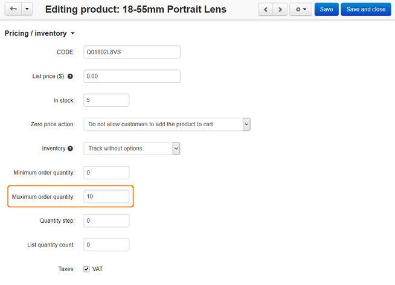

*****************************************************
How To: Set up a Maximum Order Quantity for a Product
*****************************************************

To set up a maximum order quantity for a product:

*	In the Administration panel, go to **Products → Products**.
*	Click on the name of the desired product.
*	Enter the desired number in the **Maximum order quantity** input field under the **Pricing/Inventory** section.

*	Click the **Save** button.

.. important::

	After that a customer will not be able to buy more items of this product than the number set up in the **Maximum order quantity** option.