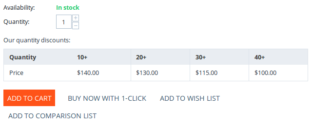

****************************************
Product Properties (Fields and Settings)
****************************************

When you create or edit a product, you should specify a number of product properties. For convenience, properties are grouped by tabs on the product editing page.

.. image:: img/product_attributes_01.png
    :align: center
    :alt: Tabs with properties on the product editing page.

.. note::

    Most of product properties can be specified via :doc:`product import </user_guide/manage_products/import_export/product_import>`.

.. contents::
    :backlinks: none
    :local: 
    :depth: 1

=======
General
=======

-----------
Information
-----------

* **Name**—the name of the product as it appears on the storefront and in the Administration panel. The name of the same product can differ, depending on the storefront and language.

* **Categories**—the categories that the product will be assigned to. When a product has multiple categories, the first category on the list will be the main category for the product. To change the main category, just drag another category in its place.

* **Price**—base product price in your store's primary currency. Prices in other currencies are converted automatically, according to the exchange rate that you specify. All calculations are done in the primary currency.

* **Full description**—the product description that will appear on the product details page of the storefront. The description can be either a plain text or a formatted HTML text. If you're not familiar with HTML code, you can rely on the visual editor: you simply edit product description like a document, and the visual editor adds the HTML code automatically.

  .. hint::

      You can choose or disable the visual editor under **Settings → Appearance → Default WYSIWYG editor**.

* **Status**—the status of the product:

  * *Active*—the product is available on the storefront and appears in the product list.

  * *Disabled*—the product is not available on the storefront.

  * *Hidden*—product does not appear in the product list on the storefront. Customers can reach a hidden product via a direct link.

* **Images**—:doc:`the images of the product </user_guide/look_and_feel/logos_banners_images/images_for_store/>`. Supported formats are JPEG, GIF, and PNG. The maximum size of an uploaded image depends on your server configuration. As a rule, it should not exceed 2 MB. Thumbnails for these images will be generated automatically.

  One of the uploaded images will appear larger than the others. That's the main product image that is displayed on the product list and on the product details page by default. To change the main image, simply drag and drop another image in its place. You can also change the order of additional images the same way.

  If you hover over an image, you'll be able to view the full-sized image, delete it, or edit its alt text. This text will be shown when the image is missing or cannot be displayed. It is a good practice to have an alternative text associated with the image, for SEO purposes.

-------------------
Pricing / Inventory
-------------------

* **CODE**—the identifier of the product that you use in your store (a stock keeping unit or SKU); it is used to distinguish products from each other during import, so that the data would be saved to the right product.

* **List price**—if this price is higher than product's **Price**, then a discount label will be displayed for the product.

* **In stock**—the number of products in the stock. Products that are out of stock can't be bought, unless you enable the **Allow negative amount in inventory** setting under **Settings → General → Catalog**.

* **Taxes**—select the :doc:`taxes <../../shipping_and_taxes/index>` that will be applied to the product.

------------
Availability
------------

* **User groups**—the :doc:`user groups <../../users/user_groups/index>` that can access the product's page.

* **Creation date**—the date when the product was added to the catalog. It is used for sorting products by date.

* **Avail since**—the date when the product becomes available for purchase. It is useful when you want to start selling at a specific date, or when the product isn't available yet.

* **Out-of-stock actions**—select if customers should be able to buy the product in advance before it is not yet available for sale, or sign up to receive an email notification when the product is available. 

  .. hint::

      Learn more about :doc:`out-of-stock actions <out_of_stock_actions>`.

-----
Extra
-----

* **Product details view**—choose a template (basically, the look) of the product page. By default, CS-Cart has 2 templates, but you can develop your own templates according to your needs.

* The next settings appear, if the checkbox **Enable selling downloadable products** is ticked on the **Settings → General → Catalog**. 

  * **Downloadable**—if this checkbox is ticked, the product is labeled as downloadable, i.e. distributed by download.

  * **Enable shipping for downloadable products**—if this checkbox is ticked, shipping costs will be calculated for this downloadable product just like for normal products.

  * **Time-unlimited download**—if this checkbox is ticked, the product download period never expires. 

    .. note::

        As a rule, customers only have a certain period of time to download a purchased product. That time period is controlled by **Download key TTL** setting in **Settings → General**.

* **Short description**—a short product description; it appears on the product list on the storefront. If you leave this field blank, the short description will be automatically taken from the full product description (first 300 characters).

* **Popularity**—integer conveying the product popularity, which is calculated automatically. This rating depends on the number of product views as well as the number of times the product was added to the cart and purchased. Products can be sorted by popularity on the storefront.

* **Search words**—the list of words by which the product should be easily found by the built-in search.

* **Promo text**—an additional block with information that appears on the top right side of the product page.

===
SEO
===

---
SEO
---

* **SEO name**—the value to which the standard URL will be changed. This property is a part of the :doc:`SEO </user_guide/addons/seo/index>` add-on.

---------
Meta data
---------

* **Page title**—the content of the ``<title></title>`` container: the title of the product page on the storefront, which is displayed in the web browser when somebody is viewing the page. If you don't specify a value manually, it will be generated automatically.

* **META description**—the content of the ``description`` meta-tag: a brief description of the product.

* **META keywords**—the content of the ``keywords`` meta-tag: a list of search keywords that appear on the product page.

.. note::

    Instructions on how to best use the meta-tags may vary depending on the search engine.

.. image:: img/product_attributes_02.png
    :align: center
    :alt: The "SEO" tab of a product in CS-Cart.

=======
Options
=======

This tab allows you to manage :doc:`product options <../options/index>` and option variants, as well as control the option combinations and add forbidden/allowed combinations.

.. image:: img/product_attributes_03.png
    :align: center
    :alt: The "Options" tab of the product editing page.

Product options appear on the product details page on the storefront. Depending on the type of an option, customers either select one of the option variants or provide their own variant. A separate article describes :doc:`the properties of options </user_guide/manage_products/options/option_attributes>`.

==========
Variations
==========

On this tab you can create :doc:`similar products <product_variations>` and add them to the group.

* **Add variations**—create variations based on product characteristics (automatically) or using existing products.

* **Add to variation group**—add this product as a variation to any existing group.

===================
Shipping Properties
===================

This tab contains a number of product properties that are important for automatic shipping cost calculation.

* **Weight**—the weight of a single item in the store's default weight measurement unit. The default weight measurement unit can be specified under **Settings → General**.

* **Free shipping**—if you tick this checkbox, the product will be excluded from the shipping cost calculation, as long as the shipping method has the **Use for free shipping** checkbox ticked.

* **Shipping freight**—the handling fee (insurance, packaging, etc.) added to the shipping cost.

* **Items in a box**—the minimum and maximum number of product items to be shipped in a separate box. Usually it's  ``1 - 1`` (only one product per box).

* **Box length**—the length of a separate box.

* **Box width**—the width of a separate box.

* **Box height**—the height of a separate box.

.. note::

    If you don't specify box dimensions, values will be taken from the shipping method. Box-related properties are required for a more accurate shipping cost estimation when a real-time shipping method supports multi-box shipping  (UPS, FedEx, and DHL). 

.. _catalog-quantity-discounts:

==================
Quantity Discounts
==================

This tab contains the list of wholesale prices for the product. Customers will see those discounts on the product page on the storefront. Prices apply depending on the number of items of this product in cart.

* **Quantity**—the minimum number of product items to qualify for the product wholesale price.

* **Value**—the value of the discount (per item).

* **Type**—the type of the discount: 

  * *Absolute*—the cost of 1 discounted item.

  * *Percent*—the percent discount off the base product item price. 

* **User group**—the :doc:`user group <../../users/user_groups/index>` which can take advantage of the wholesale price.

  .. important::

      If you set up a discount that applies for all user groups for purchasing 1 item, this will overwrite product price.

.. image:: img/product_attributes_05.png
    :align: center
    :alt: Configuring quantity discounts in CS-Cart.

=============
Files to Sell
=============

This tab contains a list of files that are associated with this :ref:`downloadable product <products-add-digital>`.

.. note:: 

    For digital instructions and/or files that come with a physical product and don't have to be bought, we recommend using the **Attachments** tab instead.
 
Each file has the following properties:

* **Name**—the name of the file as your customers will see it on the product page. Note that it does not change the original file name.

* **Position**—the position of the file relatively to the positions of the other files in the list.

* **File**—the actual file that will become available for download after purchase.

* **Preview**—a preview file that can be freely downloaded from the product details page on the storefront.

* **Activation mode**—determines how the download link will be activated: 

  * *Immediately*—immediately after the order has been placed.

  * *After full payment*—once the order status has changed to *Processed* or *Complete*.

  * *Manually*—manually by the store administrator.

* **Max downloads**—the maximum number of allowed product downloads per customer.

* **License agreement**—the text of the license agreement.

* **Agreement required**—determines whether the customers must accept license agreement at checkout.

* **Readme**—additional instructions (for example, installation instructions, etc.)

* **Folder**—the folder to which the file belongs (if you created any).

===========
Subscribers
===========

.. important::

    This functionality has nothing to do with **Marketing → Newsletters → Subscribers**, which is a part of the :doc:`Newsletters <../../addons/newsletters/index>` add-on.

When a product is out of stock, you may allow customers to subscribe for an email notification. It will be sent automatically to inform the customers that the product is available again.

Each product has its own list of email addresses, available on the **Subscribers** tab. When a product is in stock again, the notification is sent to all subscribers, and then their emails are removed from the subscriber list of the product.

As you can see, the process is entirely automated. However, you can add subscribers manually, if necessary.

.. hint::

    More information about product subscribers is available in :ref:`the dedicated article <product-subscribers>`.

=======
Add-ons
=======

This tab contains product properties that depend on the active add-ons; for example:

---
RMA
---

.. note::

    This is a part of the :doc:`RMA <../../addons/rma/index>` add-on.

* **Returnable**—if you tick this checkbox, the product will be labeled as available for the return.

* **Return period**—the time period (in days) during which the product can be returned. The period begins on the day of purchase.

-----------
Bestselling
-----------

.. note::

    This is a part of the :doc:`Bestsellers & On-Sale Products <../../addons/bestsellers_and_on_sale_products/index>` add-on.

* **Sales amount**—the number of sold product items. This value is calculated automatically when the **Bestsellers & On-Sale Products** add-on is active, but you can also change the current value manually.

----------------
Age Verification
----------------

.. note::

    This is a part of the :doc:`Age verification <../../addons/age_verification/index>` add-on.

* **Age verification**—if you tick this checkbox, the access to the product will be limited by the customer's age.

* **Age limit**—the minimum age for accessing the product.

* **Warning message**—the message to be displayed, if the customer does not qualify for accessing the product.

--------------------
Comments and Reviews
--------------------

.. note::

    This is a part of the :doc:`Comments and reviews <../../addons/comments_and_reviews/index>` add-on.

* **Reviews**—choose whether to allow comments, reviews, or both for this product.

========
Features
========

This tab allows you to define the values of the extra fields that are valid for the product. The set of extra fields is controlled in **Products → Features**.

============
Product Tabs
============

On this tab you can see the list of tabs, applied to the current product. Next to a tab name you can see its status—*Active* or *Disabled*. 

Editing and adding product tabs is done in the **Design → Product tabs** section.

.. hint::

    To see what the product page looks like, Click the gear button and select **Preview**.

============
Buy Together
============

.. note::

    This tab requires the :doc:`Buy Together <../../addons/buy_together/index>` add-on to be active.

On this tab, you can bind the product with other products from the catalog and offer a discount if the bound products are bought together. A set of the bound products is referred to as a *product combination*. The discount is promoted on the product details page on the storefront, and customers can decide whether they want to profit by the offer or not.

Along with the set of bound products and the offered discount, each combination has the following properties:

* **Name**—the name of the product combination.

* **Description**—the description of the product combination as it appears on the storefront.

* **Use available period**—if this checkbox is ticked, you'll be able to set:

  * **Available from**—the date when the product combination becomes available for customers.

  * **Available till**—the date until the product combination is available.

* **Display in promotions**—if this checkbox is ticked, the combination will appear on the list of promotions (``index.php?dispatch=promotions.list``).

* **Status**—the status of the product combination (*Active* or *Disabled*).

====
Tags
====

.. note::

    This tab requires the :doc:`Tags <../../addons/tags/index>` add-on to be active.

This tab includes a list of tags associated with the product. Tags appear on the storefront in the **Tags**.

* **Tags**—the tags that have been added to the product. Once you start typing, CS-Cart will use autocomplete to suggest what existing tag you may be entering.

.. image:: img/product_attributes_06.png
    :align: center
    :alt: The "Tags" tab.

===========
Attachments
===========

.. note::

    This tab requires the :doc:`Attachments <../../addons/attachments/index>` add-on to be active.

This tab contains :doc:`files associated with the product <attaching_files_to_products>`. Unlike the contents of the **Files to sell** tab, the files that appear here are available for non-downloadable products as well. Each attachment has the following properties:

* **Name**—the name of the product attachment.

* **Position**—the position of the attachment relatively to the position of the other product attachments.

* **File**—the file that is used as the product attachment.

* **User groups**—the :doc:`user groups <../../users/user_groups/index>`, for which the attachment is available.

=============
Reward Points
=============

.. note::

    This tab requires the :doc:`Reward Points <../../addons/reward_points/index>` add-on to be active.

Use this tab to set up the product price in reward points and specify the number of reward points to be earned for purchasing the product.

---------------
Price in points 
---------------

* **Allow payment by points**—if you tick this checkbox, customers will be able to pay for the product product with reward points.

* **Override global PER**—if this checkbox is ticked, the product will have a fixed price in points, that is independent of the point-to-money exchange rate.

* **Price in points**—a fixed product price in points.

-------------------------
Points earned per product
-------------------------

* **Override global/category point value for this product**—if you tick this checkbox, the values below override the global reward points specified in **Marketing → Reward points**.

* **User group**—the :doc:`user groups <../../users/user_groups/index>`, members of which will get reward points for buying the product.

* **Amount**—the number of reward points to be granted to the user group member who bought the product.

* **Amount type**—the absolute number of points or percentage-based value calculated in the following manner: the product cost is divided into 100, and the result is multiplied by the value in the field.

=======
Reviews
=======

.. note::

    This tab requires the :doc:`Comments and reviews <../../addons/comments_and_reviews/index>` add-on to be active. This tab appears only when communication and/or rating is enabled for the product on the **Add-ons** tab.

The list of customers' reviews of the product. Here you can add own reviews and edit existing product reviews and ratings.

=================
Required Products
=================

.. note::

    This tab requires the :doc:`Required Products <../../addons/required_products/index>` add-on to be active.

This tab contains a list of required products, which will be added to cart along with this product. To add a new required product, click the **Add product** button.

.. image:: img/product_attributes_07.png
    :align: center
    :alt: Required products

=======
Layouts
=======

The content of the product details page. This tab duplicates the :doc:`global layout </user_guide/look_and_feel/layouts/index>` of a product page.

Here you can enable or disable some blocks, changing the product's page that way. Any changes you make here will not affect the pages of other products.
