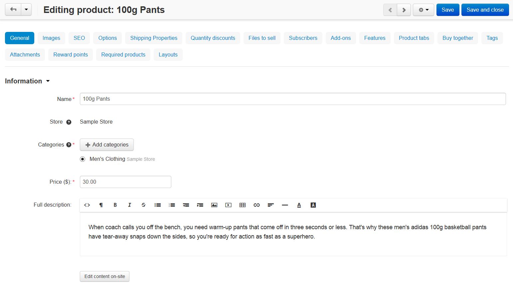
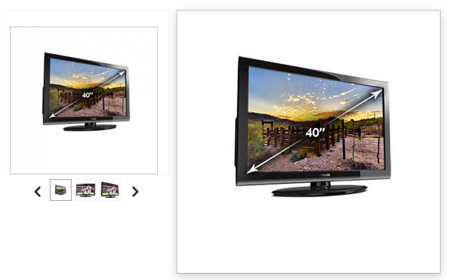
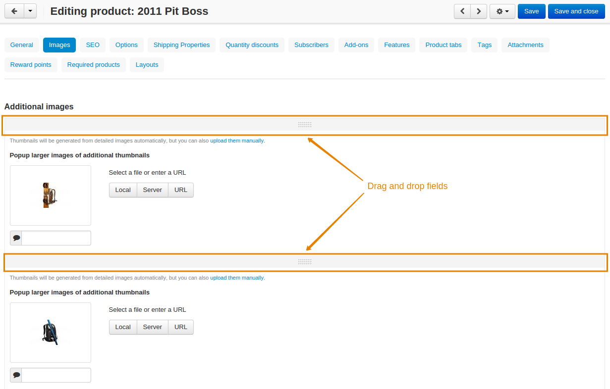
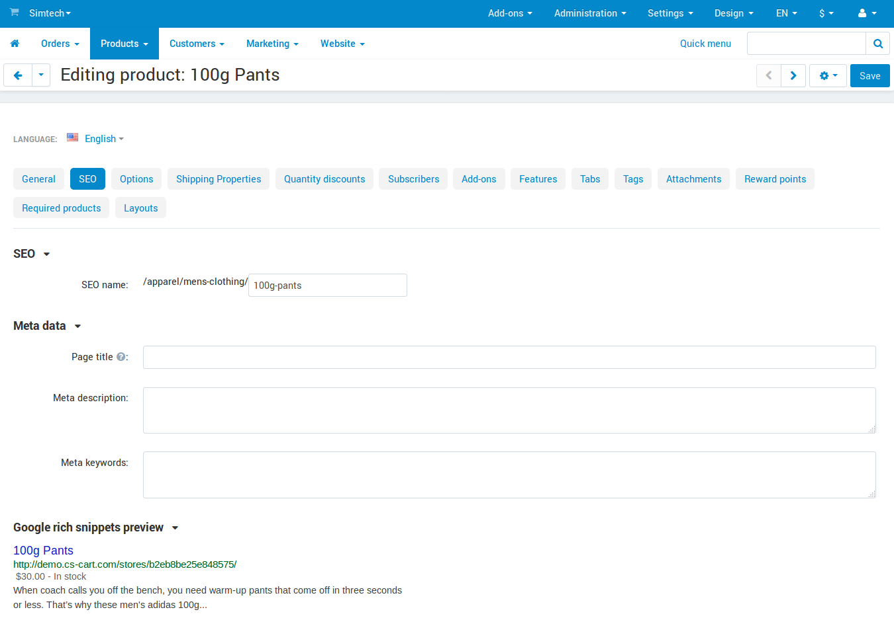
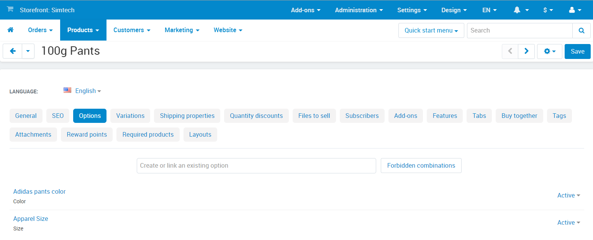
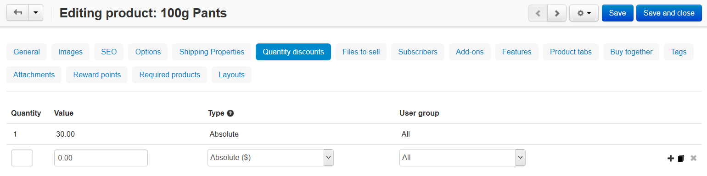
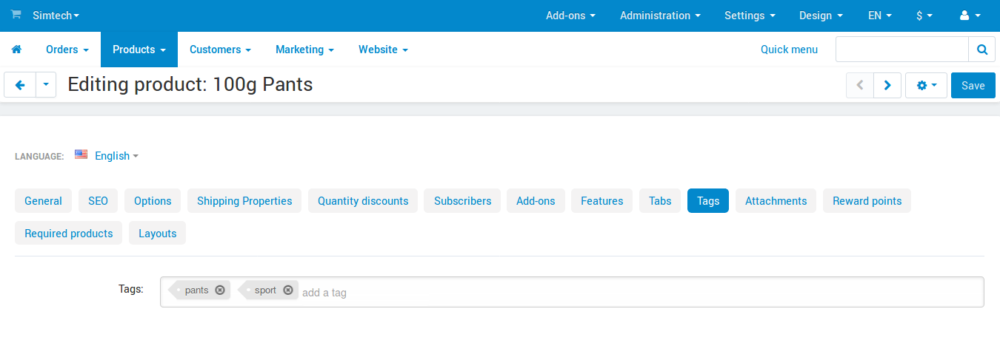
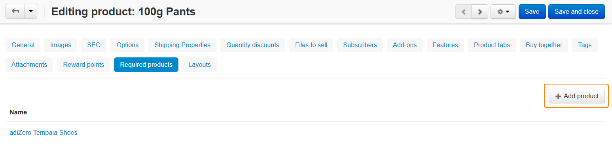

******************
Product Attributes
******************

When you create or edit a product, you should specify a number of product attributes. For convenience, attributes are grouped under several tabs.



=======
General
=======

-----------
Information
-----------

* **Name**—the name of the product as it appears on the storefront and in the Administration panel.

* **Categories**—the categories that the product will be assigned to. To define the product main category, select the corresponding radio button.

* **Price**—base product price in your store's primary currency.

* **Full description**—full product description appearing on the product details page of the storefront.

  The description can be either a plain text or a formatted HTML text. If you are not familiar with HTML, you are encouraged to add a formatted description using the built-in WYSIWYG HTML editor.

  Not only does an informative description help your customers, but it is also another SEO opportunity.

* **Status**—the status of the product:

  * **Active**—the product is available on the storefront.

  * **Disabled**—the product is not available on the storefront.

  * **Hidden**—product does not appear on the storefront.

    .. note::

        Customers can access a hidden product via a direct link.

* **Store**—the store to which the product is assigned.

* **Images**—a pair of images to illustrate the product: a product thumbnail and a large product image.

  Both images can be either uploaded from a local computer or the server file system, or linked to a remote location where the required image is physically located.

  Images must be of one of the following formats only: JPEG, GIF, PNG. Maximum size of an uploaded image depends on your server configuration. As a rule, it should not exceed 2 MB.

  An alternative text describes an image in words. Technically, it is the text that you enter appears inside the ``alt=""`` and ``title=""`` attributes of the ```` HTML tag. The text is shown when the image is missing or cannot be displayed. It is good practice to have an alternative text associated with the image, for SEO purposes.

.. note:: 

    By default, thumbnails are generated from detailed images automatically. However, you can upload thumbnails manually by clicking the **upload them manually** link.

----------------
Options Settings
----------------

* **Options type**—select how the options and variants of this product appear on the storefront: 

  * **Simultaneous**—all the options and variants appear simultaneously and independently.

  * **Sequential**—options and variants are chosen one after another. Customers will be able to choose only the allowed option combinations.


* **Exceptions type**—select a type of the product option exceptions: 

  * **Forbidden**—customers won’t be able to select the combinations of option variants. You can specify those variants under *Forbidden combinations* on the **Options** tab.

  * **Allowed**—customers will only be able to select the combinations of option variants. You can specify those variants under *Allowed combinations* on the **Options** tab. 

.. hint::

   To specify product options, switch to the **Options** tab.

-------------------
Pricing / Inventory
-------------------

* **CODE**—internal product code (SKU number).

* **List price**—the price suggested by the product manufacturer. Good practice is to show that your price is lower than the list price.

* **In stock**—the number of products in the stock. By default, products that are out of stock do not appear on the storefront until you enable the **Allow negative amount in inventory** option under **Settings → General → Catalog**.

* **Zero price action**—allowed action on the product if the product has zero price. Allow or disallow users to add the products to the cart, or ask users to enter a custom price.

* **Inventory**—the way of tracking the inventory of the current product: track with product options or without product options or do not track at all. 

  If the product is selected to be tracked with options, the common product quantity becomes unavailable, and you are supposed to specify the number of in-stock items individually for each product option/variant.

* **Minimum order quantity**—the minimum number of product items that a customer must add to cart to be able to order the product. The minimum amount always appears on a product details page of the storefront right after the product price.

* **Maximum order quantity**—the maximum number of product items that a customer can order at a time. 0 means no maximum limit.

* **Quantity step**—the number of product items between the two choices in the **Quantity** select box.

* **List quantity count**—maximum of choices in the **Quantity** select box.

* **Taxes**—select applicable taxes. :doc:`Learn more about configuring taxes <../../shipping_and_taxes/index>`.

------------
Availability
------------

* **User groups**—the :doc:`user groups <../../users/user_groups/index>` that can access the product.

* **Creation date**—the date when the product was added to the catalog.

* **Avail since**—the date when the product becomes available for sale.

* **Out-of-stock actions**—select if customers should be able to buy the product in advance before it is not yet available for sale, or sign up to receive an email notification when the product is available. :doc:`Learn more about out-of-stock actions <out_of_stock_actions>`.

-----
Extra
-----

* **Product details view**—choose a template for the page view.

* **Downloadable**—if this checkbox is ticked, the product is labeled as downloadable, i.e. distributed by download.

* **Enable shipping for downloadable products**—if this checkbox is ticked, shipping is available for this downloadable product.

.. important::

    The **Enable selling downloadable products** checkbox must be chosen in the **Settings → General → Catalog** section to enable this functionality.

* **Time-unlimited download**—if this checkbox is ticked, the product download period never expires. As a rule, download links expire after a certain period of time that is controlled by **Download key TTL** option in **Settings → General**.

* **Short description**—a short product description appearing on a product list page of the storefront.

  The description can be either a plain text or a formatted HTML text. If you are not familiar with HTML, you are encouraged to add a formatted description using the built-in WYSIWYG HTML editor.

  If you leave this field blank, the short description will be automatically taken from the full product description (first 300 characters).

* **Popularity**—integer conveying the product popularity, which is calculated automatically. This rating depends on the number of product views as well as the number of times the product was added to the cart and purchased. If necessary, you can manually adjust this value. Product popularity influences the way the products are arranged on the storefront.

* **Search words**—the list of words by which the product should be easily found by the built-in search.

* **Promo text**—important information about the product here in the form of a short message.

======
Images
======

This tab contains additional images for the product. Each additional image is represented as a pair of images: a thumbnail and a large pop-up image. 

Additional thumbnails appear on the product details page of the storefront beneath the main image thumbnail. When a customer chooses to enlarge the active thumbnail, it expands into the large pop-up window.



Both images can be either uploaded from a local computer or the server file system, or linked to a remote location where the required image is physically located.

Images must be of one of the following formats only: *JPEG*, *GIF*, *PNG*. The maximum size of an uploaded image depends on your server configuration. As a rule, it should not exceed 2MB.

An alternative text describes an image in words. Technically, the text that you enter appears inside the ``alt=""`` and ``title=""`` attributes of the ```` HTML tag. The text is shown when the image is missing or cannot be displayed. It is good practice to have an alternative text associated with the image, for SEO purposes.

.. note::

    To sort additional images in the desired order simply drag and drop uploaded images.



===
SEO
===

* **SEO name**—the value to which the standard URL will be changed.

* **Page title**—the title of the product page on the storefront, which is displayed in the web browser when somebody is viewing the page. Required for SEO purposes.

* **META description**—the content of the HTML meta tag that describes the product. Required for SEO purposes.

* **META keywords**—the content of the HTML tag that contains a list of search keywords for the product. Required for SEO purposes.



:doc:`Learn more about SEO <../../addons/seo/index>`.

=======
Options
=======

This tab allows you to manage the product options and option variants, as well as control the option combinations and add forbidden/allowed combinations.



.. note::

   This tab also allows you to add global options to the product. :doc:`Learn more about options <../options/index>`.

Product options appear on the product details page on the storefront as selectable or input parameters of the product. Options can have the following attributes:

* **Name**—the name of the product option as it appears on the storefront.

* **Position**—the position of the product option relatively to the position of the other options in the list.

* **Inventory**—if you tick this checkbox, the option will have a separate number of items in stock. This number is tracked separately.

* **Store**—the store to which the option belongs.

* **Type**— the type of the product option: *Select box*, *Radio group*, *Check box*, *Text*, *Text area* or *File*. :doc:`Learn more about option types <../options/option_settings>`.

* **Description**—the description of the product option. It will appear as it appears on the storefront under the question sign (?) next to the option name.

* **Comment**—the comment displayed below the option on the storefront.

* **Required**—if you tick this checkbox, customers will have to select this option (or fill in the field, if the option has the *Text* or *Text area* type).

* **Missing variants handling**—select how impermissible/missing option combinations should be handled: 

  * **Display message**—the option will be marked as not available; if the option is *required*, customers won't be able to add the product to the cart.

  * **Hide option completely**—the option will be hidden; if the option is *required*, customers will be able to add the product to the cart.

.. image:: img/product_attributes_04.png
    :align: center
    :alt: Option attributes

An option variant is an extension to the product option of type *select box*, *radio group* or *check box*. A variant may have a separate status, icon and amount of reward points, as well as a weight and price modifiers. Option variants have the following attributes:

* **Position**—the position of the variant relatively to the positions of the other variants in the list.

* **Name**—the name of the product variant. For example, if the option is titled *Size*, the product variants to the option can be *small*, *medium*, *large*, etc.

* **Modifier/Type**—a positive or negative value that modifies the original product price. The modifier can be either an absolute value or a percentage.

* **Weight modifier/Type**—a positive or negative value that modifies the original product weight. The modifier can be either an absolute value or a percentage.

* **Status**—the status of the product option variant (*Active* or *Disabled*).

* **Icon**—a thumbnail to represent the option variant. 

  The image can be either uploaded from a local computer or the server file system or linked to a remote location where the required image is physically located. 

  An alternative text describes the image and is shown when the image is missing or cannot be displayed. It is good practice to have an alternative text associated with the image, for SEO purposes.

* **Earned point modifier/Type**—a positive or negative value that modifies the original number of reward points that customers receive at their accounts when they buy the product. The modifier can be either an absolute value or a percentage.

===================
Shipping Properties
===================

This tab contains a number of product properties that are important for shipping this product to customers.

* **Weight**—the weight of a single product item in the store default weight unit.

* **Free shipping**—if you tick this checkbox, the product is delivered to the customer free of charge, i.e. no shipping cost for the product is calculated.

* **Shipping freight**—the handling fee (insurance, packaging, etc.) added to the product cost.

* **Items in a box**—the minimum and maximum number of product items to be shipped in a separate box.

* **Box length**—the length of a separate box.

* **Box width**—the width of a separate box.

* **Box height**—the height of a separate box.

.. note::

    The last four options are required for a more accurate shipping cost estimation when a real-time shipping method with the support for multi-box shipping is used (UPS, FedEx, and DHL). 

    If you don't specify box dimensions, values will be taken from the global configuration settings of a particular carrier. See the :doc:`Shipping and Taxes <../../shipping_and_taxes/index>` section for more details.

==================
Quantity Discounts
==================

This tab contains the list of the product wholesale prices that have the following attributes:

* **Quantity**—the minimum number of product items to qualify for the product wholesale price.

* **Value**—product wholesale price (per item).

* **Type**—the type of the discount: 

  * **Absolute**—the cost of 1 discounted item.

  * **Percent**—the percent discount off the base product item price. 

    Percentage discount has certain natural limitations: the discount cannot be more than 100%, and the discount will not be saved as long as it applies to 1 product item and all user groups.

* **User group**—the :doc:`user groups <../../users/user_groups/index>` which can take advantage of the wholesale price.



:doc:`Learn more about defining wholesale prices for products <wholesale>`.

=============
Files to Sell
=============

This tab contains a list of files that are associated with this :doc:`downloadable product <downloadable>`. Each file may have the following attributes:

* **Name**—the name of the file as your customers will see it on the product page. Note that it does not change the original file name.

* **Position**—the position of the file relatively to the position of the other files in the list.

* **File**—the file to be downloaded. The file can be uploaded from a local computer or the server file system. It can also be a linked to a remote physical location of the file.

* **Preview**—a preview file that can be freely downloaded from the product details page on the storefront.

* **Activation mode**—how the download link will be activated: 

  * **Immediately**—immediately after the order has been placed.

  * **After full payment**—once the order status has changed to *Processed* or *Complete*.

  * **Manually**—manually by the store administrator.

* **Max downloads**—the maximum number of allowed product downloads per customer.

* **License agreement**—the text of the license agreement.

* **Agreement required**—determines whether the customers must accept license agreement at checkout.

* **Readme**—the text of the *readme* file (e.g., installation instructions, etc.)

* **Folder**—the folder to which the file belongs (if you created any).

===========
Subscribers
===========

This tab contains a list of email addresses that visitors have left to receive a notification when the product is back in stock. To allow visitors to subscribe to an out-of-stock product, set the **Out of stock actions** option (see the **General** tab) to *Sign up for notifications*.

You can add the subscriber by his e-mail with the **Add subscriber** button or you can choose subscribers among the customers of your store with the **Select customer** button.

=======
Add-ons
=======

Product attributes that depend on the active add-ons.

* **Returnable**—if you tick this checkbox, the product will be labeled as available for the return.

* **Return period** (requires the :doc:`RMA <../../addons/rma/index>` add-on)—the time period period of time during which the product can be returned. The period begins on the day of purchase.

* **Sales amount**—the number of sold product items. This value is calculated automatically if the **Bestsellers and on-sale products** add-on is active (**Add-Ons → Manage add-ons**). Yet, you can change the current value manually.

* **Age verification** (requires the :doc:`Age Verification <../../addons/age_verification/index>` add-on)—if you tick this checkbox, the access to the product will be limited by the customer age.

* **Age limit** (requires the :doc:`Age Verification <../../addons/age_verification/index>` add-on)—the minimum age for accessing the product.

* **Warning message** (requires the :doc:`Age Verification <../../addons/age_verification/index>` add-on)—the message to be displayed, if the customer does not qualify for accessing the product.

* **eBay template**—choose one of the templates created in the **Marketing → eBay templates** section. This setting appears when the :doc:`eBay synchronization <../../addons/eBay/index>` add-on is installed and set up in the **Add-ons → Manage add-ons** section.

* **Package type**—the type of the product package. If you do not know your package type, select the *Large package* option. To ensure the most accurate cost, you will be asked to enter exact package dimensions. This setting appears when the **eBay synchronization** add-on is installed and set up in the **Add-ons → Manage add-ons** section.

* **Reviews** (requires the :doc:`Comments and Reviews <../../addons/comments_and_reviews/index>` add-on)—customer reviews or ratings, or both.

.. note::

   The following settings appear when you installed and enable the **eBay synchronization** add-on under **Add-ons → Manage add-ons** section.

* **Override title and description**—choose if you want the original product name and description to be replaced with those specified in the **eBay product title** and the **eBay product description** fields (you can see them below).

* **eBay product title**—the title of the product to be used at eBay. This setting appears when the **eBay synchronization** add-on is installed and set up in the **Add-ons → Manage add-ons** section.

* **eBay product description**—the description of the product to be used on eBay. This setting appears when the **eBay synchronization** add-on is installed and set up in the **Add-ons → Manage add-ons** section.

========
Features
========

This tab allows you to define the values of the extra fields that are valid for the product. The set of extra fields is controlled in **Products → Features**.

============
Product Tabs
============

In this tab, you can see the list of tabs, applied to the current product. Next to a tab name you can see its status—*Active* or *Disabled*. 

You can also see how the product page looks like. Click the gear button and select **Preview** (how a customer sees the page), or **Preview as admin** (how an administrator sees the page).

Editing and adding product tabs is done in the **Design → Product tabs** section.

============
Buy Together
============

Requires the :doc:`Buy Together <../../addons/buy_together/index>` add-on.

In this tab, you can bind the product with other products from the catalog and offer a discount if the bound products are bought together. A set of the bound products is referred to as a *product combination*. The discount is promoted on the product details page on the storefront, and customers can decide whether they want to profit by the offer or not.

Along with the set of bound products and the offered discount, each combination has the following attributes:

* **Name**—the name of the product combination.

* **Description**—the description of the product combination as it appears on the storefront.

* **Available from**—the date when the product combination becomes available for customers.

* **Available till**—the date until the product combination is available.

* **Display in promotions**—if this checkbox is ticked, the offered product combination appears in **Products → Promotions**.

* **Status**—the status of the product combination (*Active* or *Disabled*).

.. note::

    This tab is available when the :doc:`Buy together <../../addons/buy_together/index>` add-on is installed and activated in the **Add-ons → Manage add-ons** section.

====
Tags
====

This tab includes a list of tags associated with the product. Tags appear on the storefront in a special side box titled **Tag cloud**. :doc:`Learn more about tags <../../addons/tags/index>`.

* **Tags**—tags that have been added to the product. Start typing in this field to add a new tag. You can choose among the existing variants or create a new tag.



===========
Attachments
===========

Requires the :doc:`Attachments <../../addons/attachments/index>` add-on.

This tab contains product attachments, which are files associated with the products. Unlike the contents of the **Files to sell** tab, the files that appear here are available for non-downloadable products as well. Each attachment can have the following attributes:

* **Name**—the name of the product attachment.

* **Position**—the position of the attachment relatively to the position of the other product attachments.

* **File**—the file that is used as the product attachment. The file can be uploaded from a local computer or the server file system, or it can be a link to a remote location where the file is physically located.

* **User groups**—the :doc:`user groups <../../users/user_groups/index>`, for which the attachment is available.

:doc:`Learn more about attachments <attaching_files_to_products>`.

=================
Required Products
=================

Requires the :doc:`Required Products <../../addons/required_products/index>` add-on.

This tab contains a list of required products, which must be bought together with this product. To add a new product, click the **Add product** button.



=============
Reward Points
=============

Requires the :doc:`Reward Points <../../addons/reward_points/index>` add-on.

Use this tab to set up the product price in reward points and specify the number of reward points to be earned for purchasing the product.

* **Allow payment by points**—if you tick this checkbox, customers will be able to pay for the product product can be paid for with reward points.

* **Override global PER**—if this checkbox is ticked, the product will have a fixed price in points, that is independent of the point-to-money exchange rate.

* **Price in points**—fixed product price in points.
* **Override global/category point value for this product**—if you tick this checkbox, the values below override the global reward points specified in **Marketing → Reward points**.

* **User group**—the :doc:`user groups <../../users/user_groups/index>` whose members are granted reward points for buying the product.

* **Amount**—the number of reward points to be granted to the user group member who bought the product.

* **Amount type**—the absolute number of points or percentage-based value calculated in the following manner: the product cost is divided into 100, and the result is multiplied by the value in the field.

=======
Reviews
=======

Requires the :doc:`Comments and Reviews <../../addons/comments_and_reviews/index>` add-on.

The list of customers' reviews of the product. Requires that the **Reviews** field on the **Add-ons** tab be set to *Communication*, *Rating*, or both. In this tab, you can add own reviews and edit existing product reviews and ratings.

=======
Layouts
=======

The content of the product details page.

This tab duplicates the global layout of the location to which this storefront page belongs.

By using this tab, you can disable blocks that are globally enabled, and, on the contrary, enable blocks that are globally disabled. This makes it possible to configure an individual layout for different storefront pages.

Any modification that you make under this tab will not affect other storefront pages.

.. note::

    To learn more about blocks, see :doc:`Look and Feel → Layouts <../../look_and_feel/layouts/index>`.

.. note::

    Most of the attributes can be imported using :doc:`product import <../../manage_products/import_export/product_import>`.
