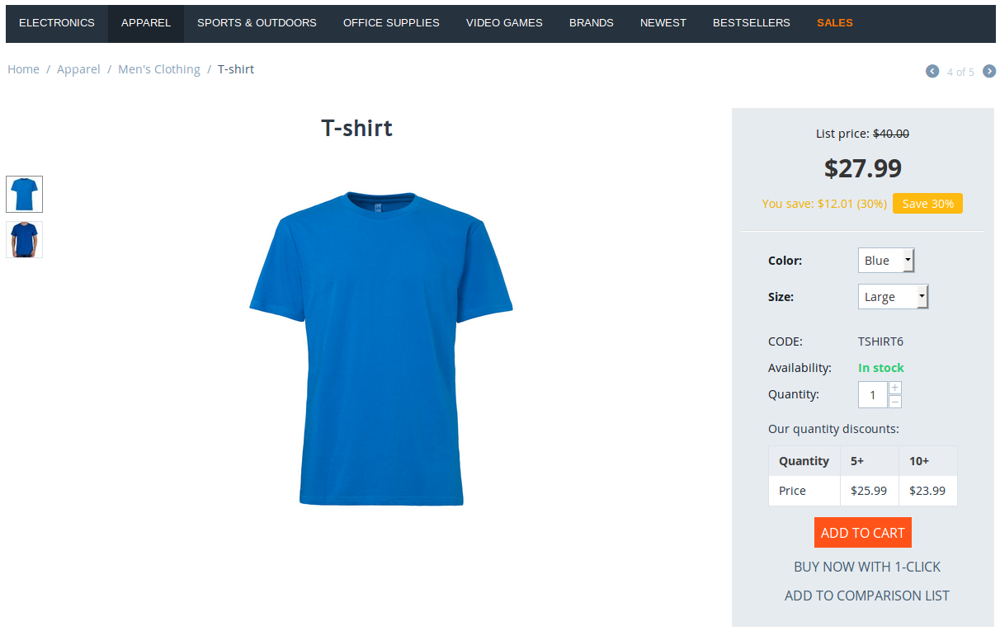
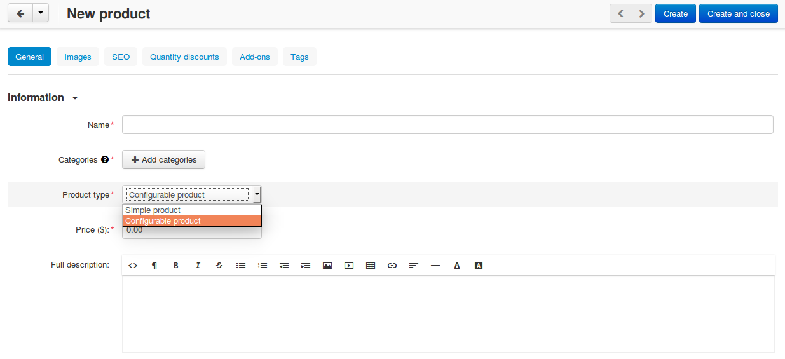

******************
Product Variations
******************

.. note::

    Product variations first appeared in **CS-Cart & Multi-Vendor 4.6.1** as an alternative to :doc:`option combinations </user_guide/manage_products/options/option_combinations>`. To create variations, you need to :doc:`install and enable the Product Variations add-on </user_guide/addons/product_variations/index>`. **The add-on is currently at the beta stage.**

Product variations are a way to group some specific :doc:`option variants </user_guide/manage_products/options/index>`. For example, let's assume that you sell T-shirts. They come in 3 colors (red, green, blue) and 3 sizes (small, medium, large). In this case *T-shirt* would be a product, and *large blue T-shirt* would be one of the product variations.

A product can have either option combinations, or variations. If you plan to create variations of a product, set **Product type** to *Configurable* when you :doc:`add the product <add_product>`.

.. important::

    Once you create a product, you won't be able to change its type. That's why it's important to know :doc:`the differences between option combinations and product variations <simple_versus_configurable>`.

.. contents::
    :backlinks: none
    :local: 
    :depth: 1

======================
Add Product Variations
======================

.. note::

    This is the behavior of CS-Cart & Multi-Vendor 4.7.2 and newer versions. If you'd like to know how to create variations in version 4.7.1, please refer to `this article <https://docs.cs-cart.com/4.6.x/user_guide/manage_products/products/product_variations.html>`_.

#. In the Administration panel, go to **Products → Products** and find your configurable product. Click **Advanced search** in the search menu on the right: the advanced search pop-up window will allow you to exclude simple products from the search results, leaving only configurable products.

#. Click on the name of the configurable product to open the product editing page.

#. Switch to the **Variations** tab and click **Add variations**.

   .. note::

       A product must have at least one option of the *Check box*, *Select box*, or *Radio group* type with the **Inventory** checkbox ticked. Otherwise you won't be able to create variations for this product.

   .. image:: img/add_variations.png
       :align: center
       :alt: Use the "Add variations" button to create variations.

#. The list of possible and existing variations will appear. Tick the checkboxes of the variations you'd like to create.

   .. image:: img/possible_variations.png
       :align: center
       :alt: Tick the checkboxes of the variations you'd like to add.

#. Click **Add variations**. New variations will be created, and you'll be able to edit them as you see fit.

=======================
Edit Product Variations
=======================

#. In the Administration panel, go to **Products → Products** and find the variation you'd like to edit. There are multiple ways to find the variation:

   * Find the product variation using the **Advanced search** link from the search menu on the right. You'll be able to search either for all variations, or for variations of specific products.

     .. hint::

         If you use this method, you'll be able to edit multiple variations at once: just tick the checkboxes next to the names of the variations, click the gear button in the top right corner, and choose **Edit selected**.

   * Find the configurable product (again, it's best to use **Advanced search**), click on its name, and switch to the **Variations** tab.

   .. image:: img/list_of_variations.png
       :align: center
       :alt: The list of variations allows you to edit some of the variation properties.

#. Once you see the list of variations, you can do 2 things:

   * Edit price, list price, quantity, and status of the variation.

   * Click the name of the variation to open the editing page, that contains more :doc:`product properties <product_attributes>`.

#. Once you're done with editing, click the **Save** button in the top right corner.

   .. image:: img/variation_properties.png
       :align: center
       :alt: A product variation is much like a separate product in the Administration panel.

=========================
Delete Product Variations
=========================

#. In the Administration panel, go to **Products → Products** and find the variation you'd like to delete. There are multiple ways to find the variation:

   * Find the configurable product, click on its name, and switch to the **Variations** tab.

   * Find the product variation using the **Advanced search** link from the search menu on the right. You'll be able to search either for all variations, or for variations of specific products.

#. Hover over the variation you'd like to delete. The gear button will appear. Click it and choose **Delete**.

   .. hint::

       If you find the variations by using **Advanced search**, you'll be able to delete multiple variations at once: just tick the checkboxes next to the names of the variations, click the gear button in the top right corner, and choose **Delete selected**.

   .. image:: img/delete_variation.png
       :align: center
       :alt: You can delete multiple variations at once, but only if you find them via Advanced Search, not on the Variations tab.
