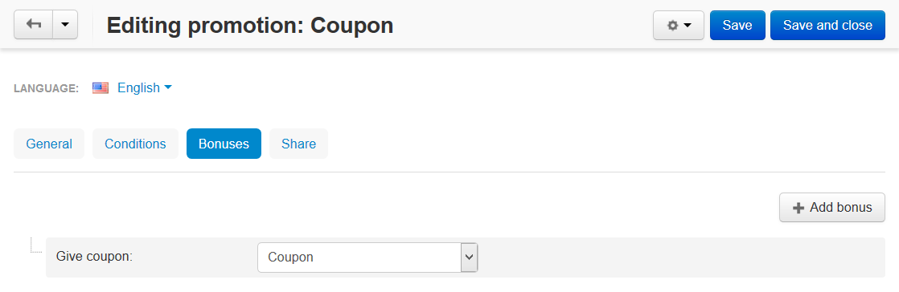

*******************************************************
How To: Create Automatic Discount Coupons for Customers
*******************************************************

.. note::

    **Tutorial Difficulty: 1 / 3**

This article describes how to generate automatic discount coupons for customers. Customers receive coupon codes by email and can use them at checkout to get various bonuses. We will need to create two promotions for that.

.. important::

    Customers can't use coupon codes in the orders they receive these codes for.

================================
Step 1. Create a Discount Coupon
================================

A discount coupon is a :doc:`cart promotion <index>` that gives bonuses to the customers who enter the coupon code at checkout.

1.1. In the Administration panel, go to **Marketing → Promotions**.

1.2. Click the **+** button in the top right corner and choose **Add cart promotion**.

1.3. Fill in the required fields on the **General** tab. Make sure your promotion has a **Name**, and that the **Status** is set to *Active*.

1.4. Switch to the **Conditions** tab.

1.5. Click the **Add condition** button and select the **Automatically generated coupon codes** option from the dropdown list.

.. note::

    You'll see **"No data found"** next to the condition. It means that no coupon codes have been generated yet. These codes will be generated by the promotion we'll set up in **Step 2**.

1.6. Click **Add condition** again and select the **Once per customer** option from the dropdown list. That way a customer will be able to use a coupon code only once.

.. image:: img/auto_coupon.png
    :align: center
    :alt: The conditions you add determine when customers can use coupon codes.

1.7. Switch to the **Bonuses** tab.

1.8. Click the **Add bonus** button and choose the desired bonus from the list.

1.9. Click the **Create** button.

=====================================================
Step 2. Create a Promotion that Provides Coupon Codes
=====================================================

A discount coupon alone isn't enough. Coupon codes are generated by a separate :doc:`cart promotion <index>`.

2.1. Go to **Marketing → Promotions**.

2.2. Click the **+** button in the top right corner and choose **Add cart promotion**.

2.3. Fill in the required fields on the **General** tab. Make sure your promotion has a **Name**, and that the **Status** is set to *Active*.

2.4. Switch to the **Conditions** tab.

2.5. Click the **Add condition** button and select the desired condition from the dropdown list.

For example, choose *Order subtotal*, then select *equal or greater*, and enter the *90* in the input field. Then customers will receive the coupon code only if their order subtotal is equal or greater than 90 units in the primary currency of your store.

2.6. Click **Add condition** again and select the **Once per customer** option from the dropdown list. That way only one coupon code will be generated for a customer.

.. image:: img/auto_coupon_02.png
    :align: center
    :alt: The conditions you add determine when coupon codes are generated.

2.7. Open the **Bonuses** tab and click the **Add bonus** button.

2.8. Select the **Give coupon** option from the dropdown list, then choose the promotion you created in **Step 1**. This will generate a code for the selected discount coupon when the conditions are met.

2.9. Click the **Create** button.

Now customers will see a popup when they add a product to cart and become eligible for the promotion. They can find their coupon code in the order details. 

.. important::

    The code won't work and won't be sent to the customer by email until the status of the order is set to *Complete*.

.. hint::

    Administrators can see the discount coupon codes generated for an order under **Orders → Orders → <Desired Order>** on the **Promotions** tab. However, the code will work only if it appears on the list of automatically generated coupon codes on the first promotion's **Conditions** tab. 

.. image:: img/free_shipping_coupon.png
    :align: center
    :alt: Customers can receive coupon code by email or find it in the order details.
