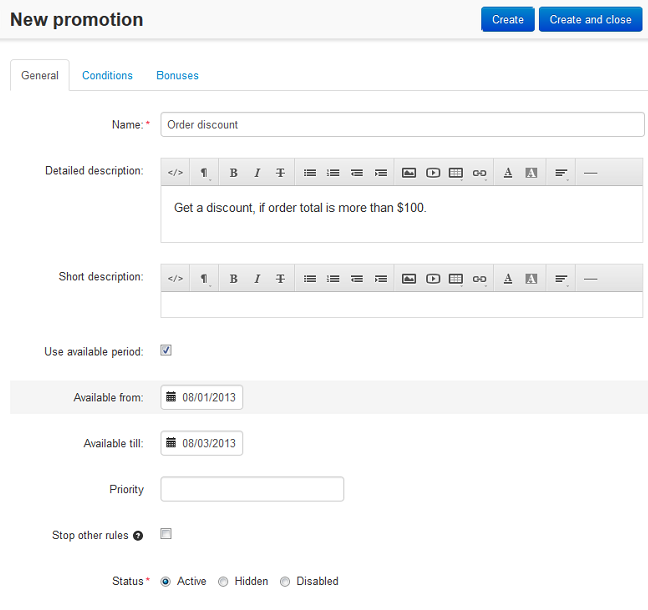
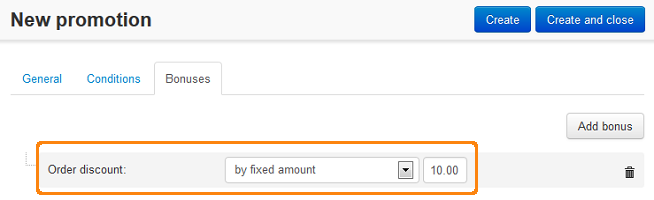

**************************************************************************
How To: Create a Discount on Order if Order Subtotal Exceeds Certain Value
**************************************************************************

To apply a discount to an order if order total exceeds some certain value:

*   In the Administration panel, go to **Marketing → Promotions**.
*   Click the **+** button on the right and choose **Add cart promotion**.
*   On the opened page, complete the information under the **General** section.

*   In the **Conditions** tab, click the **Add condition** button.
*   In the opened drop-down select box, select **Order subtotal** option. Then select **equal or greater** option and specify the necessary value.

.. image:: img/Discount_on_Order_If_Order_Subtotal_Exceeds_Certain_Value_01.png
    :align: center
    :alt: The Conditions tab

*   In the **Bonuses** tab, click the **Add bonus** button.
*   In the opened drop-down select box, select **Order discount** option. Then specify the necessary option and type the necessary value.
*   Click the **Create** button.

.. note::

	These promotions are displayed only on the **Checkout** page in the customer area.

