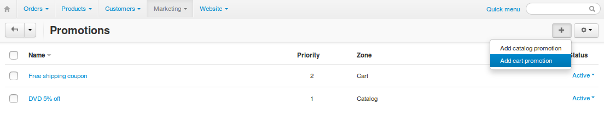
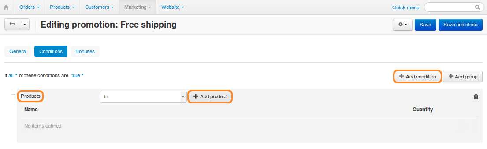
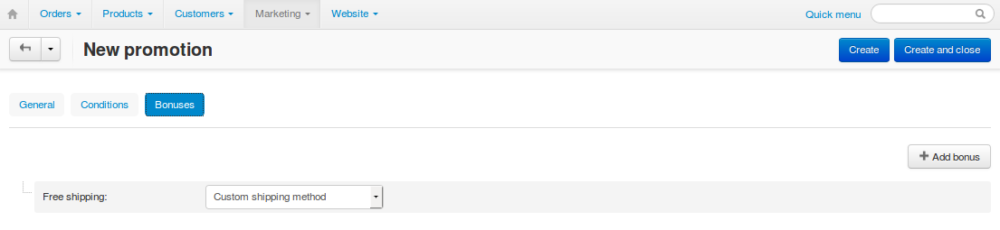
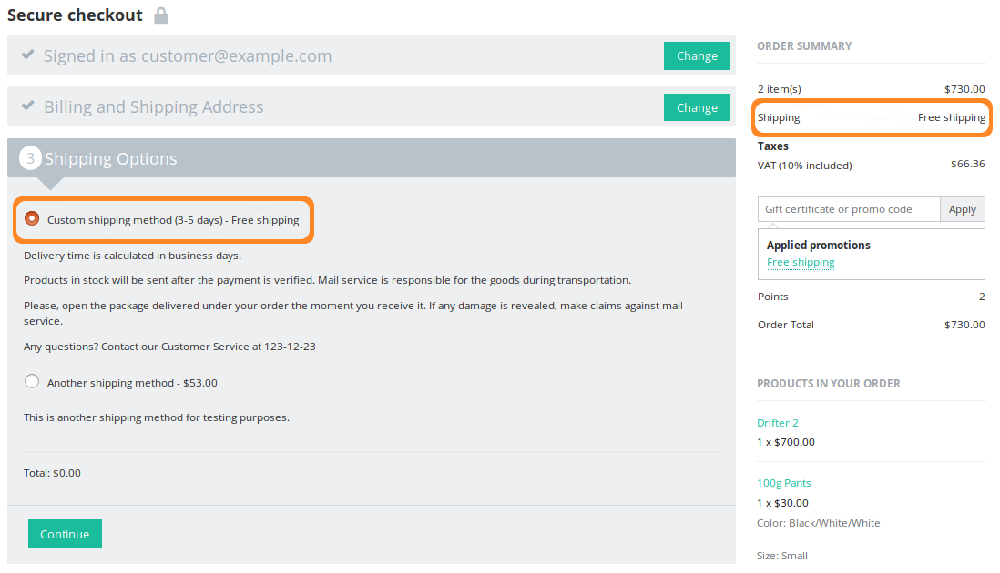

********************************************************
How To: Offer Free Shipping for Buying a Certain Product
********************************************************

.. note:: 

    **Tutorial Difficulty: 1 / 3**

You can offer free shipping if a customer buys a certain product. This is done via a :doc:`cart promotion <../../manage_products/promotions/index>`. 

.. warning::

    If the free shipping promotion applies to an order, customers won't be charged for shipping any products in that order. Additional shipping charges that you specify for individual products won't apply either.

1. Go to **Marketing → Promotions**.

2. Click the **+** button in the top right corner and choose **Add cart promotion**.

3. Name your promotion and make sure that **Status** is set to *Active*.

.. hint::

    On **General** tab you can add descriptions and choose the time period when this promotion applies. If you tick the **Stop other rules** checkbox, then all other promotions of the same type (catalogue promotions in our case) with lower priority won't apply.

.. image:: img/promotion_name.png
    :align: center
    :alt: Name your promotion and specify other parameters on the General tab.

4. Switch to the **Conditions** tab and click **Add condition**.

5. Choose **Products** in the dropdown list, then click **Add product**.

6. Tick the checkboxes of one or multiple products from the list. A customer will have to add any of them to cart to be eligible for the promotion.

7. Click **Add products and close**.

.. hint::

   If you want the promotion to apply only when a customer buys several different products, add those products as separate conditions. Make sure that the phrase above says **If all of these conditions are true**.

.. image:: img/select_product_free_shipping.png
    :align: center
    :alt: Select one or multiple products from the list.

8. Switch to the **Bonuses** tab and click **Add bonus**.

9. Select **Free shipping** from the dropdown list and choose a shipping method.

.. hint::

    You can add more bonuses if you want the promotion to apply for different shipping methods.

10. Click **Create and close**.

Congratulations! Now when customers add the specified product to cart and select the right shipping method, they won't be charged for shipping.

