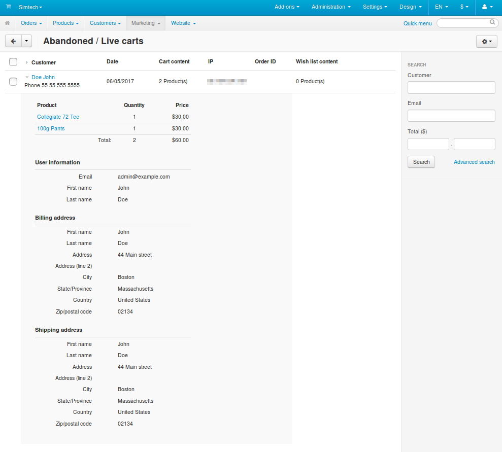
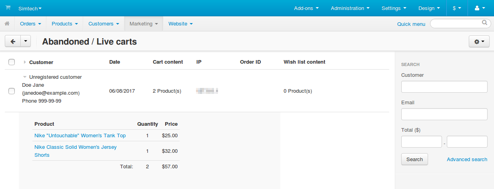

**********************
Abandoned / Live carts
**********************

=====================
About Abandoned Carts
=====================

The **Marketing → Abandoned / Live carts** section contains the lists of products that your store visitors added to their carts and wishlists but didn't purchase for some reason. When registered customers leave the website and return later, the products that were in their carts will be readded to their carts automatically.

.. note::

    Each storefront tracks visitors' carts separately.

Even if a customer isn't registered, the data of a cart is saved. In that case the customer is listed as **Unregistered customer**. The name and email of an unregistered customer will be saved as well, if that customer enters them at checkout and proceeds to the next step.

======================
Delete Abandoned Carts
======================

* To delete all carts that appear on the list:

  #. Click the **gear** button in the top right corner of the page.

  #. Choose **Delete all found**.

     .. important::

         If you filtered the list by using the search, then only the carts that match the search criteria will be deleted.

* To delete the selected carts from the list:

  #. Tick the checkboxes near of the carts.

  #. Click the **gear** button in the top right corner of the page.

  #. Choose **Delete selected**.

     .. image:: img/delete_selected_cart.png
         :align: center
         :alt: Removing a cart from the list.
