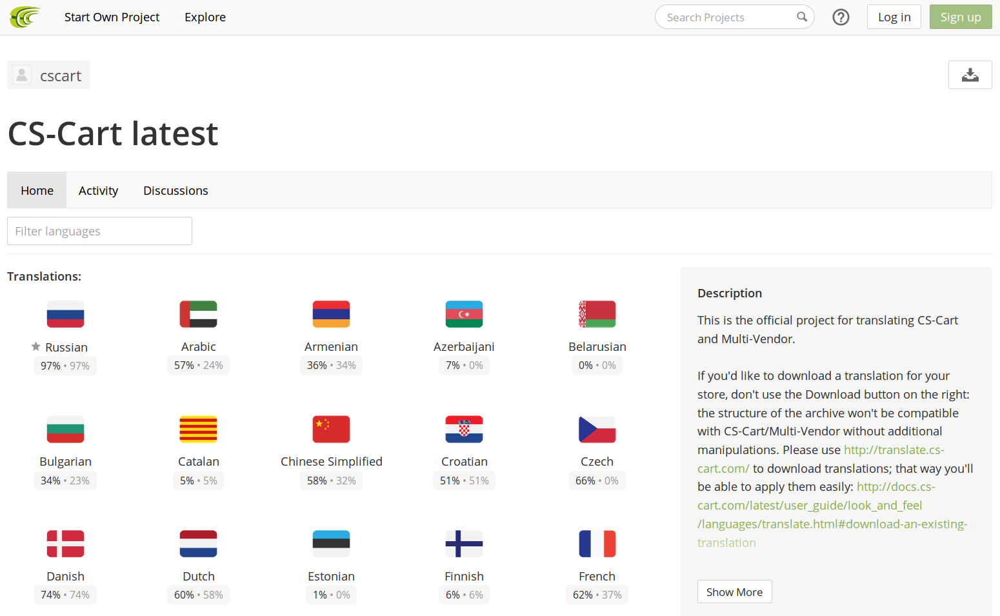
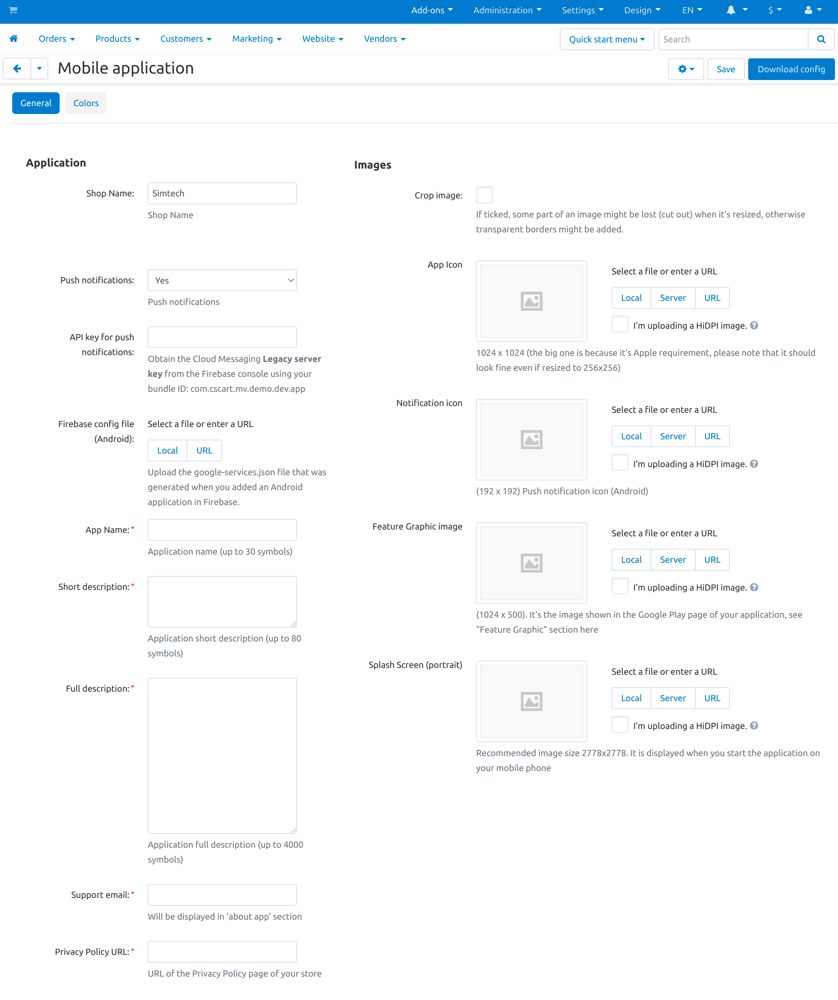
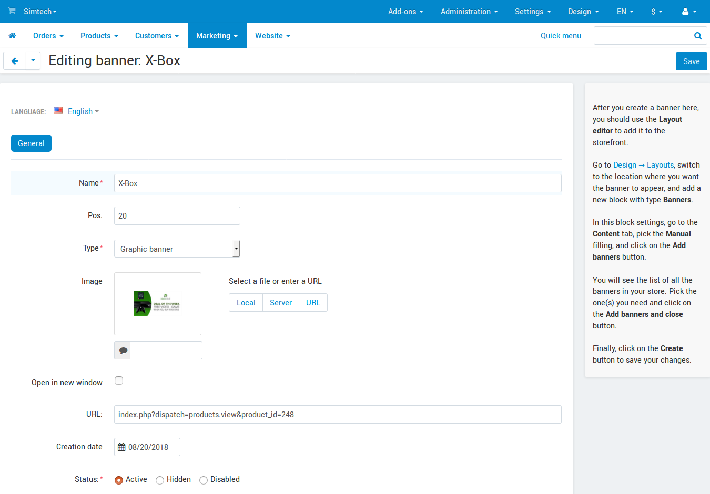

********************************
Mobile App for Multi-Vendor: FAQ
********************************

.. important::

    We offer a native mobile app for the customers of your Multi-Vendor marketplace. It is written on React Native and supports Android and iOS devices.

.. contents::
   :backlinks: none
   :local:

=========================
Part 1. General Questions
=========================

-----------------------
What Is All This About?
-----------------------

By default, Multi-Vendor has responsive design. The store will adapt to fit into the screen nicely, no matter what devices your customers use. This allows customers to make purchases from the store via their smartphones or tablets.

However, there is another way to interact with the store—a mobile application. It is a program that customers can install on their mobile devices. It exchanges data with the store, so customers can see what products are available, purchase them, add them to wish list, and more.

------------------------------------------------------------------
Why Bother with an App When a Responsive Site Does the Same Thing?
------------------------------------------------------------------

* **An app is designed for mobile devices.** A responsive web site has to look fine and work fine on all kinds of screens, from a smartphone to a large monitor. A mobile app has no such concerns: it just has to work on smaller screens with touch functionality.

* **An app is faster.** When you view a web page, you do it via a browser; the browser has to load all the elements of the page (interface, images, etc.) from the Internet. A mobile app works differently: the interface is already stored on your device, so the app only has to download the data that matters (such as updated products).

* **An app is a way of advertisement.** Firstly, the logo of the store (or any other image of your choice) appears on Apple App Store and Google Play as the app icon. Secondly, if customers install the app, they'll be seeing that logo on the screens of their smartphones among other apps regularly.

  .. image:: img/responsive_vs_mobile.png
      :align: center
      :alt: A responsive Multi-Vendor web site compared to a Mobile App.

.. _mobile-app-faq-sync:

-------------------------------------------
How Does the App Synchronize with My Store?
-------------------------------------------

The app has all the products that you offer in your store. If you add or remove products, categories, shipping and payment methods, they will appear and disappear in the app as well.

A customer who has an account in your store uses the same credentials to sign in to the app. By registering in the app, a customer also gets an account in your web store.

If a customer adds a product to cart or to the wish list in the mobile app, it will carry over to the store, and the other way around. Orders made in the app are no different to orders made at the web site: you manage them in your admin panel, and customers always see the full order history that includes orders from the app and from the site.

------------------------------------------------
What Shipping and Payment Methods Are Supported?
------------------------------------------------

The application supports **all shipping methods** and the following payment methods:

* Apple Pay

* PayPal Express Checkout

* Offline payment methods (such as "Discuss with manager", etc.)

Payment methods in the mobile app are positioned in the same order as in your store. The first payment method is selected by default.

.. hint::

    Technical info — the list of supported payment templates: ``cc.tpl``, ``empty.tpl``, ``check.tpl``, ``paypal_express.tpl``, ``phone.tpl``.
    
.. warning::
    For the time being, mobile application doesn't support the :doc:`/user_guide/addons/direct_customer_to_vendor_payments/index` add-on from Multi-Vendor Plus and Ultimate.

------------------------------------
What Languages Does the App Support?
------------------------------------

For now, the app supports only English and Russian: when one of these languages is selected on your device, the app will be displayed in that language. These translations are provided by the CS-Cart team.

The texts of the mobile app come with Multi-Vendor as a part of the **Mobile Application** add-on. Once other languages are supported, translations into them will be made by the CS-Cart community and checked by our partners `in our project at CrowdIn <https://crowdin.com/project/cs-cart-latest>`_.

----------------------------------------
Does the App Support Push Notifications?
----------------------------------------

Yes. If you enable them, customers will be able to receive information about order status changes as messages displaying on their mobile phones. To set up push notifications for your app:

#. Register at `https://firebase.google.com <https://firebase.google.com>`_.

#. Create a project for Android & iOS.

#. Enter the key in the settings of the **Mobile Application** add-on. The add-on comes with Multi-Vendor, but isn't installed by default.

#. Use the **Download config** button to get an archive with the application settings.

#. Send the downloaded **app_settings.zip** archive to us.

-------------------------------------
Can I Get the Source Code of the App?
-------------------------------------

Yes, but it depends on your chosen Multi-Vendor edition. For more information, please check `the comparison of Multi-Vendor editions <https://www.cs-cart.com/compare.html>`_ in regard to mobile application source code.

The technical support for the source code is limited. The license agreement allows using the source code only with one Multi-Vendor installation and forbids publishing the source code or handing it over to third parties. However, you get to publish the application from your own account on Apple App Store and Google Play and showcase your company as the app developer.

------------------------------------
Who Will be Listed as App Developer?
------------------------------------

If you get the source code, you'll be able to publish the app from your own developer account. Otherwise we'll publish it from our account on your behalf. In that case the app developer will be listed as follows:

* Apple App Store: `Simbirsk Technologies <https://itunes.apple.com/us/developer/simbirsk-technologies/id393297240>`_

* Google Play: `Simbirsk Technologies Ltd <https://play.google.com/store/apps/developer?id=Simbirsk+Technologies+Ltd>`_

===================
Part 2. Acquisition
===================

-----------------------------------------------
How Do I Get a Mobile Application for My Store?
-----------------------------------------------

#. Check the description of our mobile app `for Multi-Vendor <https://www.cs-cart.com/multivendor-mobile-application.html>`_.

#. If you decide to get the app (or if you have any questions), contact us via the forms on those pages.

#. We'll need some information from you, so that we could create your app and publish it on Apple App Store and Google Play.

   Multi-Vendor comes with the add-on called **Mobile Application** that isn't installed by default. This add-on allows you to:

   * Provide the information necessary for publishing the app (texts, images, links, etc.).

   * Configure the look of the app (colors, logos, etc.). You may also want to :ref:`edit the texts of the app <mobile-app-faq-texts>` at this point.

     .. image:: img/mobile_app_color_editing.png
         :align: center
         :alt: The interface for editing the colors of your mobile application.

   The add-on by itself doesn't create you a mobile app. Once you specify and save all the settings, you press the **Download config** button and get an archive called **app_settings.zip**. Send that archive to us, and we'll have all the information we need to publish your app.

--------------------------------------------
What Versions of Multi-Vendor Are Supported?
--------------------------------------------

It's best if you use the latest version. It always includes all the changes to the **Mobile Application** add-on and the way how your store interacts with your mobile application.

If you aren't using the latest version, just mention it when contacting us, and we'll help you get started. For example, version 4.8.1 is the earliest version that comes with the **Mobile Application** add-on. But we've made some improvements since then, so we may first need to apply them to your Multi-Vendor installation.

Mobile application can also run on versions older than 4.8.x (the earliest version we ran it on is 4.6.3), but the older the version, the more changes might be required. We can't promise to integrate the mobile application with any old version possible, but tell us your version number `via Help Desk <https://helpdesk.cs-cart.com>`_, and we'll take a look and let you know.

------------------------------------
Can I Test the App before Buying It?
------------------------------------

We have demo applications `for Android <https://play.google.com/store/apps/details?id=com.simtech.multivendor>`_ and `for iOS <https://itunes.apple.com/app/multi-vendor-app-by-cs-cart/id1304872157>`_ based on our Multi-Vendor demo store. Feel free to install those apps, go around the catalog, register an account, add products to cart or wish list, "order" them, and so on. Of course, we're not actually selling anything at our demo store; it is just there to show how our software works.

---------------------------------------------------
How Soon after the Payment Will You Release My App?
---------------------------------------------------

Releasing a mobile application takes some time. We guarantee that we will build and upload the application to Google Play and Apple App Store within one month since the moment of receiving the **app_settings.zip** archive from you.

If we take longer to upload your application to Google Play or Apple App Store, and the delay is on our end, we can extend your subscription period for free. Please note that we do this only on a case-by-case basis. Contact us `via Help Desk <https://helpdesk.cs-cart.com>`_ regarding that.

----------------------------------------------------
What Data Do You Need to Build a Mobile Application?
----------------------------------------------------

Most of the data described below is provided via the **Mobile Application** add-on along with the colors of your future app:

#. **Images:**

   * *App Icon*—a 1024x1024 image to serve as the logo of your app. The required size is so big because Apple requires it. Please make sure that the image will look fine even if it is resized to 256x256.

   * *Feature Graphic image*—a 1024x500 image shown on the Google Play page of your application. For more information, see the "Feature Graphic" section of `Google Play instructions <https://support.google.com/googleplay/android-developer/answer/1078870?hl=en>`_.

   * *Splash Screen Logo*—an image in two variants (1536x2208 vertical & 2208x1536 horizontal). It will be displayed when you start the application on your mobile device.

     .. note::

         Apple App Store and Google Play don't accept images with transparent backgrounds (or in technical terms, with alpha channel). Please remove alpha channel before uploading images. Opening your image and saving it as JPG is the surest and easiest option: a PNG image may or may not have alpha channel, but a JPG image never has one.

#. **App details:**

   * *Application name*—up to 30 symbols.

   * *Application short description*—up to 80 symbols.

   * *Application full description*—up to 4000 symbols.

#. **Your contact information:**

   * *Support email*—the email address to which customers will send you feedback about your app. This address will be displayed on the page of your app in Google Play and Apple App Store.

   * *Privacy Policy URL*—the link to the privacy policy page of your store.

.. important::

    Before we release the application both in Google Play and Apple App Store, we'll give you a test app either for Android or for iOS devices. Depending on the platform you choose for testing, please let us know your email address either in Google Play, or in Apple App Store.

==================================
Part 3. Post-Release Customization
==================================

-------------------------------------------
What Can I Change In My Mobile Application?
-------------------------------------------

Once the application is published, it will automatically :ref:`exchange data with your store <mobile-app-faq-sync>`. But you can also make some changes to the look of the application without contacting us and asking your customers to update their apps. Here's what you can change:

#. **The content on the home page.** You can use :doc:`blocks </user_guide/look_and_feel/layouts/blocks/index>` of 5 types there:

   * Banners

   * Categories

   * Vendors

   * Products

   * Pages

     .. image:: img/mobile_app_layout.png
         :align: center
         :alt: The interface for editing the colors of your mobile application.

#. **Links at the bottom menu of the sidebar.** The top sidebar menu (with icons) is always the same, while the bottom menu is customizable: you can add and remove links as you see fit.

   .. important::

       The changes to the home page and sidebar are made in the admin panel of your store: go to **Design → Layouts** and switch to **MobileAppLayout**. It will appear only if the **Mobile Application** add-on is installed.

------------------------------------------------------------------
What if I Want to Change Colors or Logos after You Publish My App?
------------------------------------------------------------------

If you make changes to any of the settings of the **Mobile Application** add-on (such as changing the colors or enabling push notifications), these changes won't automatically affect your published app. 

#. Make changes and save them.

#. Use the **Download config** button to get the **app_settings.zip** archive from the add-on again.

#. Send the archive to us, so that we could apply these changes.

   .. image:: img/mobile_app_color_editing.png
       :align: center
       :alt: The interface for editing the colors of your mobile application.

   .. important::

       Asking us to make changes to the app after we publish it falls under "tweaks on request", and some plans have limitations on those tweaks.

.. _mobile-app-faq-texts:

------------------------------------
How Do I Change the Texts of My App?
------------------------------------

The texts of your app are a part of **Mobile Application** add-on and can be edited in the admin panel of your store. Changing these texts works the same way as :doc:`translating CS-Cart </user_guide/look_and_feel/languages/translate>`:

#. Go to **Languages → Translations**. 

#. Run a search for ``mobile_app.mobile_`` in the sidebar on the right—the results will include the texts used in the mobile app.

#. Once you've changed the texts and saved your changes, you'll need to download the **app_settings.zip** archive from the **Mobile Application** add-on and send that archive to us.

   .. image:: img/mobile_app_texts.png
       :align: center
       :alt: Searching for the texts of the mobile app in Multi-Vendor admin panel.

   .. important::

       Asking us to make changes to the app after we publish it falls under "tweaks on request", and some plans have limitations on those tweaks.

-----------------------------------------
Home Page: How to Make Banner Links Work?
-----------------------------------------

As we mentioned above, you can create a block with banners on the home page of **MobileAppLayout**. On your website you could specify a SEO URL like ``https://example.com/category/product`` to have your banner link to a product. However, a mobile app doesn't use URLs to refer to its objects. That's why we have a special format for banner links:

* **Pages:** *index.php?dispatch=pages.view&page_id=23*

* **Products:** *index.php?dispatch=products.view&product_id=230*

* **Categories:** *index.php?dispatch=categories.view&category_id=174*

* **Vendors:** *index.php?dispatch=companies.products&company_id=2*

* **Orders:** *index.php?dispatch=orders.details&order_id=115* (only if customer has signed in)

* **Profiles:** *index.php?dispatch=profiles.update&user_id=3* (only if customer has signed in)

For example, to set a link to a product #248, enter the following into the **URL** field of you banner:

.. code-block:: none

    index.php?dispatch=products.view&product_id=248

.. hint::

    This link format also works for banners in your main store and isn't affected by URL changes (such as changing the domain name, moving the store to another folder, or changing SEO names of objects). 

----------------------------------------------------
Home Page: How to Show or Hide the Titles of Blocks?
----------------------------------------------------

The titles of blocks on the home page may or may not appear. That depends on the wrapper that you select for blocks in the admin panel of your store.

Go to **Design → Layouts** and switch to **MobileAppLayout**. Select the **Homepage** tab and click the gear icon of any block to open the block's settings. There you will be able to select a wrapper for the block:

* Select ``--`` if you want to hide the title of the block at the home page in your mobile app.

* Select any other wrapper if you want to show the title.

  .. image:: img/wrappers.png
      :align: center
      :alt: A block wrapper in Multi-Vendor determines the block title will appear on the mobile app home page.

-----------------------------------------
Sidebar: How to Add or Remove Menu Items?
-----------------------------------------

The top menu of the sidebar (Home, Cart, Wish List, My profile, Orders) is always the same. The bottom menu can be configured in the admin panel of your store.

#. Go to **Design → Layouts**.

#. Select **MobileAppLayout** on the right.

#. Switch to the **Sidebar menu** tab.

#. Click the gear icon of the **Pages** block.

#. The block settings will open. Switch to the **Content** tab. That's where you'll be able to select the pages that must appear in the sidebar of the mobile application.

   .. image:: img/sidebar_menu.png
       :align: center
       :alt: The menu items in Multi-Vendor and in the mobile app.

.. meta::
   :description: FAQ about mobile application for Multi-Vendor marketplace: functionality, acquisition, customization, and support.
