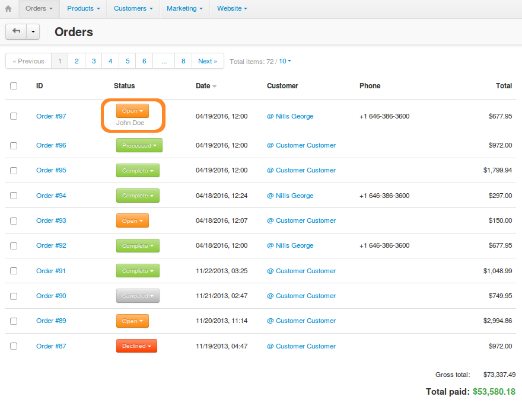
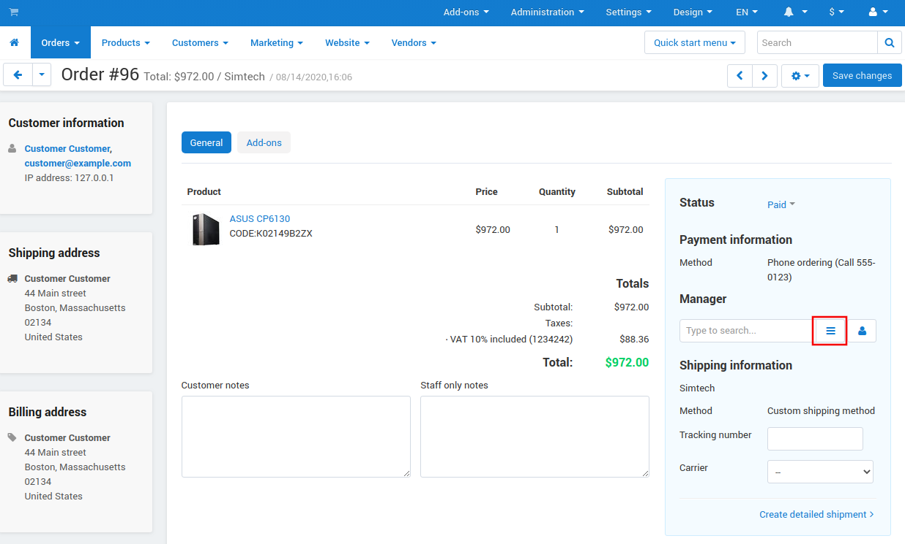
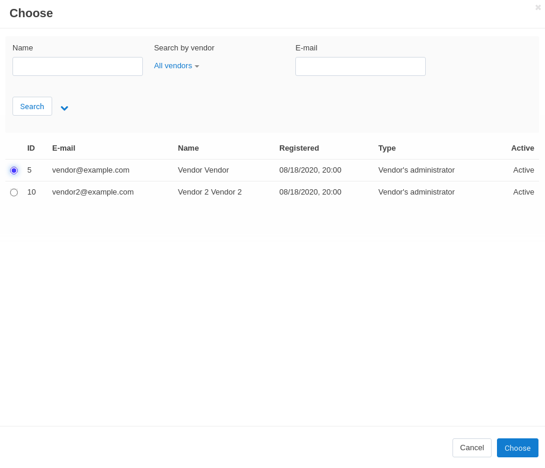

*********************************
How To: Assign Managers to Orders
*********************************

You can assign administrators to orders as managers. This is useful if your staff have their own administrator accounts in your store. You can also make use of this functionality in the :doc:`sales reports <../sales_reports/index>` to :doc:`create charts <../sales_reports/create_chart>` that include orders assigned to the specified managers.

.. note::

    The administrator who creates an order in the Administration panel is automatically assigned as a manager for that order.

To assign a manager to an existing order:

1. In the Administration panel, go to **Orders → View orders → <Desired order>**.

2. Find the **Manager** field on the right and click the **+** button.

3. You'll see a pop-up window where you can select the administrator assigned to the order. If you have too many administrators, you can use the search to make the list shorter.

4. Once you've selected the administrator, click **Choose**.

5. Click **Save changes**.

.. note::

    Once selected, a manager can't be removed from the order. However, you can use the **+** button again to choose a different manager. This removes the previous manager from the order.
