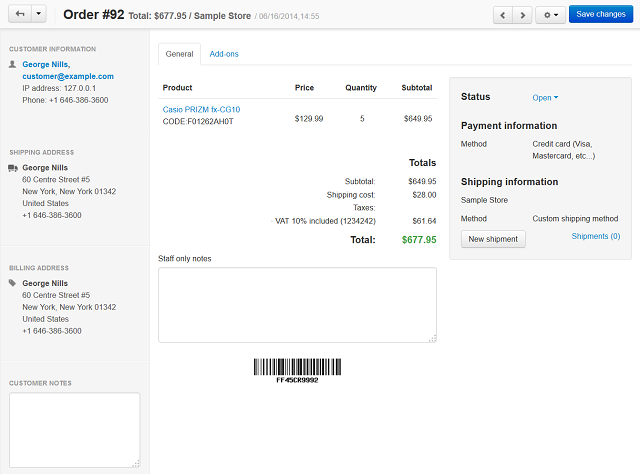

***********************************
How To: View and Edit Order Details
***********************************

To **display** order details, click the gear of the order that you want to review and choose **View**. This opens the order details page.

Here you can add comments to the order and define shipment details.

To **edit** the order details, click the gear button and choose **Edit**. This opens an editing order details page.

.. important::

    When editing an order, the promotions that apply to the order may be recalculated. To find out more about promotion recalculation and disabling it, please read :doc:`this article </user_guide/manage_products/promotions/promotion_recalculation>`.

.. image:: img/orders_07.png
    :align: center
    :alt: Edit order

Here you can edit the set of products in the order:

* To remove a product from the order, hover the mouse pointer over the required product and click the trash can icon.

* To add new products, click the **Add product** button above the list.

You can also change the product cost as it appears in the order. This doesn't affect the product cost in the catalog. You can also edit the product clicking on a product name.

In the left sidebar, you can edit customer's contact info together with the billing and shipping address. To do it, click the edit icon in the right upper corner of the corresponding section.

In the right smaller field of the page, you can change the payment method and the shipping method choosing the desired method from the drop-down menu. You can also change the order status here. To change the status, click on it and choose another status from the drop-down menu.

In this section you can also apply a discount coupon and edit the applied tax rate.
