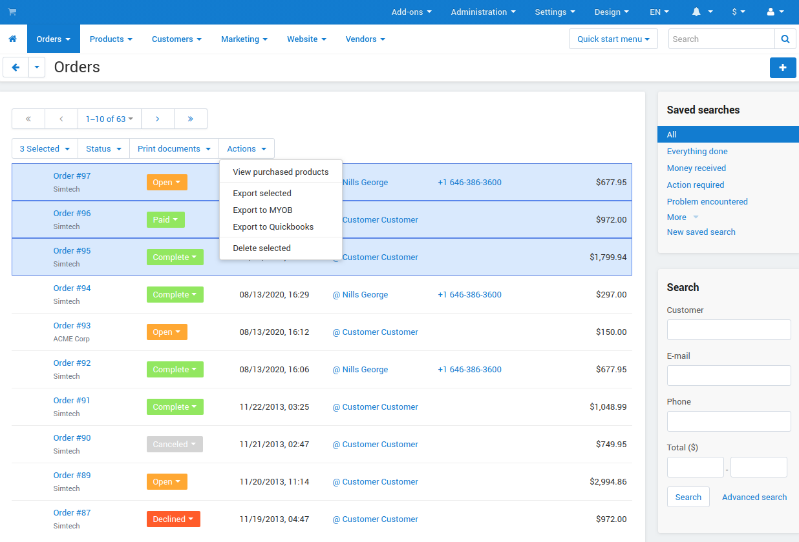

*************
Quick Actions
*************

The **View orders** section allows you to carry out many routine tasks for multiple orders including bulk order exporting and invoice printing in one click.

*	In the list of orders, select the check boxes for the orders you want to take action on.
*	Click the gear button in the upper right part of the list. This displays a list of applicable actions.

.. important ::

	The **Export to MYOB**, **Export to Quickbooks**, and **Get eBay orders** actions are available when the **MYOB**, **Quickbooks**, and **eBay synchronization** add-ons are installed and configured.

*	Click on the required action in the list.