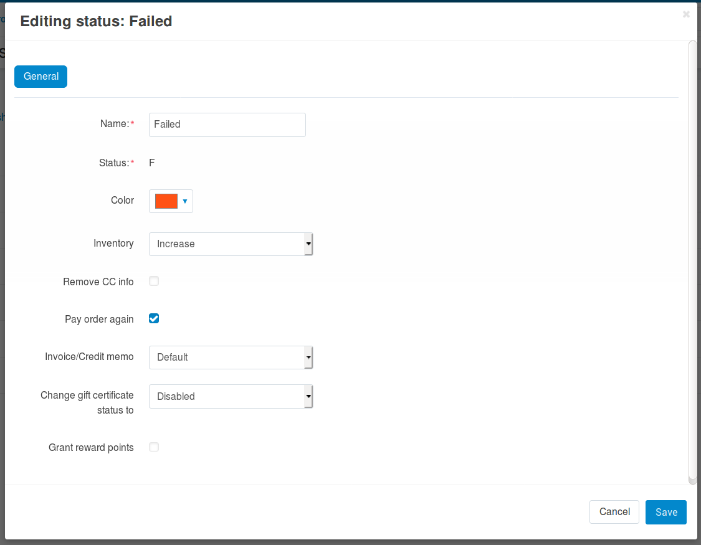

**********************************************
How To: Allow Customer to Pay Order Once Again
**********************************************

*   In the Administration panel, go to **Administration → Order statuses**.
*   Click on the name of a status.
*   Select the **Pay order again** check box and click the **Save** button to save the changes.

.. note ::

	If an order has one of the statuses for which the administrator enabled the **Pay order again** option, the **Pay order** section will be displayed under the order on the order details page in the storefront and a customer will be able to pay it once again.

