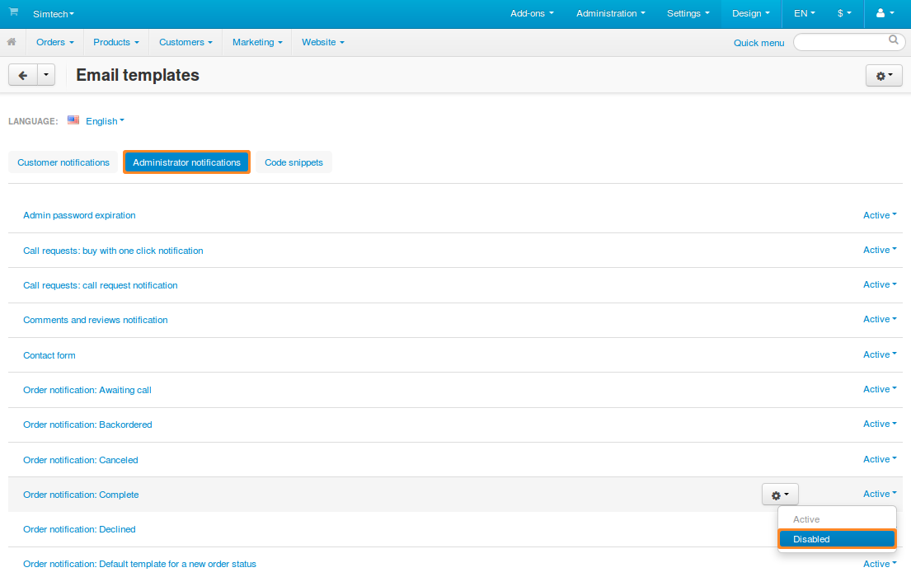

********************************************************
How To: Disable Email Notifications about Order Statuses
********************************************************

CS-Cart and Multi-Vendor can send email notifications when an order gets a certain status. These notifications can be sent to:

* the email addresses of customers;

* the orders department of your store.

.. hint::

    The email address of the orders department is specified in the Administration panel under **Settings → Company**.

Let's assume that we want to keep sending email notifications about order status changes to customers, but disable those notifications for the orders department. There are two ways to do this, depending on whether or not :doc:`the email template editor is enabled. <../../look_and_feel/email_templates/enable_email_editor>`

=====================================
When Email Template Editor Is Enabled
=====================================

1. In the Administration panel, go to **Design → Email templates**.

2. Switch to the **Administrator notifications** tab.

3. Change the statuses of the desired order status notifications to *Disabled*.

.. hint::

    The names of email templates related to order statuses begin with ``Order notification:``.

After that email notifications about orders getting this status won't be sent to the orders department.

.. note::

    If necessary, you can disable specific email notifications for customers as well. This is done on the **Customer notifications** tab.

======================================
When Email Template Editor is Disabled
======================================

1. In the Administration panel, go to **Administration → Order statuses**.

2. Click on the order status to edit it.

3. Untick the **Notify orders department** checkbox.

4. Click the **Save** button to apply the changes.

5. Repeat steps from 2 to 4 for all statuses which shouldn't send an email notification to administrators.

.. image:: img/notifications.png
    :align: center
    :alt: Notify orders department
