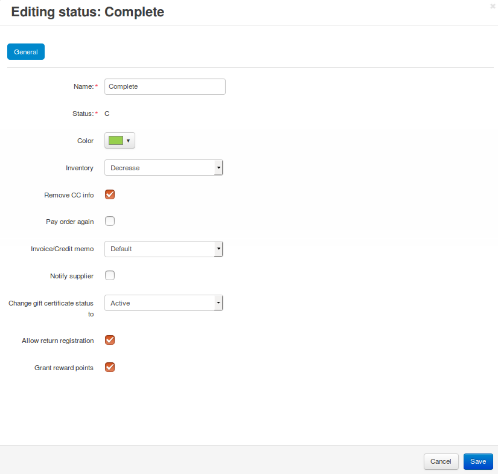

******************************
How To: Set up an Order Status
******************************

#. Go to **Administration → Statuses → Order statuses** in the Administration panel of your store.

#. Choose whether you want to:

   * create a new status by clicking the **+** button;

   * edit an existing status by clicking its name;

   * use drag & drop to sort statuses. 

   .. important::

       You can have up to 26 order statuses at the same time, as the database uses letters to identify them.

   .. image:: img/order_status_02.png
       :align: center
       :alt: Adding a new order status in CS-Cart.

#. Specify the status properties.

#. Click the **Create** or **Save** button.

   .. note::

       CS-Cart and Multi-Vendor only consider that the money has been paid when an order gets the *Processed* or *Complete* status (regardless of how you rename them). If you'd like to have more statuses that signify that the order has been paid for, that would have to be done via a third-party add-on.

=================
Status Properties
=================

.. note::

    Properties marked with ***** won't appear if you :doc:`enable the email template editor </user_guide/look_and_feel/email_templates/enable_email_editor>`. In that case you're supposed to manage email notifications related to order statuses via the :doc:`email template editor </user_guide/look_and_feel/email_templates/index>`.

* **Name**—the name of the status as it appears in the Administration panel.

* **Status**—a letter that identifies the status in the database. That's why there can't be more than 26 statuses.

* **E-mail subject***—the subject of an e-mail notification about the order with this status.

* **E-mail header***—the actual text of an e-mail notification about the order with the status.

* **Color**—the color of this status on the order list in the Administration panel.

* **Notify customer***—tick this checkbox to inform the customer by email about an order getting this status.

* **Notify orders department***—tick this checkbox to inform the store administrator by email about an order getting this status.

  .. note::

      The email address of the order department is specified in **Settings → Company**.

* **Inventory**—choose whether to decrease or increase the number of items in stock for products included in an order with this status.

* **Remove CC info**—tick this checkbox to remove sensitive credit card info from the database when the order gets this status.
    
* **Pay order again**—tick this checkbox to allow a customer to make a payment for the order again, if it was declined.

*  **Invoice/Credit memo**—choose the desired behavior after an order gets this status: 

   * *Default*—the default behavior (an invoice ID is not generated); 

   * *Invoice*—the order has been paid and processed successfully (an invoice ID is generated); 

   * *Order*—the order was placed, but has not paid for yet; 

   * *Credit memo*—the order has been paid and processed, but then returned (a credit memo ID is generated).

.. important::

    The properties described below appear only when the corresponding add-ons are installed and activated under **Add-ons → Manage add-ons**. These add-ons are: **Suppliers**, **Gift certificates**, **RMA**, **Reward points**.

* **Notify supplier**—tick this checkbox to send automatic email notifications to suppliers once an order gets this status. The notifications will be sent to suppliers whose products are in the order.

* **Change gift certificate status to**—choose a status to be automatically assigned to gift certificates purchased as a part of an order that gets this order status.

* **Allow return registration**—tick this checkbox to allow customers to request a return if the order has this status.

* **Grant reward points**—tick this checkbox to give the earned reward points to the customer once the order gets this status. 

  .. note::

      If you change a status of the order to a status that grants reward points, the customer will get them. But if you later choose another status that doesn't grant reward points, the points will be taken from the customer.

