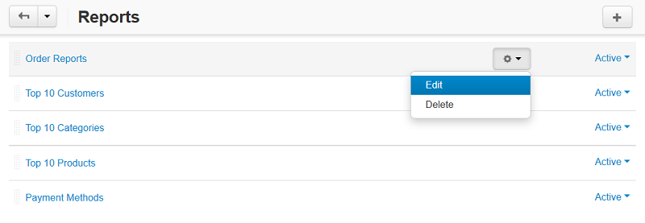
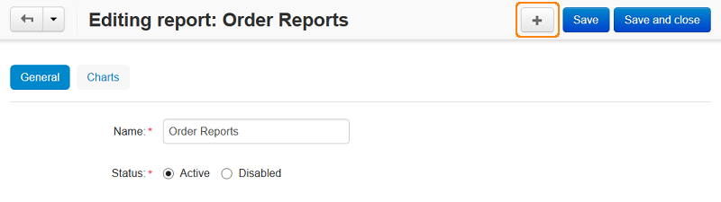
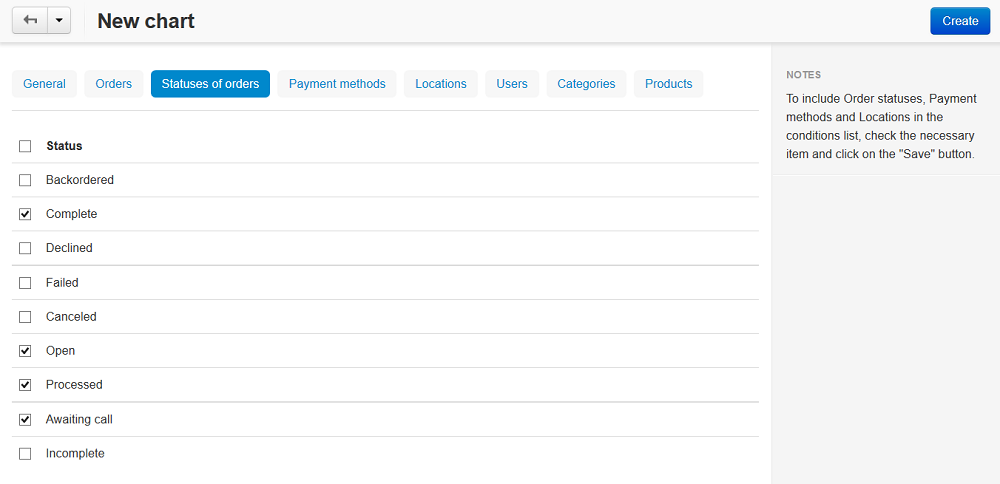

**********************
How To: Create a Chart
**********************

Data charts must be assigned to a particular :doc:`report <../sales_reports/create_report>`.

To add a chart to a report:

1. In the Administration panel, go to **Orders → Sales reports**.
2. Click the gear button and choose **Manage reports** to show the list of all available reports.
3. Click the gear button of the required report and choose **Edit** from the drop-down list.

This will open a page with the report details. The **Charts** tab contains a list of assigned reports (if any).

4. Click the **+** button to open the chart creation form.

5. Fill in the form.

   * Use the **General** tab to define the chart scope:

     * **Name**—the name of the chart as it will appear in the reports.
     * **Position**—the position of the chart relatively to the position of other charts in the report.
     * **Type**—how the data should be represented: graphically or in a table.
     * **Object to analyze**—the type of data to be reported on (users, orders and order statuses, products, categories, etc.)
     * **Value to display**—the aspect to be analyzed.
     * **Time interval**—the analyzed periods (day, week, month, year). Is not applicable to the chart type *Graphic [Pie 3D]*.

   * Use the other tabs to filter or limit chart content:

     * **Orders**,
     * **Statuses of orders**,
     * **Payment methods**,
     * **Locations**, 
     * **Users**, 
     * **Categories**, 
     * **Products**,
     * **Managers**.

     For example, the **Statuses of orders** tab allows you to show statistics on orders with specific statuses only. The **Products** tab allows you to choose the products, the statistics of which should be represented in the chart. Statistics on the unchosen products will not be included in the chart.

6. Click the **Create** button.

The new chart will be listed among the other charts.
