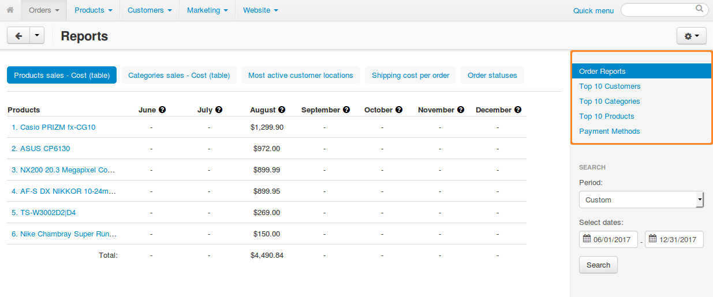

*************
Sales Reports
*************

The **Orders → Sales reports** page contains detailed statistics on the sales that were made in your web store. Statistics may be represented in a form of graphical or tabular charts. For convenience, charts are grouped into separate reports. You are encouraged to use several pre-defined reports or create your own reports.

To switch between the reports, use the menu on the right.

===============
In This Section
===============

.. toctree::
    :maxdepth: 2
    :titlesonly:
    :glob:

    *
