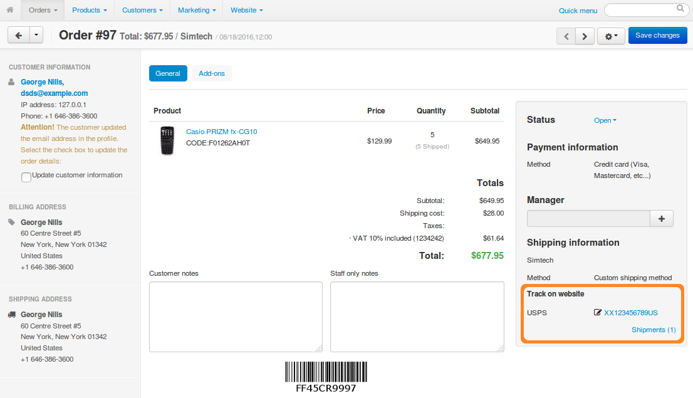
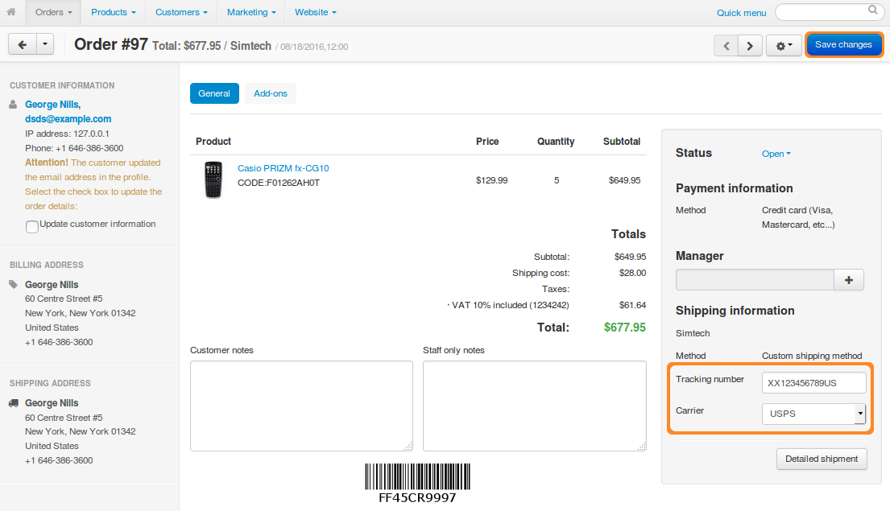
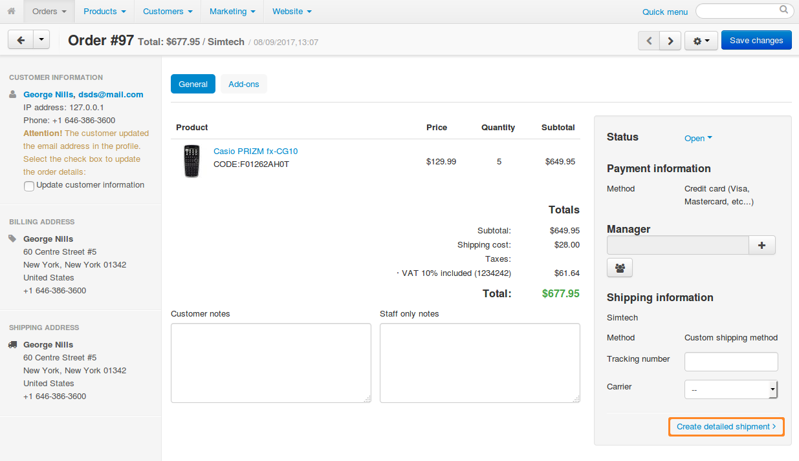
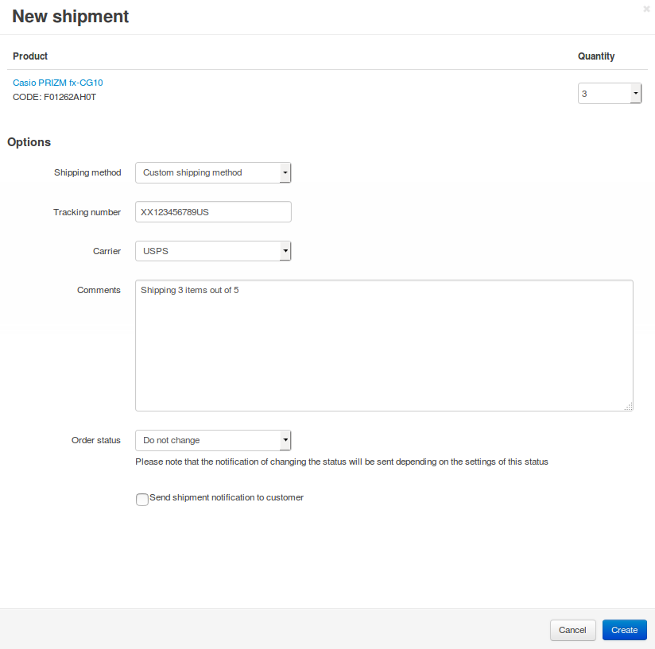

*************************
How To: Create a Shipment
*************************

.. note::

    **Tutorial Difficulty: 1 / 3**

Shipments are created separately for each order on the **order details** page in the **Shipping information** section.

1. Open the Administration panel of your store.

2. Go to **Orders → View orders** and choose the required order.

3. Create one or multiple shipments for the order:

   * **The quick way** creates a single shipment automatically. You'll have to select a carrier or enter the tracking number.

   * **The thorough way** allows you to create one or multiple shipments. You won't have to select a carrier or enter the tracking number. 

.. note::

    The tracking numbers that you enter appear in the **Shipping Information** section. If you select a carrier, the tracking numbers will show up as links leading to the shipment tracking page at the carrier's website.

-------------
The Quick Way
-------------

If you ship all the products in one batch via the same carrier:

* Choose the **carrier** and/or enter the **tracking number**.

* Click **Save changes**. The shipment will be created automatically.

----------------
The Thorough Way
----------------

If you plan to ship products via different carriers or just in separate batches:

* Click **Detailed Shipment**.

* The shipment creation window will open. For every product in the order, select the number of items to be delivered in the current shipment.

  .. note ::

      If you plan to deliver a particular product in a different shipment, select *0* (zero) from the **Quantity** drop-down list.

* Choose a shipping method.

* Optionally, enter a tracking number, choose a carrier, and add your comments.

* Change the order status, if necessary.

* Click the **Create** button.

