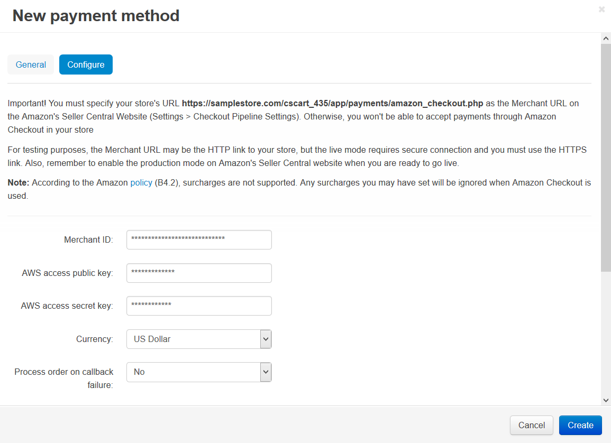

*******************************************
How To: Set up CS-Cart with Amazon Checkout
*******************************************

.. warning::

    **Checkout by Amazon** `has been discontinued <https://payments.amazon.com/help/81690>`_ and can no longer be used.

*	In the Administration panel, go to **Administration → Payment methods**.
*	Click the **+** button on the right.
*	In the opened window:

    *	In the **Name** field type *Amazon checkout*.
    *	In the **Processor** select box select *Amazon checkout*.
    *	If necessary, specify other fields and upload an icon.

*	Open the **Configure** tab in the same window to view the **Amazon checkout settings** section.

*	Follow the instruction at the top of the page.

.. note::

	Please set the **Merchant URL** parameter at **Seller central** (**Seller central → Settings → Checkout Pipeline Settings**) to *https://www.your_domain.com/app/payments/amazon/amazon_callback.php*, where *www.your_domain.com* is the address of your store.

*	Fill in the following fields:

    *	**Merchant ID** — your merchant identifier.
    *	**AWS access public key** — your AWS (Amazon Web Services) public key.
    *	**AWS access secret key** — your AWS secret key.
    *	**Currency** —  the currency in your Amazon account.
    *	**Process order on callback failure** — select *Yes* if you want to process the order even if the callback failed.
    *	**Test/Live mode** — select *Live*. In order to use the *Test* mode, you need to create the test account at Amazon.
    *	**Amazon button style** — select the style of the **Amazon Checkout** button that will be displayed on your storefront page.

*	Click the **Create** button to save the changes.

.. important::

	Also, there must be PHP's Curl support on your server (you are able to read more about it `here <http://www.php.net/curl>`_).
