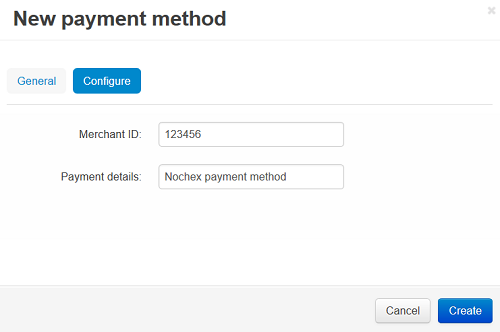

**********************************
How To: Set up CS-Cart with Nochex
**********************************

*   In the Administration panel go to **Administration → Payment methods**.
*   Click the **+** button on the right.
*   In the opened window:

    *   In the **Name** field type *Nochex*.
    *   In the **Processor** select box select *Nochex*.
    *   If necessary, specify other fields and upload an icon.

*   Open the **Configure** tab in the same window to view the Nochex settings.
*   Fill in the following fields:

    *   **Merchant ID** — your Nochex merchant ID.
    *   **Payment details** — the information that will be displayed on the Nochex site when a customer is taken there.

*   Click the **Create** button to save the changes.

