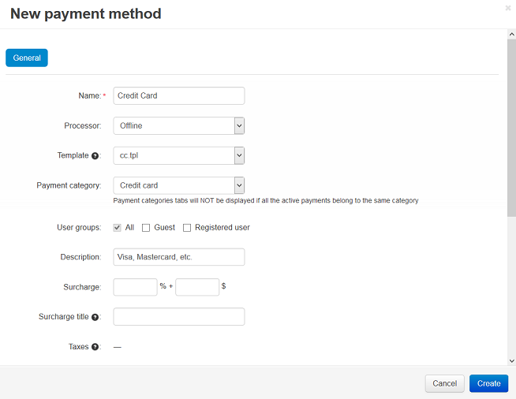

*****************************************************
How To: Set up the Credit Card Offline Payment Method
*****************************************************

To set up the credit card offline payment method, that does not use a real-time payment processor:

1. In the Administration panel go to **Administration → Payment methods**.

2. Click the **+** button on the right.

3. Into the **Name** text input field enter the name.

4. In the **Processor** selectbox choose *Offline*.

5. In the **Template** drop-down select box select *cc.tpl*. If necessary, specify other fields and upload an image.

6. Click **Create**.

7. Check this payment method:

   * Open storefront and go to checkout.

   * Select the added payment method in the **Select a payment method** section. The credit card form will be displayed below the selected payment.

   * After a customer has placed an order, his credit card information can be viewed on the **Order Details** page of the Administration panel and you will be able to process the order manually.

.. note::

    After a customer has placed an order, the order status will be **Open**. Make sure that :doc:`the Remove CC info option is disabled for the Open order status <../orders/order_statuses/remove_cc_info_auto>`.
