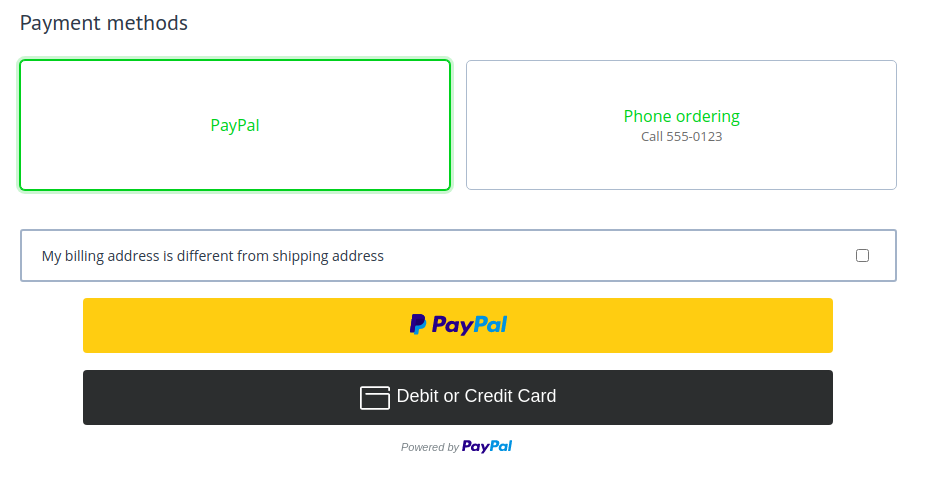

********************************
How To: Set up PayPal in CS-Cart
********************************

CS-Cart provides PayPal integrations to ensure a seamless and secure payment experience for both merchants and customers. 

There are two distinct PayPal integrations:

#. :doc:`PayPal Checkout </user_guide/payment_methods/paypal_checkout>` for single-seller online stores
#. :doc:`PayPal Commerce Platform </user_guide/payment_methods/paypal_commerce_platform>` for marketplaces where a customer might buy products from multiple sellers at once

.. note::
    
    If your marketplace uses the :doc:`Direct Customer-to-Vendor Payments </user_guide/addons/direct_customer_to_vendor_payments/index>` add-on, then your sellers can also use PayPal Checkout.

PayPal Checkout for online stores
=================================

PayPal Checkout is a solution for online stores, it follows the principle: one seller—one byuer, so there is only one transaction per order. 

It allows your customers to pay with the following payment methods:
    
* Credit and debit card
* PayPal (including Pay Later)
* Other local payment methods (like SEPA, iDEAL, giropay, etc)

You can customize the appearance of payment buttons in your online store or marketplace. 

The payment methods that your customers will see will depend on your location and currency, as well as that of your customers. For example, Venmo works in the United States and requires the Venmo app. PayPal Docs offer `Learn more information <https://developer.paypal.com/docs/checkout/apm/#link-availablepaymentmethods>`_ on various payment methods and their availability.

PayPal Commerce Platform for marketplaces
=========================================

It works as PayPal Checkout, but for marketplaces: PayPal Commerce Platform offers *everything that is in PayPal Checkout* and also handles situations when a buyer makes one payment for products from multiple sellers. PayPal Commerce Platform automatically splits the funds between the marketplace and the vendors whose products were purchased and the marketplace owner doesn’t have to transfer money manually. 

