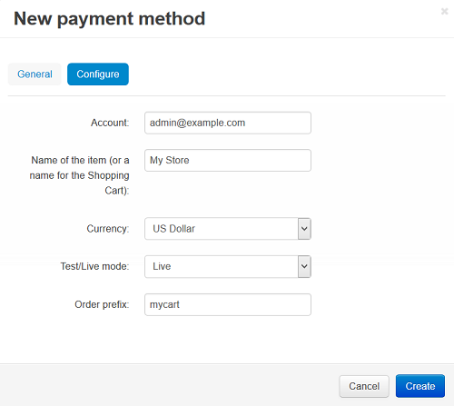

*****************************
How To: Set PayPal in CS-Cart
*****************************

To set PayPal Website Payments Standard account in CS-Cart:

*   In the Administration panel of your store, go to **Add-ons → Manage Add-ons** and make sure that the **PayPal payments** add-on is installed and configured.
*   Pay attention to the **PayPal order status conversion map** section. Here you can synchronize order status in your administration panel with the corresponding transaction status at PayPal.
*   Tick the **Override customer info** checkbox, if you want customer profile information in your store to be replaced with the info sent from PayPal.
*   Go to **Administration → Payment methods**.
*   Click the **+** button on the right.
*   In the opened window:

    *   In the **Name** text input field type *PayPal*. 
    *   In the **Processor** drop-down select box select *PayPal*. 
        If necessary, specify other fields and upload an icon.

*   In the same window go to the **Configure** tab.

*   Fill in the following fields:

    *   **Account** — your PayPal account login (namely, your email address).
    *   **Name of the item** — the value of the **Pay for** field, displayed on PayPal web page during the payment (for instance, *My shop*).
    *   **Currency** — the currency in your PayPal account. If it does not match the base currency in your CS-Cart settings, please contact CS-Cart support team.
    *   **Test/Live mode** — select *Live*. In order to use the **Test mode** you need to get additional accounts at `PayPal Sandbox <https://developer.paypal.com/>`_.
    *   **Order prefix** — any prefix you want invoice IDs to have on PayPal site (optional field) (for instance, *mycart*). Using the prefix allows to prevent duplicate invoice IDs in case you use the same PayPal account for accepting payment from several websites.

*   Click **Create**.

PayPal account settings:

If you want your customer to automatically return back to store after payment, at PayPal go to the **Profile → My selling tool** page and click the **Update** link near the **Website preferences** option. On the opened page set the **Auto Return** option as *Yes* and fill the **Return URL** input field by the following value:
*http://your_domain/index.php?dispatch=payment_notification.return&payment=paypal*

.. important::

	Use the **https** link (*https://your_domain/index.php?dispatch=payment_notification.return&payment=paypal*), if you have the secure connection enabled at checkout.

Do not touch any other settings on this page.