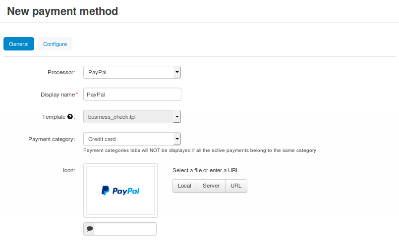
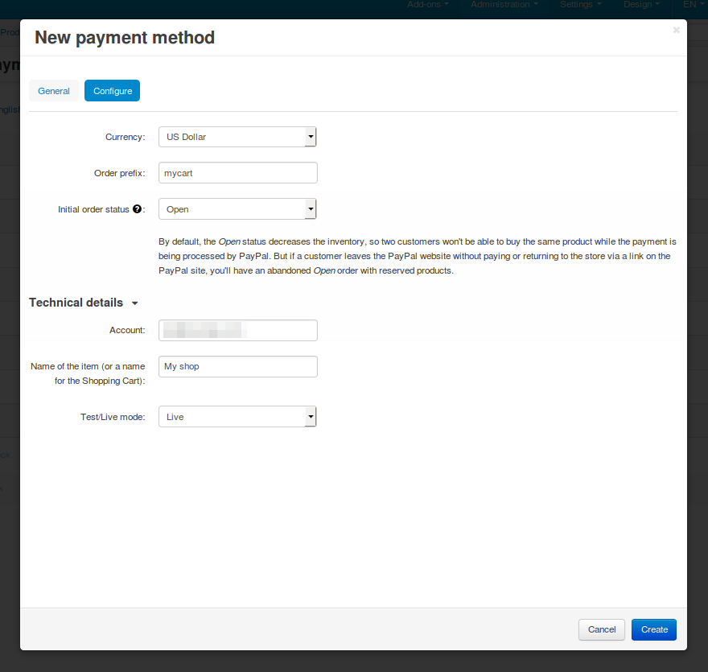

********************************
How To: Set up PayPal in CS-Cart
********************************

.. note::

    Before you begin, make sure that the :doc:`PayPal payments </user_guide/addons/paypal_payments/index>` add-on is active and configured.

1. In the Administration panel, go to **Administration → Payment methods**.

2. Сlick the **+** button (*Add payment method*) in the top right corner of the page.

3. Fill in the form:

   * Select *PayPal* in the **Processor** drop-down list.

   * Enter the **Display name**—the name of the payment method that will appear to your customers at checkout. By default, the payment method will be called *PayPal*.

   * Specify other settings and upload an icon for the payment method, if necessary.

4. Switch to the **Configure** tab and specify PayPal settings:

   * **Currency**—the currency of your PayPal account. 

     This :doc:`currency </user_guide/currencies/index>` must exist in your store and, ideally, it should be your primary currency. That is because prices are always converted to PayPal currency according to the rates you specified, before being sent to PayPal.

   * **Order prefix** (optional)—any prefix you want invoice IDs to have on PayPal site (for example, *mycart*). Using the prefix allows to prevent duplicate invoice IDs when you use the same PayPal account to accept payments from several websites.

   * **Initial order status**—select a status that all orders with this payment method will get get until the response from PayPal (an IPN message) arrives or a customer returns to the store via a link on the PayPal site.

5. Make sure to fill in the **Technical details**:

   * **Account**—the email address of your PayPal account.

   * **Name of the item**—the value of the **Pay for** field, displayed on PayPal web page during the payment (for example, *My shop*).

   * **Test/Live mode**—select *Live*.

     If you want to use the *Test* mode to see how the payment method works before you offer it to your customers, you’ll need to get additional accounts as described on `the PayPal website <https://developer.paypal.com/docs/classic/lifecycle/ug_sandbox/>`_.

6. Click the **Create** button.

