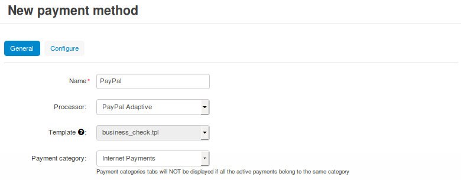
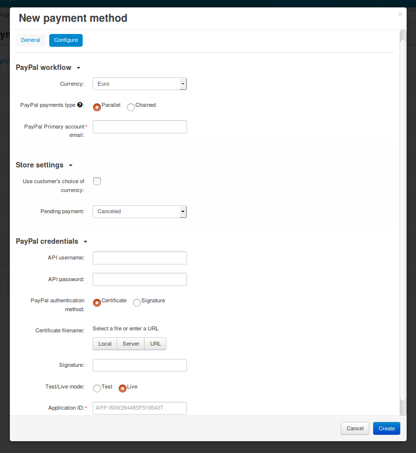
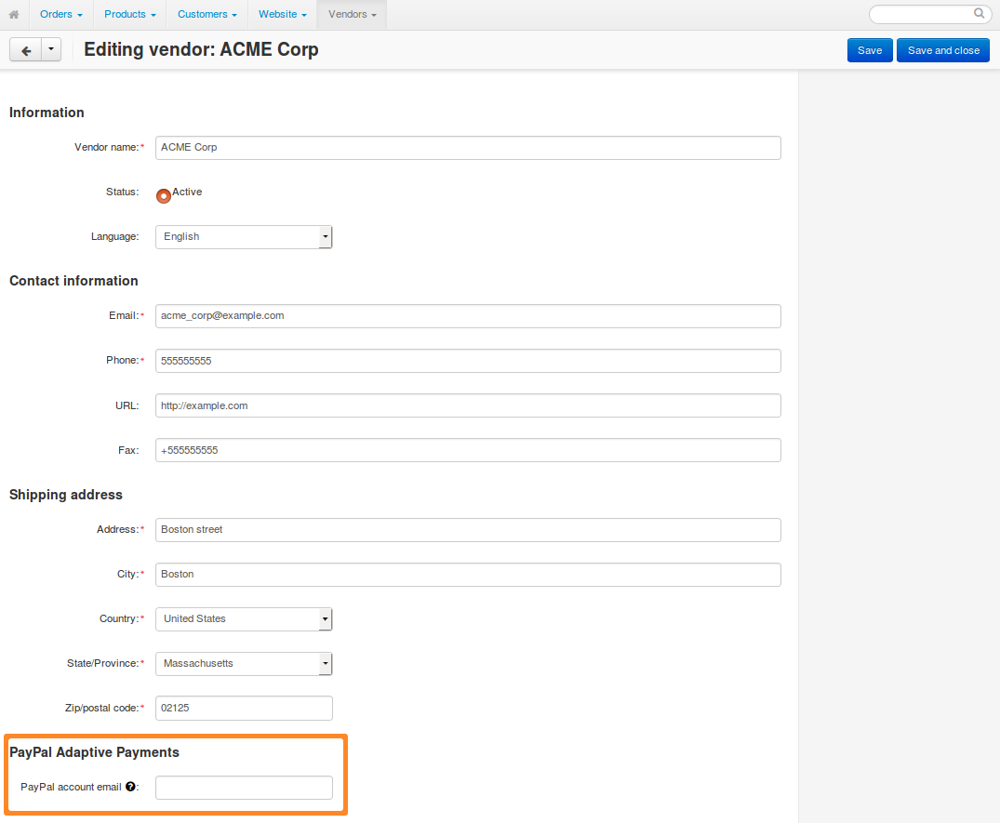
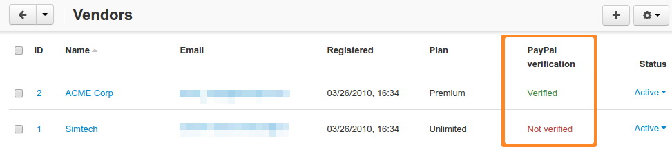

*******************************************************
How To: Set up PayPal Adaptive Payments in Multi-Vendor
*******************************************************

.. note::

    The :doc:`PayPal Adaptive Payments <index>` add-on comes with Multi-Vendor starting with version 4.5.1. Please note that PayPal doesn't accept new registrations for Adaptive Payments. The article is relevant only for the existing users of that solution.

================================
Step 1. Configure Payment Method
================================

1.1. :doc:`Install and configure the PayPal Adaptive Payments add-on. </user_guide/addons/paypal_adaptive/configure_adaptive_payments>`

1.2. Go to **Administration → Payment methods** and click the **+** button in the top right corner to add a payment method.

1.3. A new pop-up window with the payment method creation form will open. Fill in the fields on the **General** tab:

  * **Name**—the name the new payment method. That's the name that the customers will see at checkout.

  * **Processor**—the online payment processor that will handle the transactions. Choose *PayPal Adaptive* from the drop-down menu. 

  * If necessary, specify the data in other fields as you see fit.

1.4. Switch to the **Configure** tab. It contains the settings specific to PayPal Adaptive Payments.

  * **PayPal workflow:**

    * **Currency**—select the currency of your PayPal account. It must match the primary currency of your store.

    * **PayPal payments type**—choose between *Parallel* or *Chained* payments. For more information, please check `this article on PayPal Developer website <https://developer.paypal.com/docs/classic/adaptive-payments/integration-guide/APIntro/>`_.

      .. note::

          Chained payments can't be used if the **PayPal Adaptive Payments** add-on :doc:`is configured to collect both order commission and unpaid payouts </user_guide/addons/paypal_adaptive/configure_adaptive_payments>`.

    * **PayPal Primary account email**—enter the PayPal account email of the store owner (or the *primary receiver* in PayPal terms).

  * **Store settings:**

    * **Use customer's choice of currency**—let's assume you accept payments in US Dollars in PayPal, but the customer tries pays in Euros:

      * *The checkbox is ticked:* the payment amount will be automatically converted. 

      * *The checkbox is not ticked:* the payment will be declined, and the customer will be asked to pay in the currency specified in the settings.

    * **Pending payment**—select the status that the order will get until the customer makes the payment.

  * **PayPal credentials**—enter your credentials in this section. We have a separate article about :doc:`getting credentials and configuring your account for PayPal Adaptive Payments </user_guide/addons/paypal_adaptive/credentials>`.

1.5. Once you have configured the payment method, click **Create**.

=============================================
Step 2. Enter PayPal Account Data for Vendors
=============================================

Make sure that vendors specify the email addresses associated with their functioning PayPal Business accounts. To do that:

2.1. Open Multi-Vendor Administration panel and go to **Vendors → Vendors**.

2.2. Click the name of the desired vendor.

2.3. The vendor editing window will open. Scroll down and fill in *all the fields* in the **PayPal Adaptive Payments** section. Your vendors can also enter that data themselves.

2.4. After the changes are saved, the add-on automatically requests confirmation from PayPal that the provided email addresses are valid for transactions. 

We recommend you set up a CRON job that verifies the emails of vendors automatically every now and then. The link for the CRON job can be found in the settings of the **PayPal Adaptive Payments** add-on.

.. important::

   When a customer buys products from multiple vendors in one order, all of those vendors must be verified. Otherwise the customer won't be able to choose the payment method that uses PayPal Adaptive Payments.

.. meta::
   :description: Use PayPal Adaptive Payments to configure a payment method that automatically splits payments for orders among vendors.
