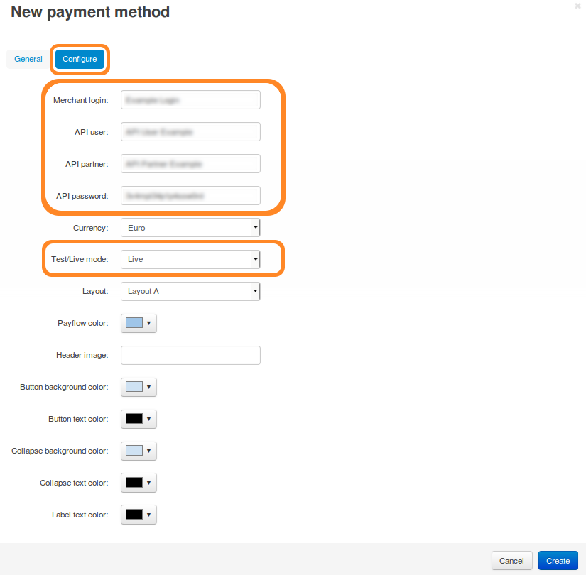

**************************************************
How To: Set up PayPal Payments Advanced in CS-Cart
**************************************************

1. In the Administration panel, go to **Administration → Payment methods**.

2. Click the **+** button (*Add payment method*) in the top right corner of the screen.

3. Fill in the form:

   * Name your new payment method (for example, **PayPal Advanced**). 

   * Select *PayPal Advanced* in the **Processor** drop-down list.

   * Specify other settings and upload an icon for the payment method, if necessary.

.. image:: img/paypal_payments_advanced.png
    :align: center
    :alt: Name your payment method and set PayPal Advanced as processor.

4. Switch to the **Configure** tab and specify PayPal Payments Advanced settings. Make sure to fill in the following fields:

   * **Merchant login**

   * **API user**

   * **API partner**

   * **API password**

.. hint::

    You can find this data in your PayPal Advanced account.

5. Set **Test/Live mode** to *Live*. 

.. note::

    To use the *Test mode*, you need to get additional accounts at `PayPal Sandbox <https://developer.paypal.com/>`_.

6. Click the **Create** button to save the changes.

