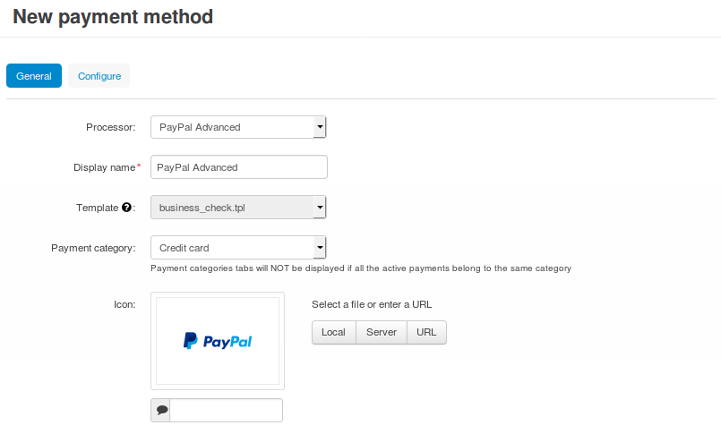
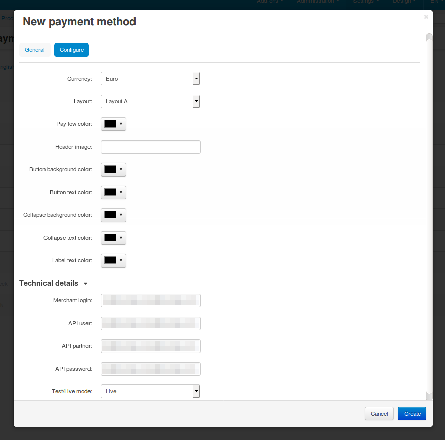

**************************************************
How To: Set up PayPal Payments Advanced in CS-Cart
**************************************************

.. note::

    Before you begin, make sure that the :doc:`PayPal payments </user_guide/addons/paypal_payments/index>` add-on is active and configured.

1. In the Administration panel, go to **Administration → Payment methods**.

2. Сlick the **+** button (*Add payment method*) in the top right corner of the page.

3. Fill in the form:

   * Select *PayPal Advanced* in the **Processor** drop-down list.

   * Enter the **Display name**—the name of the payment method that will appear to your customers at checkout. By default, the payment method will be called *PayPal Advanced*.

   * Specify other settings and upload an icon for the payment method, if necessary.

4. Switch to the **Configure** tab and specify the settings of PayPal Payments Advanced:

   * Select the **Currency** of your PayPal account.

     This :doc:`currency </user_guide/currencies/index>` must exist in your store and, ideally, it should be your primary currency. That is because prices are always converted to PayPal currency according to the rates you specified, before being sent to PayPal.

   * Choose the layout, colors, and header image of the payment page.

5. Make sure to fill in the **Technical details**:

   * **Merchant login**

   * **API user**

   * **API partner**

   * **API password**

   .. note::

       You can find this data in your PayPal Advanced account.

6. Set **Test/Live mode** to *Live*.

   You can use the *Test* mode to see how the payment method works. But this mode doesn't work with live PayPal accounts. For testing you’ll need to use `test accounts from PayPal Sandbox <https://developer.paypal.com/docs/classic/lifecycle/ug_sandbox/>`_.

7. Click the **Create** button.

