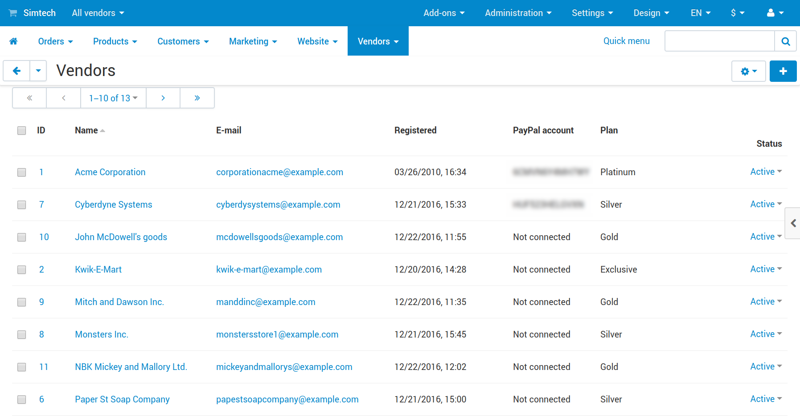

******************************************************
How To: Set up PayPal for Marketplaces in Multi-Vendor
******************************************************

.. note::

    The **PayPal for Marketplaces** add-on first appeared in Multi-Vendor 4.8.1.

================================
Step 1. Configure Payment Method
================================

#. :doc:`Install and configure the PayPal for Marketplaces add-on. </user_guide/addons/paypal_for_marketplaces/index>`

#. Go to **Administration → Payment methods** and click the **+** button in the top right corner to add a payment method.

#. The payment method creation form will open. Fill in the fields on the **General** tab:

   * **Name**—the name of the new payment method; customers will see it at checkout.

   * **Processor**—the online payment processor that will handle the transactions. Choose *PayPal for Marketplaces* from the drop-down menu. 

   * If necessary, specify the data in other fields as you see fit.

     .. image:: img/paypal_for_marketplaces_general.png
         :align: center
         :alt: The general settings of a PayPal for Marketplaces payment method.

#. Switch to the **Configure** tab. It contains the settings specific to PayPal for Marketplaces.

   In order to configure and use PayPal for Marketplaces, please `submit an application to PayPal <https://www.paypal.com/gb/smarthelp/article/what-is-paypal-for-marketplaces-ts2122>`_. Without it you won't get the necessary credentials for setting up the payment method. Also, you'll find a URL in the payment method settings. You'll need to specify that URL when `configuring the webhook for your REST application on the PayPal side <https://developer.paypal.com/docs/integration/direct/webhooks/rest-webhooks/#to-use-the-dashboard-to-subscribe-to-events>`_.

   .. note::

       Please contact PayPal if you experience any difficulty in completing the step described above.

#. Once you have configured the payment method, click **Create**.

   .. image:: img/paypal_for_marketplaces_configure.png
       :align: center
       :alt: The technical settings of a PayPal for Marketplaces payment method.

================================================
Step 2. Have Your Vendors Connect Their Accounts
================================================

All vendors who want to benefit from PayPal for Marketplaces must have PayPal Business accounts and connect them to your Multi-Vendor marketplace.

.. important::

    If a customer adds products from multiple vendors to cart, and even one of the vendors in the order hasn't connected the account, then it won't be possible for the customer to pay the order via PayPal for Marketplaces.

Here are the instructions for a :doc:`vendor's administrator </user_guide/users/vendors/index>` on how to connect a PayPal Business account to the marketplace:

#. Open the Multi-Vendor administration panel and go to **Vendors → Vendors**.

#. Click the name of the your vendor.

#. The vendor editing form will open. Scroll down and find the **PayPal for Marketplaces** section.

   .. image:: img/paypal_for_marketplaces_connect.png
       :align: center
       :alt: The PayPal for Marketplaces section in the vendor's profile.

#. Find the **Connect with PayPal** button and click it.

#. You'll be taken to the PayPal website. Follow the instructions there to connect your business account to the marketplace. This will allow you to receive money from orders to your PayPal account without the need to request its withdrawal from the marketplace owner.

Marketplace owners can use the **Vendors → Vendors** page to check the list of vendors and see what vendors have already connected their accounts. There is a special column called **PayPal account** on that page, and it will say *Not connected* for any vendor who hasn't connected the Business account yet.

