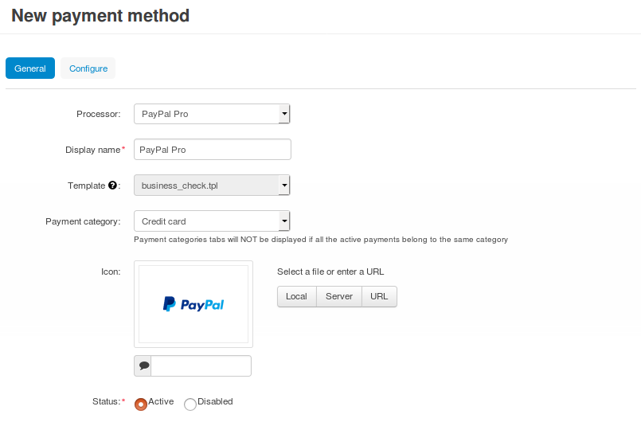
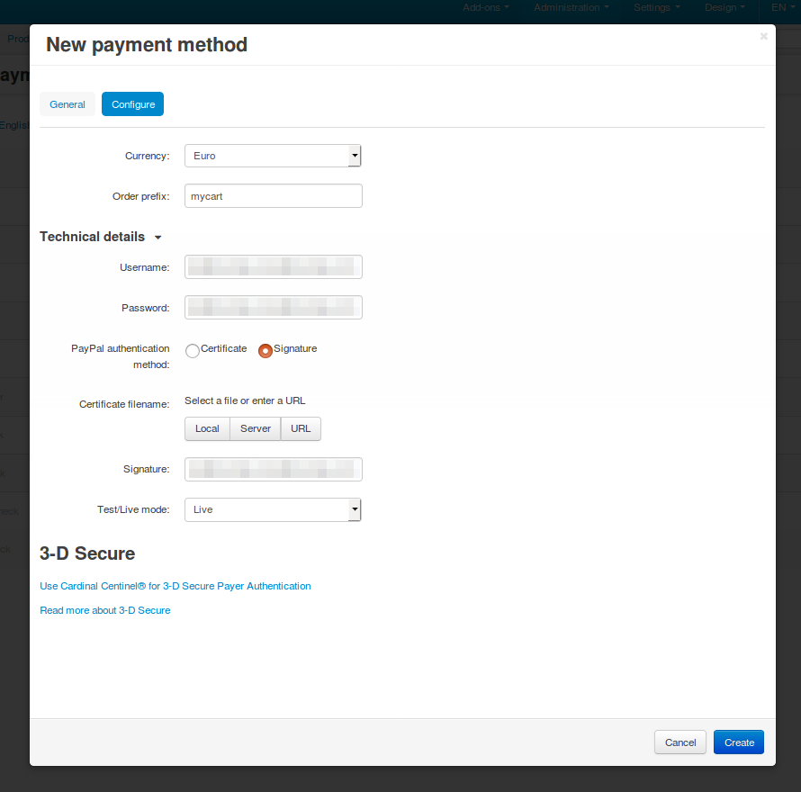

************************************
How To: Set up PayPal Pro in CS-Cart
************************************

.. note::

    Before you begin, make sure that the :doc:`PayPal payments </user_guide/addons/paypal_payments/index>` add-on is active and configured. In order to use PayPal Pro, your server must also support `PHP’s CURL <http://www.php.net/curl>`_.

1. In the Administration panel, go to **Administration → Payment methods**.

2. Сlick the **+** button (*Add payment method*) in the top right corner of the page.

3. Fill in the form:

   * Select *PayPal Pro* in the **Processor** drop-down list.

   * Enter the **Display name**—the name of the payment method that will appear to your customers at checkout. By default, the payment method will be called *PayPal Pro*.

   * Specify other settings and upload an icon for the payment method, if necessary.

4. Switch to the **Configure** tab and specify the settings of PayPal Pro:

   * **Currency**—the currency of your PayPal account.

     This :doc:`currency </user_guide/currencies/index>` must exist in your store and, ideally, it should be your primary currency. That is because prices are always converted to PayPal currency according to the rates you specified, before being sent to PayPal.

   * **Order prefix** (optional)—any prefix you want invoice IDs to have on PayPal site (for example, *mycart*). Using the prefix allows to prevent duplicate invoice IDs when you use the same PayPal account to accept payments from several websites.

5. Make sure to fill in the **Technical details**:

   * **Username**—your PayPal Pro API username.

   * **Password**—your PayPal Pro API password.

   * **PayPal authentication method**—select the desired authentication method:

     * If you select **Certficate**: upload a certificate file in the **Certificate filename** section. Make sure that there are readable :doc:`permissions </install/useful_info/permissions>` for the certificate file and for the directory where it is located on your server.

     * If you select **Signature**: enter your signature in the corresponding field.

     .. note::

         You can get the certificate and signature, as well as other API access credentials, from your account on `www.paypal.com <https://www.paypal.com/>`_.

   * **Send customer shipping address**—tick this checkbox if you want to send the customer's shipping address to PayPal.

   * **Test/Live mode**—select *Live* mode.

     If you want to use the *Test* mode to see how the payment method works before you offer it to your customers, you’ll need to get additional accounts as described on `the PayPal website <https://developer.paypal.com/docs/classic/lifecycle/ug_sandbox/>`_.

6. (optional) If necessary, click **Use Cardinal Centinel® for 3-D Secure Payer Authentication**. This will expand the additional section of the settings that you’ll need to fill in. 

   If you change your mind, click **Don’t use Cardinal Centinel® for 3-D Secure Payer Authentication**.

7. Click the **Create** button.

