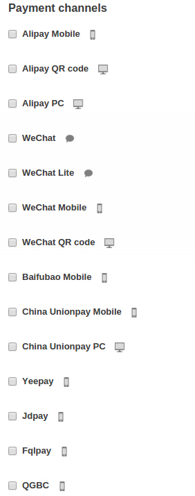

*****************************************
How To: Set Up Ping++ Payments in CS-Cart
*****************************************

After you have :doc:`installed the Ping++ Payments add-on <../addons/ping_payments/index>`, you need to set up a payment method. To do it, please follow these steps:

#. In the Administration panel, go to **Administration → Payment methods**.

#. Сlick the **+** button (*Add payment method*) in the top right corner of the page.

#. Fill in the form:

   * Select **Ping++** in the **Processor** drop-down list.

   * Enter the **Name**—the name of the payment method that will appear to your customers at checkout.

   * Specify other settings and upload an icon for the payment method, if necessary.

   .. image:: img/ping_general_tab.png
       :align: center
       :alt: Creating a payment method for Ping++.

#. Switch to the **Configure** tab and specify Ping++ general settings:

   .. important::

       To use the Ping++ payment method, you must have the Chinese Yuan (CNY) currency enabled.

   * **App ID**—the ID is obtained after registration in the Ping++ system.

   * **API key**—the key that you can get on the Ping++ web site.

   * **Order number prefix**—an alphanumeric prefix for order ID used by Ping++ payments channels. This field is required because some of the payment channels have restrictions on the minimum number of symbols in ID.

   .. image:: img/ping_configure_tab.png
       :align: center
       :alt: Configuring Ping++.

#. Fill in WeChat settings if you plan to use this payment channel:

   * **App ID**—the ID is obtained after registration in the WeChat system. 

   * **App secret**—your secret key.

#. Select payment channels that will be used by the Ping++ aggregator.

