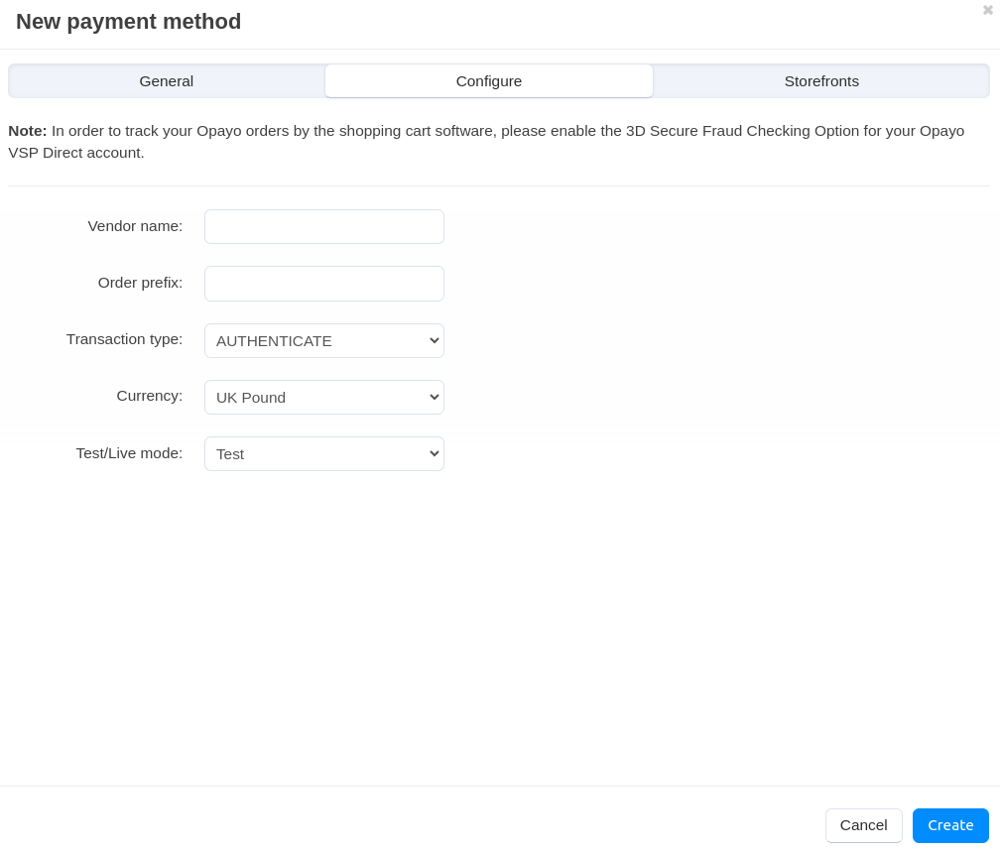

****************************************
How To: Set up CS-Cart with Opayo direct
****************************************

.. important::

    The SagePay Direct payment method was renamed to Opayo direct in CS-Cart 4.18.1. 

*   In the Administration panel, go to **Settings → Payment methods**.
*   Click the **+** button on the right.
*   In the opened window:

    *   In the **Name** field type *Opayo direct*.
    *   In the **Processor** select box select *Opayo direct*.
    *   If necessary, specify other fields and upload an icon.

*   Open the **Configure** tab in the same window to view the Opayo direct settings.

*   Fill in the following fields:

    *   **Vendor name** — enter the vendor name.
    *   **Order prefix** — any prefix you want invoice IDs to have on Opayo site (optional field) (for instance, *mycart*). Using the prefix allows to prevent duplicate invoice IDs in case you use the same Opayo direct account for accepting payment from several websites.
    *   **Transaction type** — select the AUTHENTICATE option.
    *   **Currency** — the currency in your Opayo direct account. If it does not match the base currency in your CS-Cart settings, please contact CS-Cart support team.
    *   **Test/Live mode** — set it to *Test* while testing the credit card processing through this payment gateway.

*   Click the **Create** button to save the changes.
