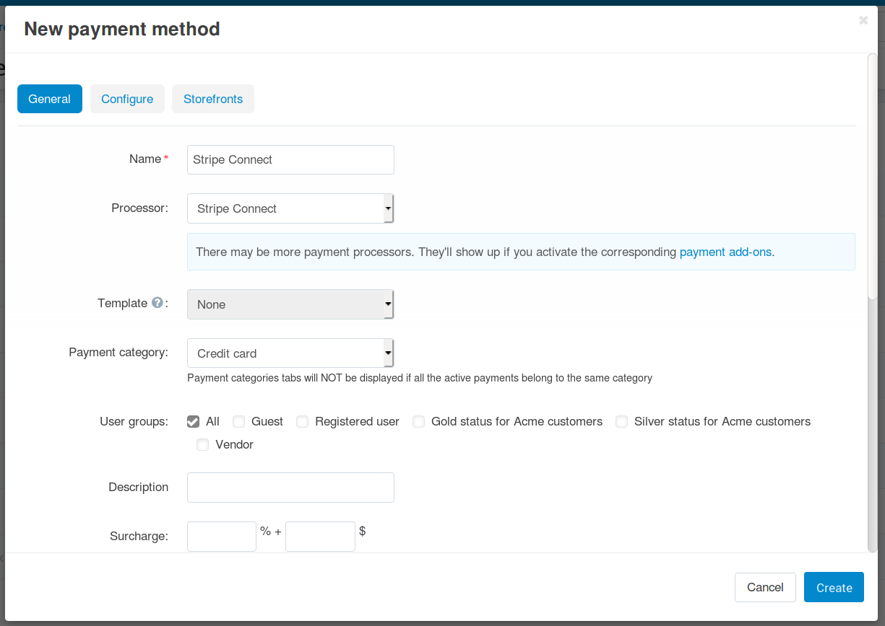
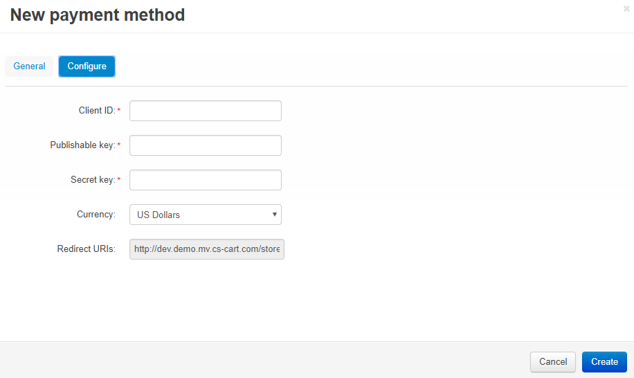
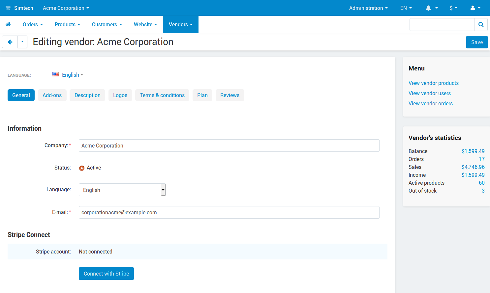

*********************************************
How To: Set up Stripe Connect in Multi-Vendor
*********************************************

.. note::

    The :doc:`Stripe Connect Payments </user_guide/addons/stripe_connect/index>` add-on is available in Multi-Vendor starting with version 4.7.1.

====================================
Step 1. Configure the Payment Method
====================================

1.1. :doc:`Install and configure the Stripe Connect Payments add-on. </user_guide/addons/stripe_connect/settings>`

1.2. Go to **Administration → Payment methods** and click the **+** button in the top right corner to add a payment method.

1.3. A new pop-up window with the payment method creation form will open. Fill in the fields on the **General** tab:

* **Name**—the name the new payment method. That’s the name that the customers will see at checkout.

* **Processor**—the online payment processor that will handle the transactions. Choose *Stripe Connect* from the drop-down menu.

* If necessary, specify the data in other fields as you see fit.

1.4. Switch to the **Configure** tab. It contains the settings specific to Stripe Connect:

* **Client ID**—the live client ID of your Stripe account.

* **Publishable key**—the publishable API key of your Stripe account.

* **Secret key**—the secret API key of your Stripe account. 

* **Currency**—select the currency of your Stripe account. It should match the primary currency of your store—that way the calculations will be more precise.

* **Redirect URIs**—a value that you must copy to the corresponding field on the Stripe dashboard.

  .. note::

      Learn more about how to get client ID and API keys for Stripe Connect and how to use Redirect URIs :doc:`in a separate article </user_guide/addons/stripe_connect/credentials>`.

1.5. Once you have configured the payment method, click **Create**.

================================================
Step 2. Have Your Vendors Connect Their Accounts
================================================

Once you set up a Stripe Connect payment method, your vendors will be able to connect their accounts, so that they can use the Stripe Connect payment method that you have created. Here is the instruction for a vendor:

2.1. Open the vendor's administration panel and go to **Vendors → Vendors**.

2.2. Click on the name of your company.

2.3. The vendor editing page will open. Scroll down and click the **Connect with Stripe** button. This will take you to the Stripe page where you'll be able to register an account or connect an existing one.

.. important::

    Only :doc:`vendors' administrators </user_guide/users/vendors/index>` can see the **Connect with Stripe** button. The store owners can see whether or not a vendor has connected a Stripe account.

