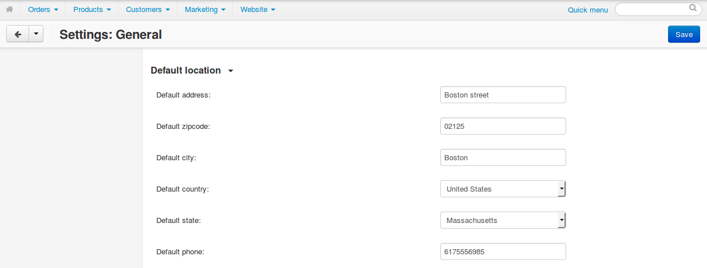
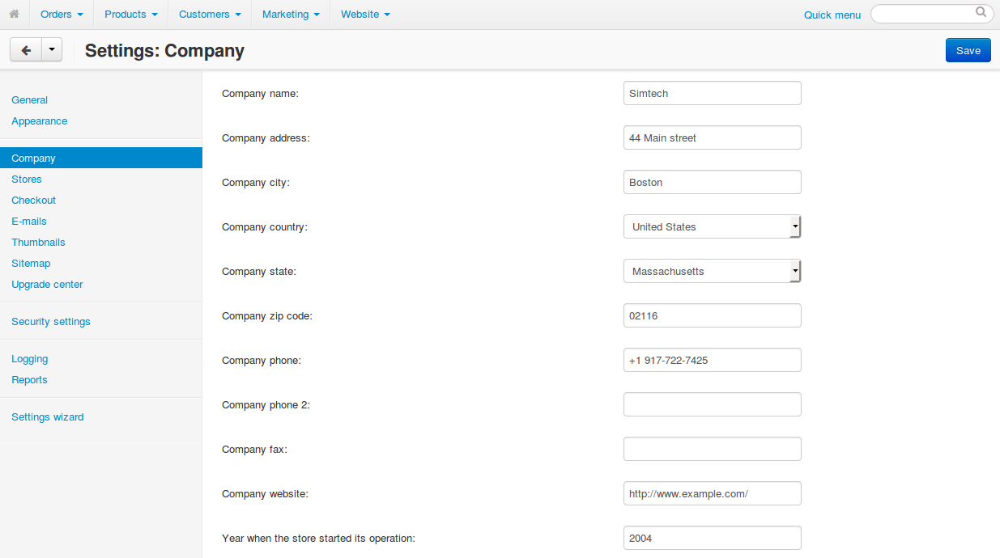

*************************************
Address for Shipping Cost Calculation
*************************************

CS-Cart and Multi-Vendor need the address of the store and the address of the customer to calculate shipping costs. A customer can enter the address when placing an order or creating the account.

.. hint::

    You can :doc:`add or enable/disable profile fields in profile and at checkout </user_guide/users/customers/change_profile_fields>`.

========================
Default Customer Address
========================

The **Settings → General** page allows you to specify the **Default location**, in other words, the default customer address. It will be used for testing the rate calculation of :doc:`real-time shipping methods </user_guide/shipping_and_taxes/shipping_methods/realtime_shipping_methods/index>` in the admin panel.

===============
Company Address
===============

The **Settings → Company** page allows you to specify the sender address (the address of your store and warehouse). 

.. important::

    If you have multiple warehouses or suppliers, you can use :doc:`the functionality of the "Suppliers" add-on </user_guide/users/suppliers/configure_suppliers>`.

