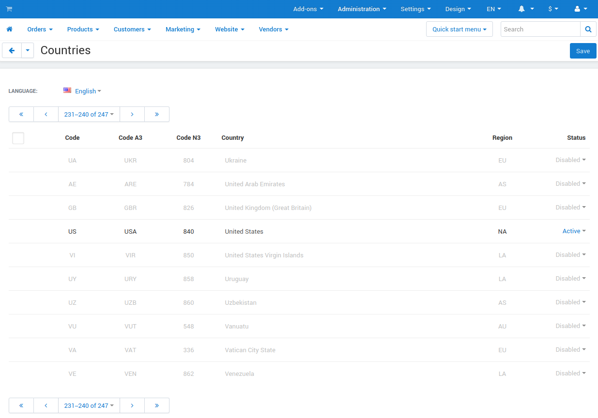

*********
Countries
*********

Use the **Administration → Shipping and taxes → Countries** page to manage the set of countries that are supported in your store.

==================
Country Properties
==================

* **Code**—a 2-letter code to identify the country.

* **Code A3**—a 3-letter official ISO code to identify the country.

* **Code N3**—a 3-digit code to identify the country.

* **Country**—the name of the country.

* **Region**—the part of the world where the country is situated.

* **Status**—the status of the country: *Active* or *Disabled*.

  .. note::

      If you disable a country, users won't be able to select it in their profiles or at checkout.
