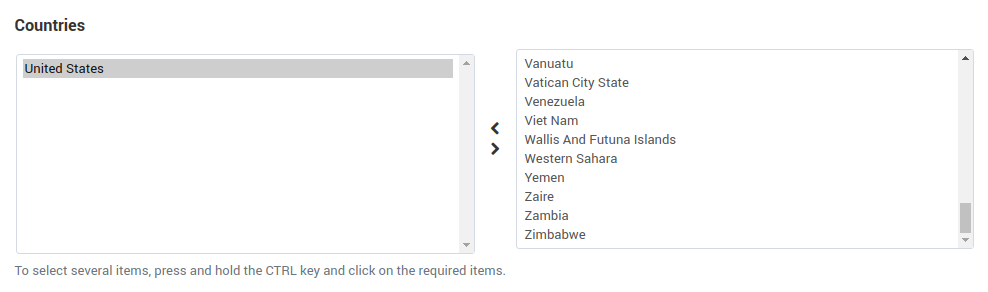
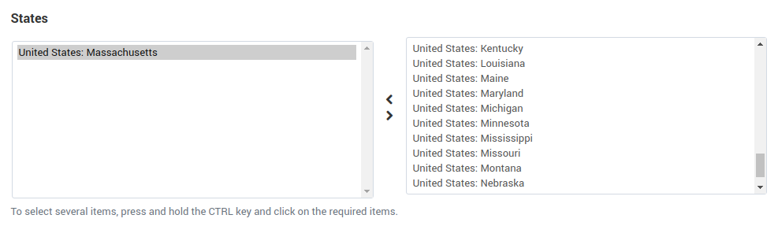

********************
Rate Area Properties
********************

.. important::

    A customer is assigned to a rate area when all the **non-empty conditions** (as in, country, state, ZIP code, city, address) are met. Don't specify more conditions than you have to: a customer might make a mistake or leave the fields empty.

.. contents::
    :backlinks: none
    :local:
    

=======
General
=======

* **Name**—the name of the rate area in the administration panel.

* **Status**—the status of the rate area: *Active* or *Disabled*.

* **Add in all realtime shipping methods**—tick the checkbox if you want the new rate area to be added to all realtime shipping methods that exist in your store (available only when :doc:`creating a new rate area </user_guide/shipping_and_taxes/locations/set_location>`).

  .. image:: img/locations_general.png
      :align: center
      :alt: The "General" section of the rate area editing page in CS-Cart and Multi-Vendor.

=========
Countries
=========

The right box contains all available countries, and the left box contains the countries included in the rate area. To move items from one box to the other, use the twin horizontal arrows between the boxes. To select multiple items, press and hold **Ctrl** or **Shift** while selecting.

.. hint::

    Go to **Administration → Shipping & taxes → Countries** to :doc:`adjust the list of available countries <countries>`.

======
States
======

The right box contains all available states, and the left box contains the states included in the rate area. To move items from one box to the other, use the twin horizontal arrows between the boxes. To select multiple items, press and hold **Ctrl** or **Shift** while selecting.

.. hint::

    Go to **Administration → Shipping & taxes → States** to :doc:`adjust the list of available states <states>`.

================
Zip/Postal Codes
================

The text box contains the ZIP/postal codes included in the rate area. Different entries must be separated by a paragraph break (i.e, each entry must be a separate line).

It is not necessary to specify the exact codes, you can use wildcards instead. Here is how they work:

* **?** = any single character (or a space). For example, **98?78** stands for *98078*, *98A78*, *98 78*, etc.

* ***** = any series of characters; for example, **12*** stands for *12345*, *128765*, *12 0AC1D9 B5*, etc.

  .. image:: img/zip_postal_codes.png
      :align: center
      :alt: The "ZIP/Postal code" section of the rate area editing page in CS-Cart and Multi-Vendor.

======
Cities
======

The text box contains the cities included in the rate area. Different entries must be separated by a paragraph break (i.e, each entry must be a separate line).

It is not necessary to specify the full city name, you can use wildcards instead. Here is how they work:

* **?** = any single character (or a space).

* ***** = any series of characters.

For example:

* **New Y*** stands for *New York*, *New York City*, *New Yorkshire*, *New Year's Eve*,  and so on.

* **L?s*** stands for *Las Vegas*, *Los Angeles*, *Lisbon*, and so on.

  .. image:: img/locations_sities.png
      :align: center
      :alt: The "Cities" section of the location editing page in CS-Cart and Multi-Vendor.

=========
Addresses
=========

The text box contains the addresses included in the rate area. Different entries must be separated by a paragraph break (i.e, each entry must be a separate line).

It is not necessary to specify the exact addresses, you can use wildcards instead. Here is how they work:

* **?** = any single character (or a space); for example **??? Street** stands for *Doe Street*, or *3rd Street*, and so on.

* ***** = any series of characters; for example, *** Street** stands for *1st Street*, *Random Street*, and so on.

  .. image:: img/locations_addresses.png
      :align: center
      :alt: The "Addresses" section of the rate area editing page in CS-Cart and Multi-Vendor.

.. meta::
   :description: How to configure a rate area to differentiate shipping rates and taxes by location in CS-Cart or Multi-Vendor ecommerce CMS?
