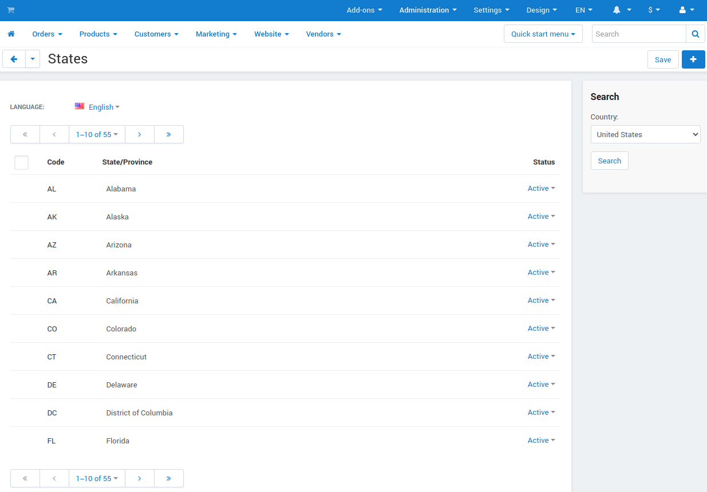

******
States
******

Use the **Administration → Shipping and taxes → States** page to edit the list of states and provinces (per country) that are supported in your store.

You can add missing states/provinces, or delete and modify existing ones for each :doc:`active country <countries>`.

================
State Properties
================

* **Code**—a unique code to identify the state or province.

* **State/Province**—the name of the state or province.

* **Status**—the status of the state/province: *Active* or *Disabled*.

  .. note::

      If you disable a state, users won't be able to select it in their profiles or at checkout.
