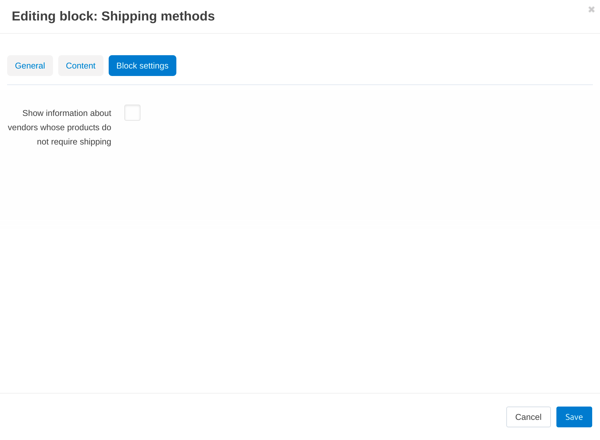

******************************************
How To: Disable Shipping on the Storefront
******************************************

Some stores don't require shipping at all. That's why you can hide shipping method selection on the checkout page.

#. Go to **Administration → Shipping & taxes → Shipping methods**.

#. Change the statuses of all shipping methods to *Disabled*.

   .. important::

       A product can have **Shipping freight** on the **Shipping properties** tab. But since the shipping method isn't selected now, the shipping freights of products won't be taken into account as well.

#. Go to **Design → Layouts** and switch to the **Checkout** tab.

#. Hide the block for shipping method selection. This will remove the mention of no shipping being required from the checkout page.

.. note::

    The following instruction is only for CS-Cart Multi-Vendor 4.14.1 and higher.

There is another way to turn off the no shipping required mention. It is more suitable for marketplaces that have either digital products or products that require shipping.

#. Go to the **Design → Layouts → Manage Blocks** page and open the "Shipping Methods" block editing.

#. On the *Block settings* tab, leave the **Show information about vendors whose products do not require shipping** checkbox empty.

#. Save your changes. Now, customers won't see the mention that delivery is not required on the checkout page.

Put a tick on the *Block settings* tab in the editing block window if you still want to inform customers that shipping isn't required. Then set your own warning text on the *Content* tab that customers will see on the checkout page if there is no shipping required.

