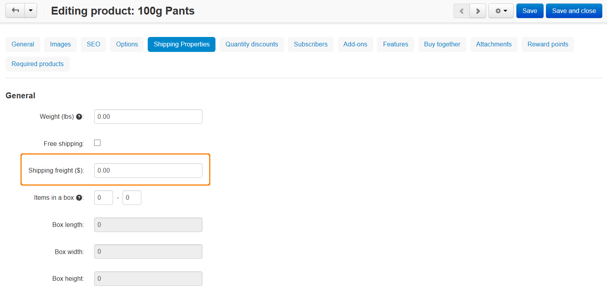
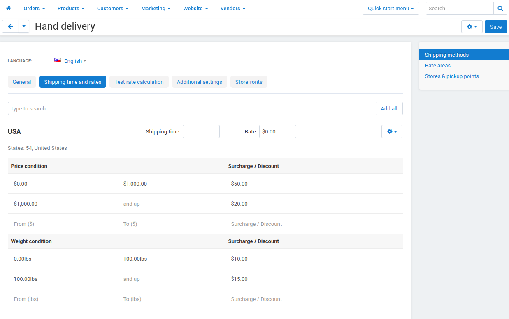

*******************************
Getting Incorrect Shipping Cost
*******************************

If you get an incorrect shipping cost, there are two things you need to check.

Check whether an additional shipping charge is set up for your products:

1. In the Administration panel, go to **Products → Products**.
2. Choose the product for which the shipping cost is displayed incorrectly.
3. Open the **Shipping Properties** tab and check the **Shipping freight ($)** field. If you don't want to add additional cost to the shipping cost for this product, leave this field empty or enter **0** and click the **Save and close** button.

If a realtime shipping method is set up, check whether an additional charge is set up for it:

1. Go to **Administration → Shipping & Taxes → Shipping Methods**.
2. Click on the name of the realtime shipping method.
3. Open the **Shipping charges** tab, check whether rates are set up in the **Cost dependences**, **Weight dependences**, and **Items dependences** sections. These rates are be added to the shipping cost which will be transferred from the website of a realtime shipping service (for instance UPS, USPS, etc.) If you don't want to add these rates to the shipping cost, remove them and click the **Save and close** button.

